# Запись нот, ключей и добавочных линеек

**Автор: Chelsey Hamm.**

> **Черновик перевода.** Источник — [OMT2, Nebraska, Fall 2023](https://pressbooks.nebraska.edu/openmusictheory/chapter/notation-of-notes-clefs-and-ledger-lines/). С текущей редакцией VIVA не сверено. Перевод — участники Open Music Theory RU. [CC BY-SA 4.0](https://creativecommons.org/licenses/by-sa/4.0/).

## Главное

- Нота передаёт и высоту звука, и его ритмическое значение.
- Ноты записываются на **нотном стане**. Чем выше частота звука, тем выше располагается нота. При одинаковой скорости распространения звука более высокой частоте соответствует более короткая волна.
- **Головка ноты** должна быть овальной, а не круглой, и слегка наклоняться вверх вправо. Важно соблюдать её размер и положение относительно линеек.
- **Штиль** направлен вверх и находится справа от головки либо направлен вниз и находится слева. Для нот выше средней линейки штиль направляют вниз, для нот ниже неё — вверх. На средней линейке направление зависит от окружающих нот.
- При записи двух одновременно звучащих нот на расстоянии секунды одну головку сдвигают в сторону. Нижняя нота всегда располагается слева, независимо от направления штиля.
- **Ключ** определяет, каким высотам соответствуют линейки и промежутки между ними.
- **Добавочные линейки** продолжают нотный стан вверх и вниз.

Западная музыкальная нотация прежде всего передаёт две стороны музыки: **высоту звука** и **ритм**. Высота отображается по вертикали, а ритм — по горизонтали. Запись читают слева направо и сверху вниз, как страницу английской книги.

> **Примечание переводчиков.** Русский текст читается в том же направлении. Горизонтальная ось задаёт последовательность музыкальных событий; расстояние между нотами на странице не обязано быть строго пропорционально длительности.

## Из каких частей состоит нота

Нота передаёт высоту звука и его ритмическое значение. Каждая записанная нота имеет **головку** (*notehead*) — незакрашенную или закрашенную. У ноты также могут быть **штиль** (*stem*), **вязка** (*beam*) или **флажок** (*flag*). Подробнее см. главу [«Длительности нот и пауз»](08-rhythmic-rest-values.md).

<figure id="example-1">
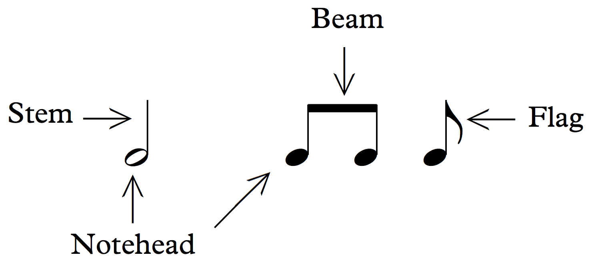
<figcaption>Пример 1. Головки нот, штили, вязки и флажки.</figcaption>
</figure>

## Нотный стан

**Нотный стан**, или **нотоносец** (*staff*), необходим для обозначения высоты. Он состоит из пяти горизонтальных линеек, расположенных на одинаковом расстоянии друг от друга. Каждая нота помещается на линейке или в промежутке между линейками в соответствии со своей высотой; подробнее об этом — в разделе [«Ключи»](#clefs).

<figure id="example-2">
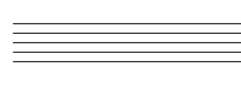
<figcaption>Пример 2. Нотный стан.</figcaption>
</figure>

## Расположение головок нот

Головка ноты на линейке должна занимать половину промежутка над ней и половину промежутка под ней. Головка ноты в промежутке должна касаться ограничивающих его линеек сверху и снизу. В примере 3 показаны правильно записанные закрашенные и незакрашенные головки.

<figure id="example-3">
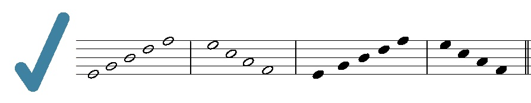
<figcaption>Пример 3. Правильные головки нот на линейках и в промежутках.</figcaption>
</figure>

Головки должны быть овальными, а не круглыми, со слабым наклоном вверх вправо. В примере 4 показаны ошибки: слишком маленькие или слишком большие головки, а также головки неправильной формы.

<figure id="example-4">
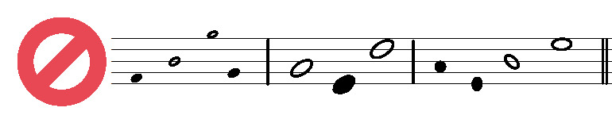
<figcaption>Пример 4. Неправильные головки нот.</figcaption>
</figure>

## Штили и вязки

Штиль может быть направлен вверх — тогда его проводят справа от головки, — или вниз — тогда его проводят слева. Для нот выше средней линейки штиль направляют вниз, для нот ниже средней линейки — вверх. На средней линейке допустимы оба направления; выбор зависит от окружающих нот.

<figure id="example-5">
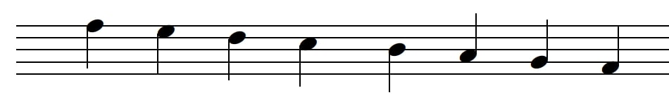
<figcaption>Пример 5. Правильное направление штилей.</figcaption>
</figure>

Подробнее о направлении штилей и объединении нот вязками говорится в главах [«Простые метры и тактовые размеры»](https://pressbooks.nebraska.edu/openmusictheory/chapter/simple-meter-and-time-signatures/) и [«Составные метры и тактовые размеры»](https://pressbooks.nebraska.edu/openmusictheory/chapter/compound-meters-and-time-signatures/) на английском языке.

В исходнике для рукописного штиля предлагается длина, охватывающая четыре линейки нотного стана. Вязка должна быть примерно в четыре раза толще штиля.

> **Примечание переводчиков.** Формулировка «четыре линейки» описывает расстояние, охватывающее четыре линейки, а не четыре промежутка между ними. Это упрощённый ориентир из оригинала; направление и длина штилей в многоголосии и конкретных издательских стилях могут отличаться. Здесь рассматривается базовая запись.

## Запись секунд

Когда две ноты на расстоянии секунды звучат одновременно, их головки занимают соседние линейку и промежуток. Чтобы они не перекрывались, одну головку сдвигают влево или вправо относительно штиля. **Нижняя нота всегда находится слева**, независимо от того, куда направлен штиль.

См. также раздел [«Ступеневая величина интервала»](04-keyboard-grand-staff.md#generic-intervals).

<figure id="example-6">
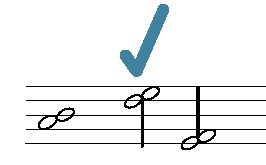
<figcaption>Пример 6. Три правильно записанные секунды.</figcaption>
</figure>

Головки нельзя располагать строго друг над другом. Нельзя также помещать нижнюю ноту справа, как в ошибочных вариантах примера 7.

<figure id="example-7">
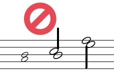
<figcaption>Пример 7. Три неправильно записанные секунды.</figcaption>
</figure>

Запись секунд внутри септаккордов рассматривается в английской главе [«Септаккорды»](https://pressbooks.nebraska.edu/openmusictheory/chapter/seventh-chords/).

## Ключи

Ноты на линейках и в промежутках обозначают звуки определённой высоты. Для их описания музыканты пользуются пространственными метафорами: ноты ближе к верхней части стана называют «высокими», а ближе к нижней — «низкими». Более высоким звукам соответствуют более короткие звуковые волны и более высокая частота, низким — более длинные волны и меньшая частота.

Такие метафоры зависят от культурной среды и эпохи. Например, некоторые древнегреческие теоретики помещали знаки высоких звуков **ниже** знаков низких звуков.[^1] Как показано в примере 8, вероятное объяснение связано со струнными инструментами, знакомыми этим теоретикам: их устройство напоминало устройство современных скрипок, гитар и арф.

<iframe src="https://www.youtube.com/embed/N0SznGRFHSg?rel=0" title="Пример 8. Jacob Tews: высота и нотация в Древней Греции; видео на английском" loading="lazy" allowfullscreen></iframe>

*Пример 8. Jacob Tews из Университета Кристофера Ньюпорта рассказывает о древнегреческой музыкальной нотации.* [Открыть видео на YouTube](https://www.youtube.com/watch?v=N0SznGRFHSg), если встроенный проигрыватель недоступен. Видео на английском языке.

Чтобы запись сообщала не только «выше» или «ниже», но и конкретную высоту, на стане должен стоять **ключ** (*clef*). Он определяет, каким звукам соответствуют линейки и промежутки. Подробнее см. главу [«Чтение ключей»](03-reading-clefs.md).

Сегодня чаще всего используются **скрипичный** и **басовый** ключи. Вам также могут встретиться **альтовый** и **теноровый** ключи. В примере 9 один и тот же звук записан во всех четырёх ключах.

<figure id="example-9">
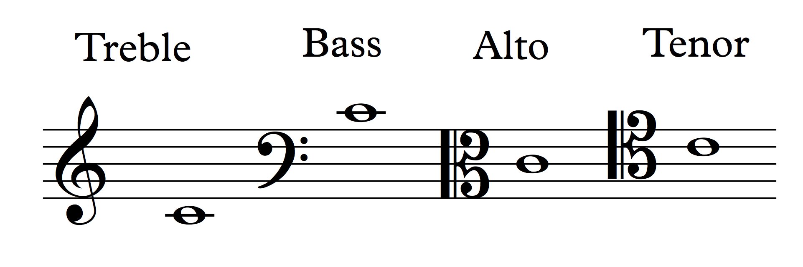
<figcaption>Пример 9. Один звук в скрипичном, басовом, альтовом и теноровом ключах.</figcaption>
</figure>

> **Примечание переводчиков.** Во всех четырёх случаях это до первой октавы — `C4` по принятой в книге научной нумерации октав. Сопоставление обозначений приведено в [правилах перевода](../translation-notes.md).

Высокие звуки — например, партии флейты или сопрано — обычно записывают в скрипичном ключе. Низкие — например, партии тромбона или басового голоса — обычно в басовом. Альтовый и теноровый ключи встречаются реже. В некоторых случаях альтовый ключ используют для звуков средне-высокого регистра, а теноровый — средне-низкого.

## Как писать ключи

Скрипичный ключ можно написать за три шага.

<figure id="example-10">
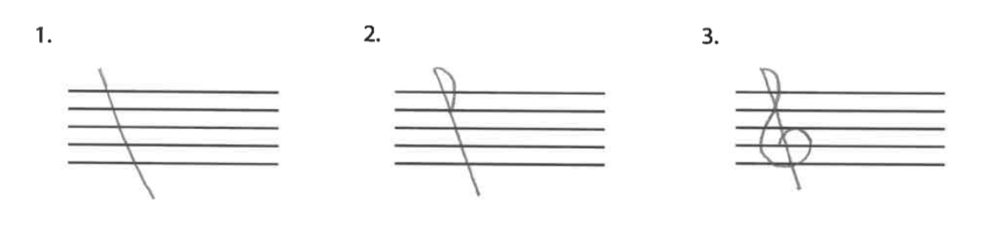
<figcaption>Пример 10. Скрипичный ключ за три шага.</figcaption>
</figure>

1. Проведите слегка наклонную вертикальную линию, немного выходящую за пределы стана сверху и снизу.
2. Нарисуйте полуокружность, пересекающую эту линию на второй линейке **сверху**.
3. Обведите вторую линейку **снизу** завитком.

Басовый ключ также можно написать за три шага.

<figure id="example-11">
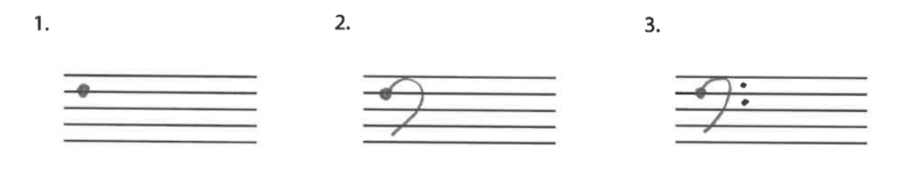
<figcaption>Пример 11. Басовый ключ за три шага.</figcaption>
</figure>

1. Поставьте точку на второй линейке сверху.
2. Нарисуйте обращённую влево латинскую `C`, заканчивающуюся в нижнем промежутке. Верхняя часть дуги не должна выходить за пределы стана.
3. Справа от дуги поставьте две точки в двух верхних промежутках.

Альтовый ключ пишут за четыре шага.

<figure id="example-12">
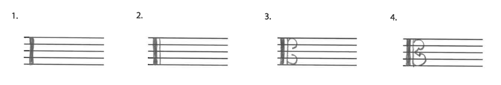
<figcaption>Пример 12. Альтовый ключ за четыре шага.</figcaption>
</figure>

1. Проведите толстую вертикальную черту на всю высоту стана.
2. Рядом проведите более тонкую вертикальную черту.
3. Нарисуйте две обращённые влево латинские `C`: верхняя занимает чуть меньше верхней половины стана, нижняя — чуть меньше нижней половины.
4. Соедините их остриём, приходящимся на среднюю линейку.

Теноровый ключ выглядит так же, как альтовый, но сдвинут на одну линейку вверх. Вертикальные черты начинаются на второй линейке снизу и немного выходят за пределы стана сверху. Верхняя дуга немного выступает над верхней половиной стана, нижняя занимает чуть меньше двух средних промежутков. Соединяющее их остриё приходится на вторую линейку сверху.

<figure id="example-13">
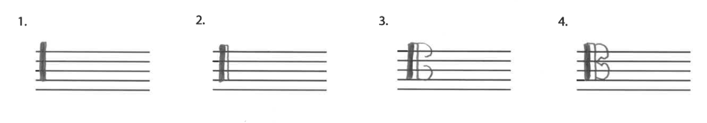
<figcaption>Пример 13. Теноровый ключ за четыре шага.</figcaption>
</figure>

Иногда музыканты сокращённо обозначают альтовый или теноровый ключ буквой `K`.

<figure id="example-14">
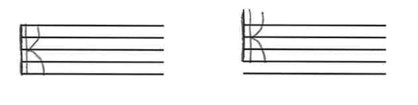
<figcaption>Пример 14. Буква K как сокращённая запись альтового и тенорового ключей.</figcaption>
</figure>

## Добавочные линейки

Если звук слишком высок или низок, чтобы записать его в пределах стана, используют короткие **добавочные линейки** (*ledger lines*), продолжающие стан вверх или вниз.

<figure id="example-15">
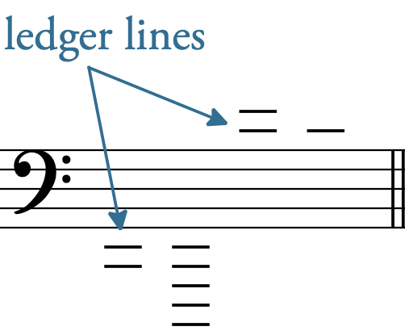
<figcaption>Пример 15. Добавочные линейки над станом и под ним.</figcaption>
</figure>

В примере 16 на добавочных линейках над станом и под ним записаны ноты со штилями и вязками.

<figure id="example-16">
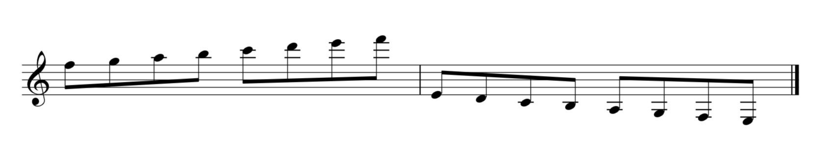
<figcaption>Пример 16. Ноты на добавочных линейках со штилями и вязками.</figcaption>
</figure>

Не проводите лишнюю добавочную линейку над самой высокой или под самой низкой записываемой нотой. В примере 17 сначала показан правильный вариант, затем — неправильный, с лишними линейками.

<figure id="example-17">
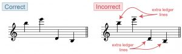
<figcaption>Пример 17. Правильная и неправильная запись добавочных линеек.</figcaption>
</figure>

## Дополнительные материалы

Ссылки ведут на английские материалы оригинальной главы; это не переведённые разделы нашего проекта.

- [Высота и частота: физика звука](https://www.physicsclassroom.com/Class/sound/u11l2a.cfm) — The Physics Classroom.
- [Нотный стан](https://www.essential-music-theory.com/music-staff.html) — Essential Music Theory.
- [Как писать ноты](https://www.youtube.com/watch?v=zMwcJ6fPG-g) — видео.
- [Музыкальные ключи](https://www.musicnotes.com/now/tips/a-complete-guide-to-musical-clefs-what-are-they-and-how-to-use-them/) — Musicnotes.
- [Как писать скрипичный и басовый ключи](https://www.youtube.com/watch?v=ZDGhR6EeKw4&feature=related) — видео.
- [Как писать ключи до](https://ultimatemusictheory.com/draw-c-clef-signs/) — Ultimate Music Theory.
- [Нотный стан, ключи и добавочные линейки](https://www.musictheory.net/lessons/10) — musictheory.net.
- [Руководство по оформлению нотной записи](https://blogs.iu.edu/jsomcomposition/music-notation-style-guide/) — Indiana University.

## Упражнения из внешних источников

Английские PDF:

1. [Нотный стан](https://pressbooks.nebraska.edu/app/uploads/sites/379/2023/09/0001_The_Staff.pdf).
2. [Запись нот на линейках и в промежутках; высокие и низкие ноты](https://pressbooks.nebraska.edu/app/uploads/sites/379/2023/09/0002_The_Staff_High_Low.pdf).

## Задание

**Запись головок нот, ключей и добавочных линеек.** Английский лист задания: [PDF](https://pressbooks.nebraska.edu/app/uploads/sites/379/2023/09/WK-Notation-of-Notes-Clefs-and-Ledger-Lines-1.pdf), [DOCX](https://pressbooks.nebraska.edu/app/uploads/sites/379/2023/09/WK-Notation-of-Notes-Clefs-and-Ledger-Lines-1.docx).

[^1]: Например: André Barbera, *The Euclidean Division of the Canon: Greek and Latin Sources. New Critical Texts and Translations on Facing Pages, with an Introduction, Annotations, and Indices Verborum and Nominum et Rerum* (Lincoln: University of Nebraska Press, 1991), с. 276–279. Библиографическая ссылка сохранена из оригинала; издание отдельно не проверялось.

---

Нотные иллюстрации: OMT / глава Chelsey Hamm, CC BY-SA 4.0. Примеры 1–7 и 9–16 получены из адаптации Nebraska; пример 17 — из [того же примера в LibreTexts](https://human.libretexts.org/Bookshelves/Music/Music_Theory/Open_Music_Theory_2e_(Gotham_et_al.)/01%3A_Fundamentals/1.02%3A_Notation_of_Notes_Clefs_and_Ledger_Lines), поскольку ссылка в Nebraska ведёт на недоступный VIVA. Подписи и текстовые описания переведены; надписи внутри рисунков сохранены. Видео Jacob Tews размещено на YouTube и не включено в лицензию нашего перевода.
