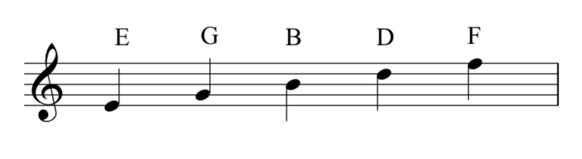
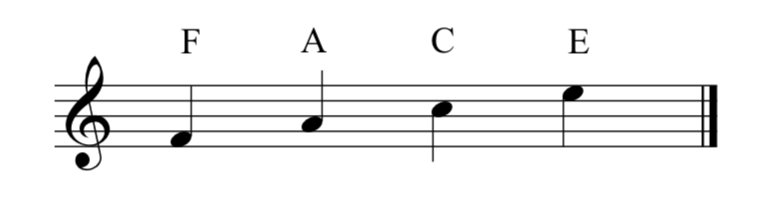
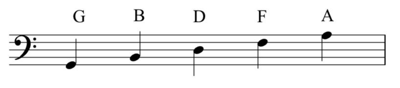
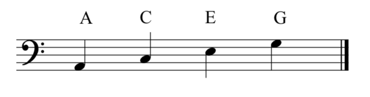
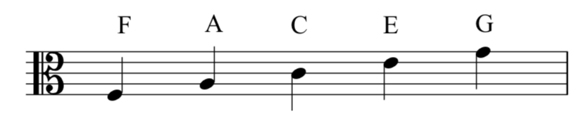
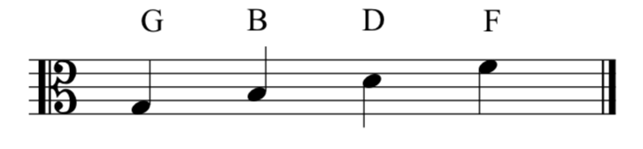
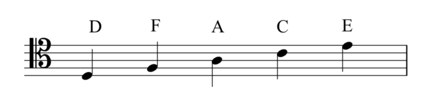
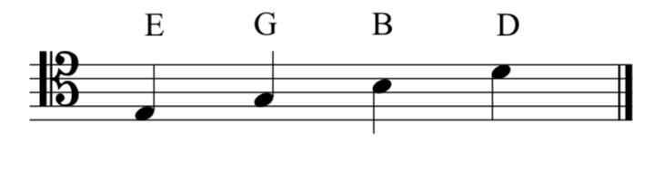
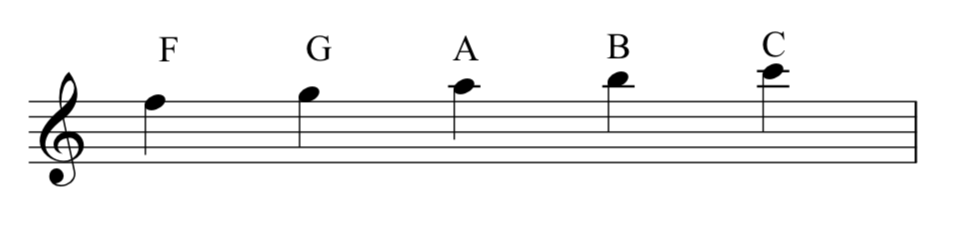
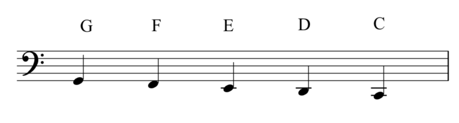

# Чтение ключей

**Автор: Chelsey Hamm.**

> **Черновик перевода.** Источник — [OMT2, Nebraska, Fall 2023](https://pressbooks.nebraska.edu/openmusictheory/chapter/clefs/). С текущей редакцией VIVA не сверено. Перевод — участники Open Music Theory RU. [CC BY-SA 4.0](https://creativecommons.org/licenses/by-sa/4.0/).

## Главное

- В англоязычной нотной записи высоты обозначают буквами **A, B, C, D, E, F, G**; эта последовательность повторяется.
- Разные ключи облегчают чтение музыки в разных диапазонах.
- Ключ определяет, каким высотам соответствуют линейки и промежутки нотного стана.

В западной музыкальной нотации для названий звуков используют первые семь букв латинского алфавита: A, B, C, D, E, F, G. После G последовательность начинается снова: A, B, C, D, E, F, G, A, B, C и так далее. Повторение связано с принципом **октавной эквивалентности** (*octave equivalence*): звукам, разделённым октавой, дают одно и то же буквенное название. Подробнее об этом — в следующей главе, [«Клавиатура и объединённый нотный стан»](04-keyboard-grand-staff.md).

> **Примечание переводчиков.** В русском тексте буквам A, B, C, D, E, F, G соответствуют названия **ля, си, до, ре, ми, фа, соль**. На исходных рисунках сохранены латинские буквы. Здесь и далее **B — си**; полная таблица — в [правилах перевода](../translation-notes.md).

Представление об октавной эквивалентности зависит от социально-культурной среды (*milieu*). Например, некоторые древнегреческие теоретики его не принимали и использовали для названий высот больше семи букв греческого алфавита.

## Ключи и диапазоны

В [предыдущей главе](02-notes-clefs.md#clefs) мы познакомились со скрипичным, басовым, альтовым и теноровым ключами. Каждый ключ задаёт высоты для линеек и промежутков стана. Разные ключи удобны для разных **диапазонов** (*ranges*) — совокупностей высот, доступных голосу или инструменту. В следующей главе мы увидим это на клавиатуре.

Скрипичный ключ обычно используют для высоких голосов и инструментов: флейты, скрипки, трубы, сопрано. Басовый — для низких: фагота, виолончели, тромбона, басового голоса. Альтовый ключ прежде всего используется для альта — инструмента среднего диапазона. Теноровый иногда встречается в партиях виолончели, фагота и тромбона, хотя основной ключ этих инструментов — басовый.

Запомнив расположение нот в каждом ключе, вы сможете легче читать партии разных голосов и инструментов.

## Чтение скрипичного ключа

Скрипичный ключ — один из самых распространённых сегодня. В примере 1 показаны названия нот на его линейках. **Снизу вверх: ми, соль, си, ре, фа — E, G, B, D, F.** В оригинале для запоминания предложена фраза «Every Good Bird Does Fly»: первые буквы её слов дают нужную последовательность. Завиток ключа охватывает вторую линейку снизу — линейку соль. Поэтому скрипичный ключ также называют **ключом соль** (*G clef*).

<figure id="example-1">

<figcaption>Пример 1. Названия нот на линейках в скрипичном ключе.</figcaption>
</figure>

В промежутках снизу вверх располагаются **фа, ля, до, ми — F, A, C, E** (пример 2). Латинские буквы образуют английское слово *face* — «лицо».

<figure id="example-2">

<figcaption>Пример 2. Названия нот в промежутках в скрипичном ключе.</figcaption>
</figure>

> **Примечание переводчиков.** Английские мнемонические фразы сохранены, потому что они помогают запомнить именно буквенные обозначения на рисунках. Их буквальный перевод на русский не сохраняет нужных начальных букв. Для чтения русскими названиями проговаривайте приведённые рядом последовательности нот.

## Чтение басового ключа

Другой часто используемый ключ — басовый. На его линейках снизу вверх находятся **соль, си, ре, фа, ля — G, B, D, F, A** (пример 3). Мнемоническая фраза оригинала: «Good Bikes Don’t Fall Apart». Басовый ключ также называют **ключом фа** (*F clef*): его начальная точка лежит на линейке фа — второй сверху, то есть четвёртой снизу.

<figure id="example-3">

<figcaption>Пример 3. Названия нот на линейках в басовом ключе.</figcaption>
</figure>

В промежутках снизу вверх расположены **ля, до, ми, соль — A, C, E, G** (пример 4). В оригинале используется фраза «All Cows Eat Grass».

<figure id="example-4">

<figcaption>Пример 4. Названия нот в промежутках в басовом ключе.</figcaption>
</figure>

## Чтение альтового ключа

Альтовый ключ встречается реже. На его линейках снизу вверх находятся **фа, ля, до, ми, соль — F, A, C, E, G** (пример 5). Фраза для запоминания: «Fat Alley Cats Eat Garbage». Центральное остриё альтового ключа указывает на линейку до — среднюю линейку стана. Поэтому он относится к **ключам до** (*C clefs*).

<figure id="example-5">

<figcaption>Пример 5. Названия нот на линейках в альтовом ключе.</figcaption>
</figure>

В промежутках снизу вверх расположены **соль, си, ре, фа — G, B, D, F** (пример 6). Мнемоническая фраза: «Grand Boats Drift Flamboyantly».

<figure id="example-6">

<figcaption>Пример 6. Названия нот в промежутках в альтовом ключе.</figcaption>
</figure>

## Чтение тенорового ключа

Теноровый ключ тоже относится к ключам до и используется реже скрипичного и басового. Его центральное остриё указывает на вторую линейку сверху, то есть четвёртую снизу. На линейках снизу вверх находятся **ре, фа, ля, до, ми — D, F, A, C, E** (пример 7). Фраза оригинала: «Dodges, Fords, and Chevrolets Everywhere»; здесь учитывается и начальная буква слова *and*.

<figure id="example-7">

<figcaption>Пример 7. Названия нот на линейках в теноровом ключе.</figcaption>
</figure>

В промежутках снизу вверх расположены **ми, соль, си, ре — E, G, B, D** (пример 8). Фраза для запоминания: «Elvis’s Guitar Broke Down».

<figure id="example-8">

<figcaption>Пример 8. Названия нот в промежутках в теноровом ключе.</figcaption>
</figure>

## Добавочные линейки

Если нота слишком высока или низка, чтобы записать её в пределах стана, используют короткие **добавочные линейки**. Они продолжают стан вверх или вниз и применяются с любым ключом. В примере 9 показано продолжение стана вверх в скрипичном ключе: соль, ля, си, до — G, A, B, C.

<figure id="example-9">

<figcaption>Пример 9. Продолжение стана вверх в скрипичном ключе.</figcaption>
</figure>

Каждому следующему промежутку и каждой следующей линейке соответствует очередное название ноты — как если бы стан просто продолжался вверх. То же правило действует под станом. В примере 10 в басовом ключе последовательность идёт вниз: фа, ми, ре, до — F, E, D, C.

<figure id="example-10">

<figcaption>Пример 10. Продолжение стана вниз в басовом ключе.</figcaption>
</figure>

Линейки и промежутки под станом получают названия так же, как если бы стан продолжался вниз.

## Дополнительные материалы

Все ссылки ниже ведут на англоязычные материалы исходной главы. Рабочие листы пока не переведены; доступность внешних ресурсов может меняться.

- [Нотный стан, ключи и добавочные линейки — musictheory.net](https://www.musictheory.net/lessons/10)
- [Карточки для скрипичного, басового, альтового и тенорового ключей — Richman Music School](https://www.richmanmusicschool.com/products/name-that-note)
- [Карточки для печати: скрипичный ключ, с. 3–5 — Samuel Stokes Music](https://www.samuelstokesmusic.com/flashcards/Bass-and-treble-flashcards.pdf)
- [Карточки для печати: басовый ключ, с. 1–3 — Samuel Stokes Music](https://www.samuelstokesmusic.com/flashcards/Bass-and-treble-flashcards.pdf)
- [Карточки для печати: альтовый ключ — Samuel Stokes Music](https://www.samuelstokesmusic.com/flashcards/Alto-clef-flashcards.pdf)
- [Карточки для печати: теноровый ключ — Samuel Stokes Music](https://www.samuelstokesmusic.com/flashcards/Tenor-clef-flashcards.pdf)
- [Игра на скорость: скрипичный ключ — Tone Savvy](https://tonesavvy.com/music-practice-exercise/235/paced-note-name-sight-reading-game-treble/)
- [Игра на скорость: басовый ключ — Tone Savvy](https://tonesavvy.com/music-practice-exercise/239/paced-note-name-sight-reading-game-bass/)
- [Игра на скорость: альтовый ключ — Tone Savvy](https://tonesavvy.com/music-practice-exercise/240/paced-note-name-sight-reading-game-alto/)
- [Игра на скорость: теноровый ключ — Tone Savvy](https://tonesavvy.com/music-practice-exercise/236/paced-note-name-sight-reading-game-tenor/)

## Упражнения из внешних источников

### Начальный уровень

- Скрипичный и басовый ключи: [PDF](http://www.musicfun.net.au/pdf_files/note_names.pdf).
- Скрипичный ключ: [PDF](http://www.musicfun.net.au/pdf_files/treble_nn_letter.pdf).
- Басовый ключ: [PDF](http://www.musicfun.net.au/pdf_files/bass_nn_2.pdf).
- Альтовый ключ: [PDF](http://www.musicfun.net.au/pdf_files/alto_nn_2.pdf).
- Теноровый ключ: [PDF](https://cdn.shopify.com/s/files/1/2308/9201/files/Naming_Tenor_Clef_Notes.pdf?951452119379613733).

### Средний уровень

- Упражнения в скрипичном ключе: [PDF](http://www.conejousd.org/Portals/36/TEACHERS/apayne/Treble%20Clef%20Note%20Reading%20Packet.pdf).
- Скрипичный ключ с добавочными линейками: [PDF](https://www.masoncoschools.com/userfiles/90/Classes/1028/vln_worksheet_2.pdf?id=541114).
- Упражнения в басовом ключе: [PDF](http://mcfarlandakchoral.weebly.com/uploads/3/8/3/1/38313119/bass_clef_note_reading_packet.pdf), [PDF](https://www.masoncoschools.com/userfiles/90/Classes/1028/vc_dbl_worksheet_1.pdf?id=541115).
- Басовый ключ с добавочными линейками: [PDF](https://www.d11.org/site/handlers/filedownload.ashx?moduleinstanceid=20010&dataid=31986&FileName=0006%20Bass%20Clef%20Ledger%20Lines.pdf).
- Упражнения в альтовом ключе: [PDF](https://www.masoncoschools.com/userfiles/90/Classes/1028/alto_clef_worksheet_2015.pdf?id=541109), [PDF](https://static1.squarespace.com/static/5b1f56848ab722d5e4f7b305/t/5d49d7b42400100001377fee/1565120436475/Adv+Alto+Clef+Note+Identification.pdf).
- Упражнения в теноровом ключе: [PDF](https://static1.squarespace.com/static/5b1f56848ab722d5e4f7b305/t/5d49d8b809ff9b000132f662/1565120696482/Adv+Tenor+Clef+Note+Identification.pdf).

### Продвинутый уровень

- Все ключи: [PDF](http://www2.lawrence.edu/fast/BIRINGEG/media/theory_funds/pdf/ws01-pitch_notation.pdf).

## Задания

- Запись и определение нот: задание 1: [PDF](https://pressbooks.nebraska.edu/app/uploads/sites/379/2023/09/WK-Reading-Clefs-1.pdf), [MuseScore (MSCZ)](https://viva.pressbooks.pub/app/uploads/sites/12/2021/10/WK-Reading-Clefs-1.mscz#fixme).
- Запись и определение нот: задание 2: [PDF](https://pressbooks.nebraska.edu/app/uploads/sites/379/2023/09/WK-Reading-Clefs-2.pdf), [MuseScore (MSCZ)](https://viva.pressbooks.pub/app/uploads/sites/12/2021/10/WK-Reading-Clefs-2.mscz#fixme).

> **Примечание переводчиков.** В оригинале ссылки MuseScore подписаны `.mscx`, но ведут на файлы `.mscz` с фрагментом `#fixme`. Здесь название формата приведено по URL; сами ссылки сохранены как в источнике и требуют проверки.

---

Иллюстрации: Chelsey Hamm / Open Music Theory, адаптация Nebraska Fall 2023, CC BY-SA 4.0. Все десять рисунков сохранены локально без изменения; подписи и текстовые описания переведены. Английские мнемонические фразы сохранены и пояснены отдельно.
