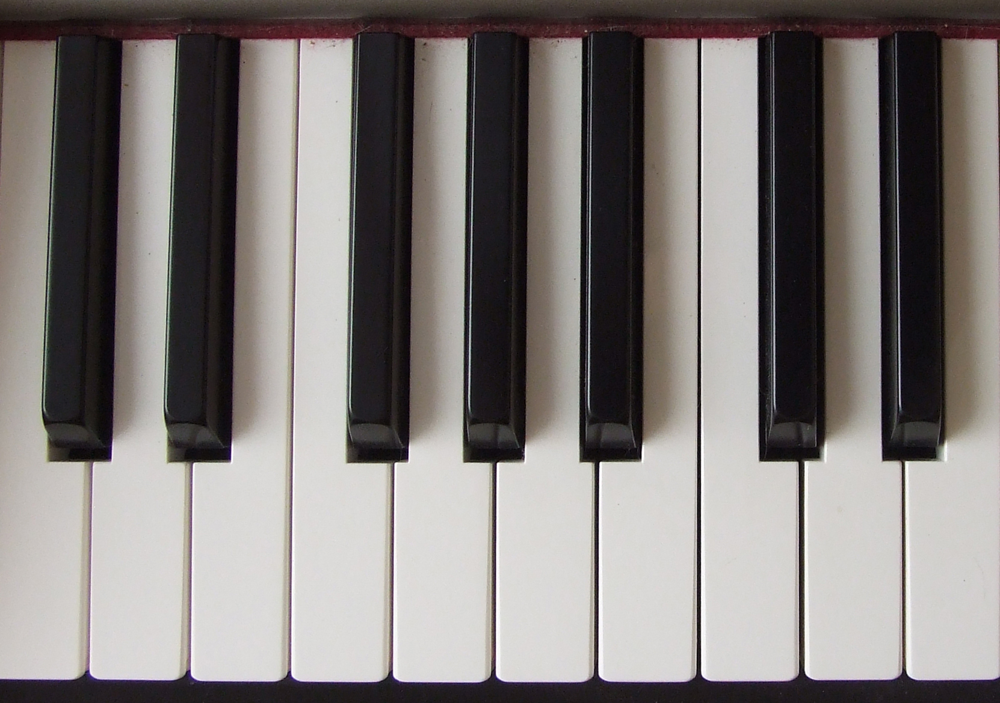
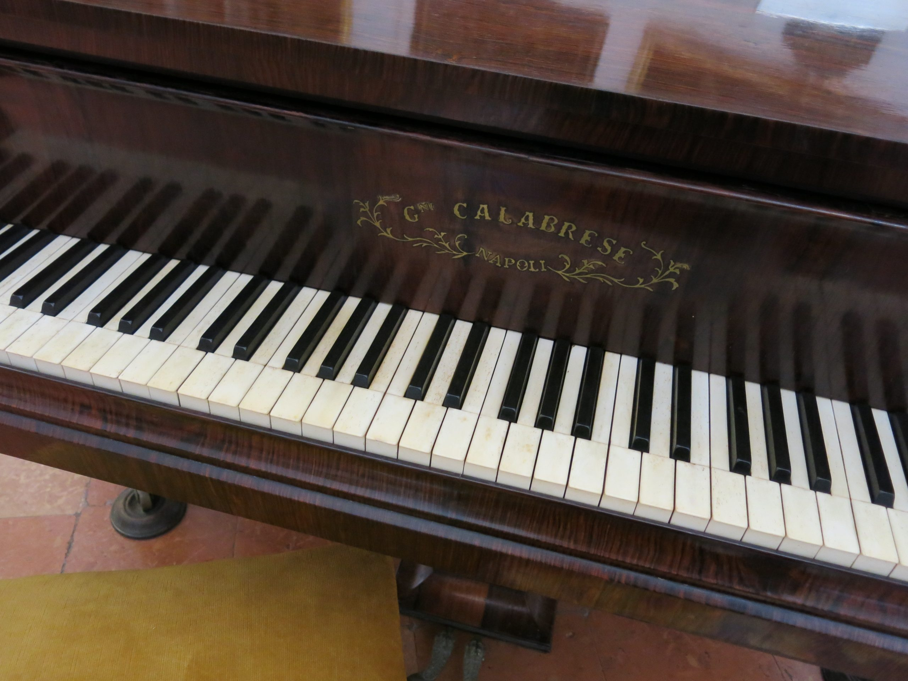
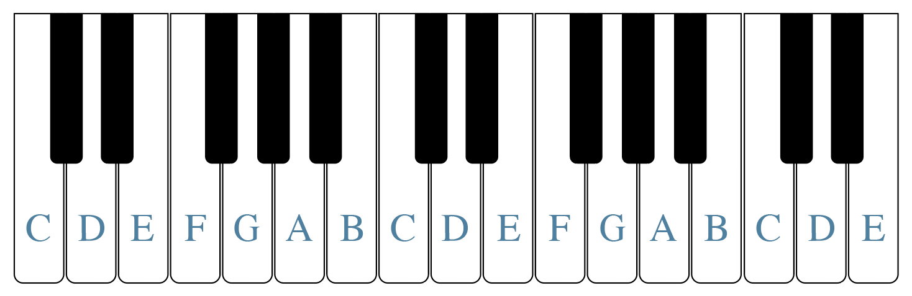
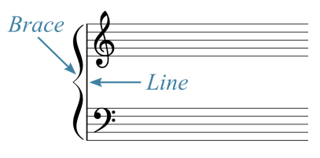
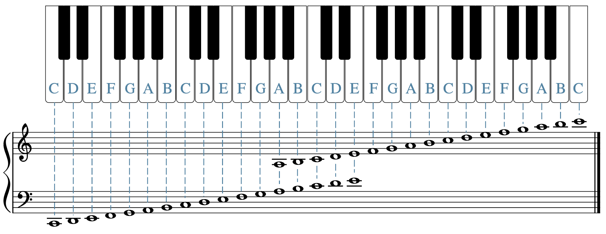
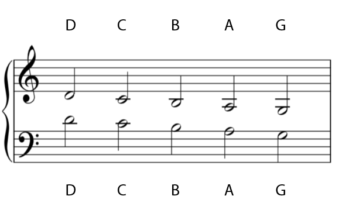
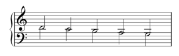
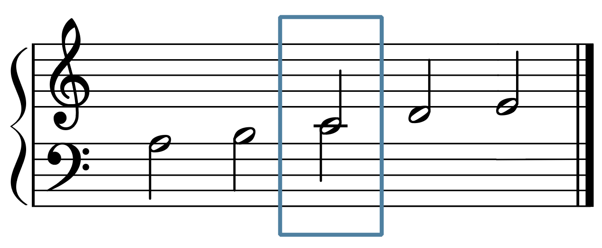
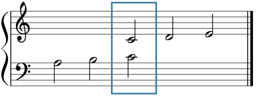
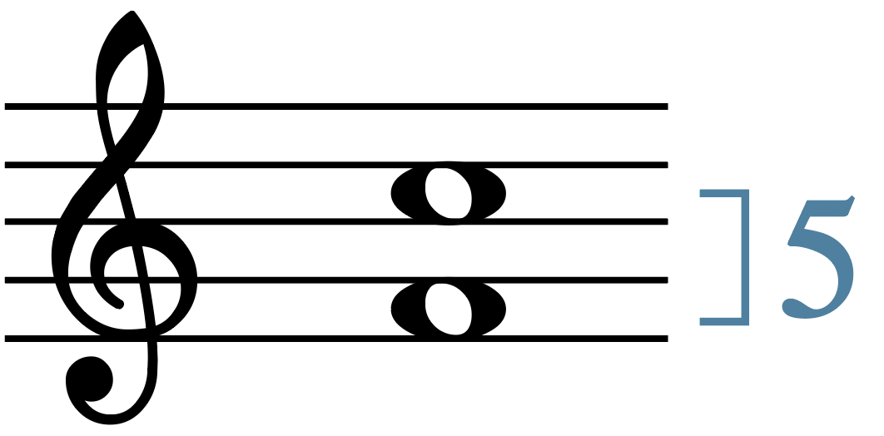

# Клавиатура и объединённый нотный стан

**Автор: Chelsey Hamm.**

> **Черновик перевода.** Источник — [OMT2, Nebraska, Fall 2023](https://pressbooks.nebraska.edu/openmusictheory/chapter/the-keyboard-and-grand-staff/). С текущей редакцией VIVA не сверено. Перевод — участники Open Music Theory RU. [CC BY-SA 4.0](https://creativecommons.org/licenses/by-sa/4.0/).

## Главное

- Игра на фортепиано помогает изучать теорию музыки, связывая звук с движением и ощущениями.
- На клавиатуре повторяются группы из двух и трёх чёрных клавиш. На стандартном фортепиано этот рисунок охватывает более семи октав.
- Белая клавиша **до (C)** находится непосредственно слева от группы из двух чёрных клавиш, **фа (F)** — слева от группы из трёх.
- Фортепианную музыку обычно записывают на двух объединённых нотных станах — *grand staff*.
- **До первой октавы (C4)** записывается на добавочной линейке между этими станами.
- При определении ступеневой величины интервала считайте первую ноту как **один**.

Многим студентам легче изучать теорию, когда они взаимодействуют с музыкой через движение — **кинестетически**. Игра на инструменте, например фортепиано, позволяет физически создавать звук и помогает представить запись и внутренне услышать музыку, которую вы изучаете. Так легче понять отношения между высотами.

> **Примечание переводчиков.** Английское *audiate* здесь означает «внутренне слышать», то есть мысленно представлять звучание. Это не просто узнавание названий записанных нот.

## Фортепианная клавиатура

Один из простых способов связать теорию с движением — научиться находить и играть ноты на клавиатуре. Возможно, акустическое или электронное фортепиано есть в вашем учебном заведении. Можно воспользоваться и недорогой электронной клавиатурой или приложением на телефоне. В оригинале в качестве примера названо [Tiny Piano](http://www.tinypiano.com/).

> **Примечание переводчиков.** Название приложения сохранено как ссылка из редакции 2023 года; его текущая доступность и стоимость не проверялись. Для упражнений подойдёт любая доступная клавиатура, позволяющая находить и слушать ноты.

В примере 1 видны белые и чёрные клавиши. Чёрные объединяются в группы по две или по три. Эти группы чередуются вдоль всей клавиатуры; рисунок повторяется в каждой октаве (пример 2).

<figure id="example-1">

<figcaption>Пример 1. Небольшой участок фортепианной клавиатуры.</figcaption>
</figure>

<figure id="example-2">

<figcaption>Пример 2. Больший участок фортепианной клавиатуры.</figcaption>
</figure>

## Посадка за фортепиано

Сидите прямо: голова располагается над плечами, плечи опущены. Локти находятся на удобном расстоянии от корпуса, пальцы слегка согнуты — как при снятии книги с полки. Не зажимайте колени и запястья. Если вы не используете педали, стопы стоят на полу.

В примере 3 Benjamin Corbin из Университета Кристофера Ньюпорта показывает правильную посадку.

<iframe src="https://www.youtube.com/embed/93k3JolSjF8?rel=0" title="Пример 3. Benjamin Corbin: посадка за фортепиано; видео на английском" loading="lazy" allowfullscreen></iframe>

*Пример 3. Посадка за фортепиано.* [Открыть видео на YouTube](https://www.youtube.com/watch?v=93k3JolSjF8), если встроенный проигрыватель недоступен. Видео на английском языке.

## Октавная эквивалентность и названия белых клавиш

В примере 4 подписаны буквенные названия белых клавиш. Одни и те же буквы встречаются в разных частях клавиатуры. Как мы видели в [предыдущей главе](03-reading-clefs.md), названия A, B, C, D, E, F, G повторяются по кругу. Согласно принципу **октавной эквивалентности**, звуки на расстоянии октавы получают одно и то же название.

<figure id="example-4">

<figcaption>Пример 4. Буквенные названия белых клавиш.</figcaption>
</figure>

Белая клавиша непосредственно слева от группы из **двух** чёрных — **до (C)**. Белая клавиша непосредственно слева от группы из **трёх** чёрных — **фа (F)**.

> **Примечание переводчиков.** Октава — интервал между одноимёнными звуками, при котором частоты относятся как 2:1. Октавная эквивалентность не означает одинаковую высоту: например, C4 и C5 — разные звуки с одним названием до.

## Объединённый нотный стан

Фортепианную музыку обычно записывают одновременно в скрипичном и басовом ключах на **двух объединённых нотных станах** (*grand staff*). Стан со скрипичным ключом находится над станом с басовым. Слева их соединяют вертикальной чертой и фигурной скобкой (пример 5). Обычно нижние ноты в басовом ключе исполняются левой рукой, а верхние в скрипичном — правой.

<figure id="example-5">

<figcaption>Пример 5. Два нотных стана соединены вертикальной чертой и акколадой.</figcaption>
</figure>

> **Примечание переводчиков.** Фигурная скобка называется **акколадой**. «Объединённый нотный стан» — рабочее соответствие термина *grand staff* в этом переводе. Речь о двух пятилинейных станах, а не об одном десятилинейном. Распределение между руками может отличаться от описанной обычной схемы.

В примере 6 подписаны высоты на линейках и в промежутках обоих станов. Их названия соответствуют уже знакомым нам по главе [«Чтение ключей»](03-reading-clefs.md).

<figure id="example-6">

<figcaption>Пример 6. Соответствие клавиш нотам на двух станах.</figcaption>
</figure>

Рассмотрим ноты под станом со скрипичным ключом и над станом с басовым ключом (пример 7). Каждая вертикальная пара обозначает **один и тот же звук**, записанный в двух разных ключах. Ноты со штилями вверх относятся к скрипичному стану, со штилями вниз — к басовому.

<figure id="example-7">

<figcaption>Пример 7. Одни и те же высоты под скрипичным и над басовым станом.</figcaption>
</figure>

В примере 8 расстояние между станами уменьшено: так выглядели бы ноты примера 7, если бы между двумя станами не оставляли большого промежутка. Названия не изменились; два изображения одной высоты совмещены в одну головку с двумя штилями.

<figure id="example-8">

<figcaption>Пример 8. Станы примера 7 сближены; два изображения каждой высоты совмещены.</figcaption>
</figure>

> **Примечание переводчиков.** В HTML исходной адаптации рисунок 8 не отображается из-за повреждённой разметки. В переводе он восстановлен по указанной там ссылке с исправлением символа в имени файла. Исходный снимок страницы сохранён без этой правки.

В примере 9 в таком же сближенном расположении станов выделено **до первой октавы (C4)** — *middle C*, буквально «среднее до». В английском названии отражено его положение между станами. На фортепианной клавиатуре эта нота находится примерно посередине, обычно под названием изготовителя.

<figure id="example-9">

<figcaption>Пример 9. До первой октавы выделено между сближенными станами.</figcaption>
</figure>

Пример 10 возвращает обычное расстояние между станами. До первой октавы теперь показано отдельно в каждом ключе, но оба обозначения по-прежнему соответствуют **одной высоте**.

<figure id="example-10">

<figcaption>Пример 10. Обычное расстояние между станами; до первой октавы выделено в обоих ключах.</figcaption>
</figure>

## Ступеневая величина интервала

В теории музыки часто требуется описать расстояние между нотами — на клавиатуре или на нотном стане. Подсчёт ступеней между ними в оригинале называется **generic interval**. Здесь будем говорить о **ступеневой величине интервала**. При таком подсчёте первую ноту считают как **один**, а не как ноль.

В примере 11 в скрипичном ключе записаны фа (F) и до (C). Если считать только переходы — от фа к соль, от соль к ля, от ля к си, от си к до, — получится четыре. Но для определения величины интервала нужно считать сами ступени, включая обе крайние: **фа — 1, соль — 2, ля — 3, си — 4, до — 5**. Поэтому это **квинта**.

<figure id="example-11">

<figcaption>Пример 11. Квинта: от фа до до — пять ступеней с учётом обеих крайних.</figcaption>
</figure>

> **Примечание переводчиков.** Здесь считают названия ступеней, а не все белые и чёрные клавиши подряд. Такая величина определяет, секунда это, терция, кварта, квинта и т. д., но ещё не уточняет качество интервала — например, большая или малая секунда. Подсчёт полутонов — отдельная операция; с ней познакомимся в [следующей главе](05-half-whole-steps.md).

## Дополнительные материалы

Все ссылки ниже ведут на англоязычные материалы исходной главы. Рабочие листы пока не переведены; доступность внешних ресурсов может меняться.

- [Посадка за фортепиано — Liberty Park Music](https://www.libertyparkmusic.com/essential-tips-maintain-good-piano-posture/)
- [Названия белых клавиш: тренировка — musictheory.net](https://www.musictheory.net/exercises/keyboard)
- [Объединённый нотный стан — musictheory.net](https://www.musictheory.net/lessons/10)
- [Игра на чтение нот — readmusicfree.com](http://www.readmusicfree.com/grandstaffdefender.html)
- [Ступеневая величина интервала — musictheory.net](https://www.musictheory.net/lessons/30)
- [Пустые схемы клавиатуры для учащихся и преподавателей](https://pressbooks.nebraska.edu/app/uploads/sites/379/2023/09/Blank-Keyboards-for-Class.pdf)

## Упражнения из внешних источников

- Рисование объединённого стана и определение нот: [PDF 1](http://static1.1.sqspcdn.com/static/f/801966/15097456/1321143277083/Music-Theory-Worksheet-8-Grand-Staff.pdf?token=oxqaNRlQqGdWlNPTT23YPiu%2BGHI%3D).

- Определение нот на двух станах без знаков альтерации: [PDF 1](http://www.sheetmusic1.com/NSGS/ns.grand.staff/midc1.pdf), [PDF 2](http://www.sheetmusic1.com/NSGS/ns.grand.staff/midc2.pdf), [PDF 3](http://www.sheetmusic1.com/NSGS/ns.grand.staff/gs3.pdf), [PDF 4](http://www.sheetmusic1.com/NSGS/ns.grand.staff/gs4.pdf), [PDF 5](http://www.sheetmusic1.com/NSGS/ns.grand.staff/gs5.pdf).

- Определение белых клавиш: [PDF 1](https://www.myfunpianostudio.com/worksheets/piano_worksheets_names_of_keys_cowboy.pdf), [PDF 2](https://www.myfunpianostudio.com/worksheets/piano_worksheets_names_of_piano_keys_cowgirl.pdf).

## Задания

- Белые клавиши и объединённый нотный стан: [PDF](https://pressbooks.nebraska.edu/app/uploads/sites/379/2023/09/WK-The-Keyboard-and-the-Grand-Staff-1-1.pdf), [DOCX](https://pressbooks.nebraska.edu/app/uploads/sites/379/2023/09/WK-The-Keyboard-and-the-Grand-Staff-1-1.docx).

- Клавиатура и объединённый стан с добавочными линейками: [PDF](https://pressbooks.nebraska.edu/app/uploads/sites/379/2023/09/WK-The-Keyboard-and-the-Grand-Staff-2.pdf), [DOCX](https://pressbooks.nebraska.edu/app/uploads/sites/379/2023/09/WK-The-Keyboard-and-the-Grand-Staff-2.docx).

- Ступеневая величина интервала: [PDF](https://pressbooks.nebraska.edu/app/uploads/sites/379/2023/09/WK-The-Keyboard-and-the-Grand-Staff-3-11.pdf), [DOCX](https://pressbooks.nebraska.edu/app/uploads/sites/379/2023/09/WK-The-Keyboard-and-the-Grand-Staff-3-11.docx).

- Названия нот на объединённом стане с добавочными линейками: [PDF](https://pressbooks.nebraska.edu/app/uploads/sites/379/2023/09/WK-The-Keyboard-and-the-Grand-Staff-4-1.pdf), [DOCX](https://pressbooks.nebraska.edu/app/uploads/sites/379/2023/09/WK-The-Keyboard-and-the-Grand-Staff-4-1.docx).

---

Иллюстрации: Chelsey Hamm / Open Music Theory, адаптация Nebraska Fall 2023, CC BY-SA 4.0. Десять рисунков и фотографий сохранены локально; подписи и текстовые описания переведены, изображения не изменены. Восстановление ссылки примера 8 отмечено выше и в реестре источников. Видео Benjamin Corbin размещено на YouTube и не включено в лицензию нашего перевода.
