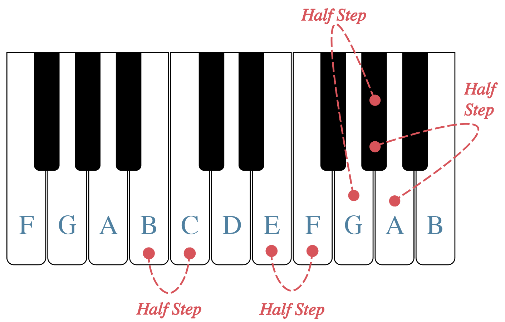
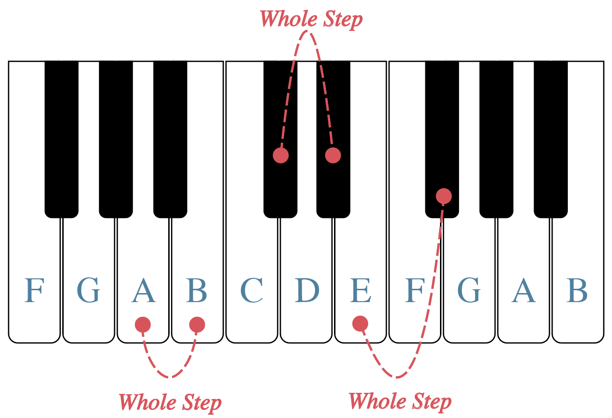
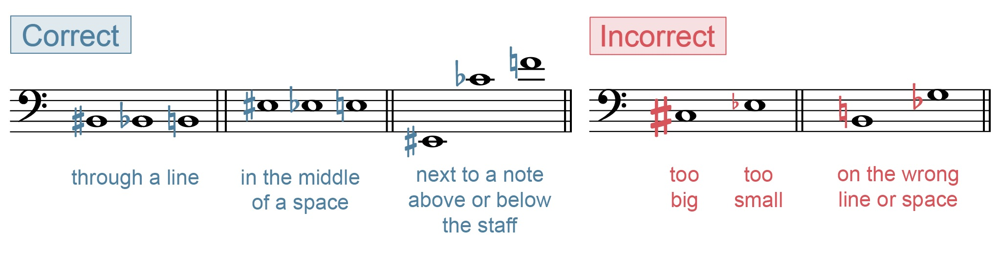
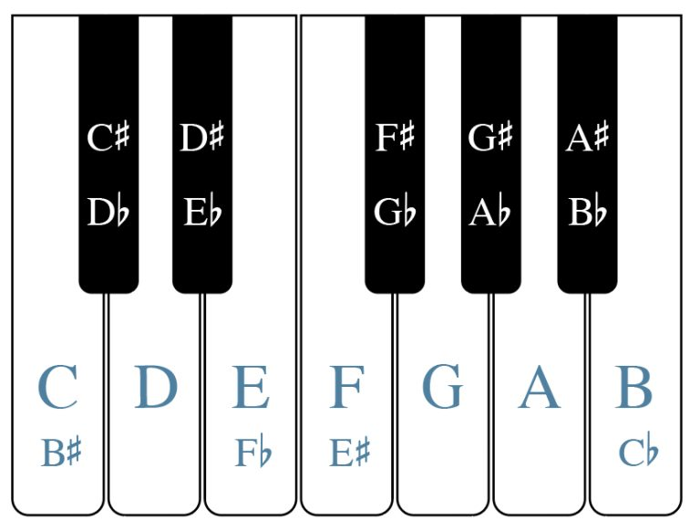
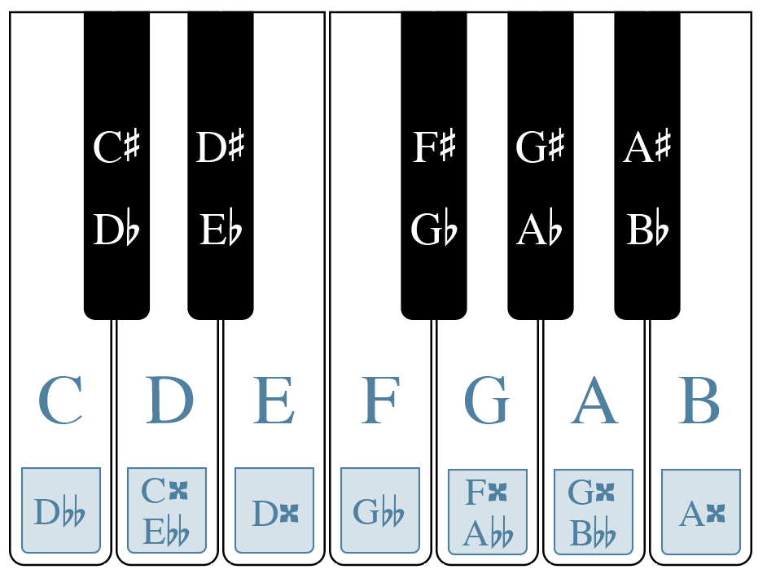

# Полутоны, тоны и знаки альтерации

**Автор: Chelsey Hamm.**

> **Черновик перевода.** Источник — [OMT2, Nebraska, Fall 2023](https://pressbooks.nebraska.edu/openmusictheory/chapter/half-and-whole-steps/). С текущей редакцией VIVA не сверено. Перевод — участники Open Music Theory RU. [CC BY-SA 4.0](https://creativecommons.org/licenses/by-sa/4.0/).

## Главное

- **Полутон** вверх на клавиатуре — переход к ближайшей клавише справа; полутон вниз — к ближайшей слева. Учитываются и белые, и чёрные клавиши.
- **Тон** равен двум полутонам: это два перехода к соседним клавишам вправо или влево.
- **Диез** повышает ноту на полутон, **бемоль** понижает на полутон. **Бекар** отменяет действие знака альтерации и возвращает основной, неизменённый звук.
- **Дубль-диез** повышает ноту на тон, **дубль-бемоль** понижает на тон.
- Знак альтерации пишут **слева от ноты**, на соответствующей ей линейке или в промежутке.
- Разные названия и способы записи одного звучания называются **энгармонически равными**.

В [предыдущей главе](04-keyboard-grand-staff.md) мы изучили названия белых клавиш и увидели чередование групп из двух и трёх чёрных. Прежде чем назвать чёрные клавиши, познакомимся с полутонами и тонами.

## Полутоны и тоны

**Полутон** (*half step*) в рассматриваемой системе — наименьшее расстояние между двумя соседними высотами. В примере 1 на клавиатуре подписаны белые клавиши и отмечены некоторые полутоны.

> **Примечание переводчиков.** Здесь речь об обычной клавиатуре с двенадцатью равномерно темперированными звуками в октаве: полутон составляет 1/12 октавы. Это не утверждение, что в западной музыке вообще не бывает меньших интервалов; микротоновая музыка выходит за рамки этой главы.

Для большинства белых клавиш ближайшая клавиша на полутон выше — чёрная справа, а на полутон ниже — чёрная слева. Например, чёрная клавиша между соль (G) и ля (A) на полутон выше соль и на полутон ниже ля.

Между **ми и фа (E–F)**, а также **си и до (B–C)** чёрных клавиш нет: расстояние между этими белыми клавишами уже равно полутону. Группировка чёрных клавиш по две и по три помогает быстрее ориентироваться и зрением, и на ощупь.

<figure id="example-1">

<figcaption>Пример 1. На клавиатуре отмечены некоторые полутоны.</figcaption>
</figure>

**Тон** (*whole step*) равен двум полутонам. Некоторые тоны отмечены в примере 2. Между парами белых клавиш ля–си, до–ре, ре–ми, фа–соль и соль–ля находится по одной чёрной клавише; каждая такая пара образует тон.

Чтобы найти звук на тон выше ми или си, сделайте два последовательных перехода к соседней клавише вправо, учитывая оба цвета. От ми вы придёте к чёрной клавише справа от фа, от си — к чёрной справа от до. Аналогично, на тон ниже до находится чёрная клавиша слева от си, а на тон ниже фа — чёрная слева от ми.

От чёрной клавиши также отсчитывают два соседних перехода вправо или влево. Например, на тон выше чёрной клавиши справа от до находится чёрная клавиша справа от ре. На тон ниже чёрной клавиши слева от си — чёрная клавиша слева от ля.

<figure id="example-2">

<figcaption>Пример 2. На клавиатуре отмечены некоторые тоны.</figcaption>
</figure>

Как звучат полутон и тон? В коротком видео примера 3 это демонстрирует Chelsey Hamm из Университета Кристофера Ньюпорта.

<iframe src="https://www.youtube.com/embed/a2q0xBYo4Z0?rel=0" title="Пример 3. Chelsey Hamm: звучание полутона и тона; видео на английском" loading="lazy" allowfullscreen></iframe>

*Пример 3. Звучание полутона и тона.* [Открыть видео на YouTube](https://www.youtube.com/watch?v=a2q0xBYo4Z0), если встроенный проигрыватель недоступен. Видео на английском языке.

## Диезы, бемоли и бекары

**Знак альтерации** (*accidental*) изменяет высоту записанной ноты.

| Знак | Название | Действие |
|---|---|---|
| ♯ | Диез (*sharp*) | Повышает основной звук на полутон |
| ♭ | Бемоль (*flat*) | Понижает основной звук на полутон |
| ♮ | Бекар (*natural*) | Возвращает основной звук без повышения или понижения |
| 𝄪 | Дубль-диез (*double sharp*) | Повышает основной звук на два полутона, то есть на тон |
| 𝄫 | Дубль-бемоль (*double flat*) | Понижает основной звук на два полутона, то есть на тон |

Диез похож на наклонный знак решётки, бемоль — на наклонную строчную латинскую *b*. Бекар напоминает наклонную рамку с продолжениями вверх слева и вниз справа. Диез, бемоль и бекар — наиболее распространённые знаки альтерации.

Знак всегда ставят **слева от головки**, независимо от направления штиля. Он должен находиться на той же линейке или в том же промежутке, что и нота. В примере 4 показаны правильные и неправильные варианты: знак не должен быть слишком большим или маленьким либо относиться к соседней линейке или промежутку.

<figure id="example-4">

<figcaption>Пример 4. Правильное и неправильное расположение знаков альтерации.</figcaption>
</figure>

> **Примечание переводчиков.** Повышение и понижение в таблице отсчитываются от основной ноты с данным названием. Дубль-диез у фа означает фа, повышенное на тон, а не дополнительный тон поверх уже повышенного фа-диез. Бекар отменяет и двойную альтерацию полностью, возвращая основной звук.

## Чёрные клавиши фортепиано

В примере 5 подписаны чёрные клавиши. Если чёрная клавиша на полутон выше белой, к названию белой добавляют **«диез»**. Например, клавиша справа от до называется **до-диез (C♯)**. Если чёрная клавиша на полутон ниже белой, к её названию добавляют **«бемоль»**. Та же клавиша, расположенная слева от ре, называется **ре-бемоль (D♭)**.

<figure id="example-5">

<figcaption>Пример 5. Названия чёрных клавиш и некоторые энгармонические названия белых.</figcaption>
</figure>

Названия с диезом или бемолем могут относиться и к белым клавишам. Фа можно обозначить как ми-диез (E♯), а ми — как фа-бемоль (F♭). До соответствует си-диез (B♯), а си — до-бемоль (C♭).

В примере 6 приведены также некоторые двойные знаки. Дубль-диез повышает на два полутона: **ре-дубль-диез (D𝄪)** звучит как ми, **ми-дубль-диез (E𝄪)** — как фа-диез или соль-бемоль. Дубль-бемоль понижает на два полутона: **ля-дубль-бемоль (A𝄫)** звучит как соль, **до-дубль-бемоль (C𝄫)** — как си-бемоль или ля-диез.

<figure id="example-6">

<figcaption>Пример 6. Двойные знаки альтерации на клавиатуре.</figcaption>
</figure>

## Энгармоническое равенство

У каждой клавиши есть больше одного названия. Когда ноты **записаны по-разному, но звучат одинаково**, говорят об **энгармоническом равенстве** (*enharmonic equivalence*).

Например, до-диез (C♯) и ре-бемоль (D♭) энгармонически равны — это видно в примерах 5 и 6. В примере 6 нота ре (D) также энгармонически равна до-дубль-диез (C𝄪) и ми-дубль-бемоль (E𝄫). Все три названия соответствуют нажатию одной клавиши и одной высоте звука.

> **Примечание переводчиков.** Это равенство относится к звучанию на рассматриваемой равномерно темперированной клавиатуре. Разное написание сохраняет музыкальный смысл: оно может показывать разные ступени, интервалы и гармонические функции. В других строях такие высоты не обязательно совпадают. При записи с номером октавы также учитывайте смену номера на до: например, B♯3 звучит как C4, а C♭4 — как B3.

## Дополнительные материалы

Все ссылки ниже ведут на англоязычные материалы исходной главы. Рабочие листы пока не переведены; доступность внешних ресурсов может меняться.

- [Полутоны и тоны — Music Theory Fundamentals](http://musictheoryfundamentals.com/MusicTheory/intervals_part1.php)
- [Полутоны, тоны и знаки альтерации — musictheory.net](https://www.musictheory.net/lessons/20)
- [Игра: полутоны, тоны и знаки альтерации — drawmusic.com](http://www.drawmusic.com/music-theory/steps-game)
- [Знаки альтерации — mymusictheory.com](https://www.mymusictheory.com/learn-music-theory/for-students/grade-1/grade-1-course/125-3-accidentals)
- [Чёрные клавиши фортепиано — musicradar.com](https://www.musicradar.com/how-to/learn-the-black-keys-on-the-piano)
- [Упражнения на клавиатуре — musictheory.net](https://www.musictheory.net/exercises/keyboard/999d)
- [Игра на сопоставление названий клавиш — Quizlet](https://quizlet.com/23438150/match)
- [Карточки с названиями клавиш — Quizlet](https://quizlet.com/23438150/all-keys-on-piano-keyboard-flash-cards/)
- [Энгармоническое равенство — The Music Notation Project](http://musicnotation.org/tutorials/enharmonic-equivalents/)

## Упражнения из внешних источников

- Полутоны и тоны на клавиатуре и на нотном стане: [PDF](http://static1.1.sqspcdn.com/static/f/801966/23104230/1373756418073/Music-Theory-Worksheet-18-Whole-Half-Stepsv2.pdf?token=GZEUx18WdVeYh2GuEgy70sWCvzI%3D).
- Полутоны и тоны на нотном стане: [PDF](http://people.wku.edu/michael.kallstrom/4.%20half%20and%20whole%20steps%20worksheet.pdf).
- Запись и определение нот со знаками альтерации: [PDF — с. 1](http://jkornfeld.net/complete_exercises.pdf), [PDF — с. 9–11](http://www.mypiano.com.au/uploads/1/5/5/7/15579660/theory_worksheets_complete.pdf).
- Сопоставление клавиатуры и нотной записи: [PDF](http://colorinmypiano.com/wp-content/files/Staff_to_Keyboard_Matching_-_digital_worksheet.pdf).
- Энгармоническое равенство: [PDF — с. 3](http://jkornfeld.net/complete_exercises.pdf), [PDF](https://mymission.lamission.edu/userdata/wentzj/docs/Enharmonics%20Worksheet.pdf).

## Задания

- Чёрные клавиши фортепиано: [PDF](https://pressbooks.nebraska.edu/app/uploads/sites/379/2023/09/WK-Half-and-Whole-Steps-and-Accidentals-1-11.pdf), [DOCX](https://pressbooks.nebraska.edu/app/uploads/sites/379/2023/09/WK-Half-and-Whole-Steps-and-Accidentals-1-11.docx).
- Полутоны и тоны на клавиатуре: [PDF](https://pressbooks.nebraska.edu/app/uploads/sites/379/2023/09/WK-Half-and-Whole-Steps-and-Accidentals-2-1-v2.pdf), [DOCX](https://pressbooks.nebraska.edu/app/uploads/sites/379/2023/09/WK-Half-and-Whole-Steps-and-Accidentals-2-1.docx).
- Запись знаков альтерации: [PDF](https://pressbooks.nebraska.edu/app/uploads/sites/379/2023/09/WK-Half-and-Whole-Steps-and-Accidentals-3-1.pdf), [DOCX](https://pressbooks.nebraska.edu/app/uploads/sites/379/2023/09/WK-Half-and-Whole-Steps-and-Accidentals-3-1.docx).
- Запись и определение знаков альтерации: [PDF](https://pressbooks.nebraska.edu/app/uploads/sites/379/2023/09/WK-Accidentals-2.pdf), [DOCX](https://pressbooks.nebraska.edu/app/uploads/sites/379/2023/09/WK-Accidentals-2.docx).
- Полутоны и тоны на нотном стане: [PDF](https://pressbooks.nebraska.edu/app/uploads/sites/379/2023/09/WK-Half-and-Whole-Steps-and-Accidentals-5-1.pdf), [DOCX](https://pressbooks.nebraska.edu/app/uploads/sites/379/2023/09/WK-Half-and-Whole-Steps-and-Accidentals-5.docx).
- Энгармоническое равенство: [PDF](https://pressbooks.nebraska.edu/app/uploads/sites/379/2023/09/WK-Half-and-Whole-Steps-and-Accidentals-6-1.pdf), [DOCX](https://pressbooks.nebraska.edu/app/uploads/sites/379/2023/09/WK-Half-and-Whole-Steps-and-Accidentals-6-1.docx).

---

Иллюстрации: Chelsey Hamm / Open Music Theory, адаптация Nebraska Fall 2023, CC BY-SA 4.0. Пять рисунков сохранены локально без изменения; подписи и текстовые описания переведены. Видео Chelsey Hamm размещено на YouTube и не включено в лицензию нашего перевода.
