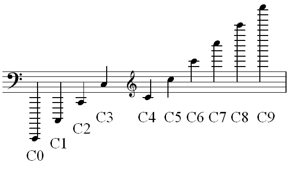
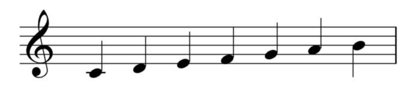
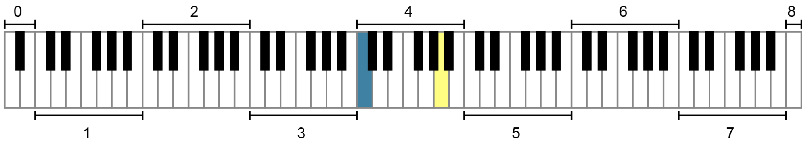

# 6. Американская стандартная система обозначения высоты звука (ASPN)

> **Черновик перевода.** Авторы главы: Chelsey Hamm и Bryn Hughes. Источник — [OMT2, Nebraska, Fall 2023](https://pressbooks.nebraska.edu/openmusictheory/chapter/aspn/). С текущей редакцией VIVA не сверено. Перевод — участники Open Music Theory RU. [CC BY-SA 4.0](https://creativecommons.org/licenses/by-sa/4.0/).

## Главное

- **Американская стандартная система обозначения высоты звука** (*American Standard Pitch Notation*, **ASPN**) обозначает конкретные музыкальные частоты, соединяя название ноты, например C, с номером октавы в нижнем индексе, например 4: C₄.
- **Высота звука** (*pitch*) здесь означает отдельный звук с определённой частотой, например C₄. **Высотный класс** (*pitch class*) — менее конкретное понятие: например, до (C) без указания октавы.
- ASPN различает **октавы** от до до си (C–B). Их нумеруют от низких к высоким, начиная с 0 и далее по порядку: 1, 2 и так далее.
- На фортепианной клавиатуре представлены главным образом октавы с номерами от 1 до 7, а также небольшие части октав 0 и 8.
- **До первой октавы** (*middle C*, `C4`) в ASPN обозначается C₄. Полезно запомнить это обозначение как отправную точку.

## ASPN: высота звука и высотный класс

Чтобы говорить о конкретных нотах, то есть о конкретных **высотах звука**, мы будем использовать американскую стандартную систему обозначения высоты звука, сокращённо **ASPN**. Она соединяет название ноты, например C, с номером **октавы** в нижнем индексе, например 4. Получается обозначение из двух частей: C₄. Такая запись очень удобна: ею можно обозначить любую музыкальную ноту в пределах человеческого слуха, от самых низких звуков до самых высоких.

В главе [«Чтение ключей»](03-reading-clefs.md) мы познакомились с **октавной эквивалентностью**: это понятие объясняет, почему звуки, отстоящие друг от друга на одну или несколько октав, имеют одно и то же буквенное название. В теории музыки различают **высоту звука** — отдельный звук с определённой частотой, например C₄ в ASPN, — и **высотный класс**, менее конкретное понятие, например до (C) вообще. В высотный класс входят одноимённые звуки в любых октавах, а также их энгармонические эквиваленты. Например, все до принадлежат одному высотному классу; энгармонически равные им ре-дубль-бемоль (D𝄫) и си-диез (B♯) тоже относятся к высотному классу до. В этой главе мы будем обозначать с помощью ASPN конкретные высоты звука.

## ASPN и обозначения октав

ASPN различает **октавы**, начинающиеся с до (C) и заканчивающиеся си (B). Поэтому новый номер октавы появляется на ноте до, как показано в [примере 1](#example-1). Октавы нумеруют от низких к высоким, начиная с 0 и далее по порядку: 1, 2, 3 и так далее. До первой октавы обозначается C₄ — это полезно запомнить.

<figure id="example-1">

<figcaption>Пример 1. Обозначения октав в ASPN: каждая октава начинается с до (C).</figcaption>
</figure>

Все буквенные названия в пределах одной октавы — до ноты до следующей октавы — получают одинаковый номер. Например, все ноты в [примере 2](#example-2) имеют номер 4: они расположены от C₄ включительно до C₅, не включая C₅. Знаки альтерации у ноты не влияют на её номер в ASPN. Например, B♯₃ и C₄ имеют разные номера октав, хотя энгармонически равны: си-диез по-прежнему относится к нижней из этих двух октав.

> **Примечание переводчиков.** В оригинале сказано, что все ноты примера 2 находятся «выше C₄», хотя сам C₄ тоже включён в пример. Здесь нижняя граница уточнена. Номер относится к буквенной записи ноты, а не просто к её звучанию: B♯₃ сохраняет номер ноты B₃, даже когда звучит как C₄. Цифра 4 в ASPN соответствует русской **первой** октаве, а не четвёртой; см. [правила обозначений](../translation-notes.md#Нумерация-октав).

<figure id="example-2">

<figcaption>Пример 2. Ноты C₄, D₄, E₄, F₄, G₄, A₄ и B₄.</figcaption>
</figure>

## ASPN и клавиатура

Обозначения ASPN очень удобны для поиска конкретных нот на фортепианной клавиатуре. В [примере 3](#example-3) показана клавиатура с номерами октав по системе ASPN. Как видите, клавиатура охватывает полные октавы с номерами от 1 до 7, а также небольшие части октав 0 и 8. Обозначения ASPN одинаковы для любых инструментов и типов голосов. Иными словами, C₄ всегда обозначается как C₄, независимо от того, исполняется ли этот звук на флейте, тромбоне, скрипке или голосом.

<figure id="example-3">

<figcaption>Пример 3. Фортепианная клавиатура с обозначениями октав в ASPN. Обе выделенные цветом ноты — синяя и жёлтая — относятся к октаве с номером 4.</figcaption>
</figure>

## ASPN и нотная запись

В [примере 4](#example-4) приведены обозначения ASPN для часто встречающихся нот в скрипичном, басовом, альтовом и теноровом ключах. Если запомнить положение C₄ в каждом ключе, находить обозначения ASPN будет быстрее и легче.

<iframe src="https://musescore.com/user/32728834/scores/8395191/s/5sFqPN/embed" title="Пример 4. Обозначения нот в ASPN в четырёх ключах — MuseScore" width="100%" height="440" loading="lazy" allowfullscreen></iframe>

<a href="https://musescore.com/user/32728834/scores/8395191/s/5sFqPN">Открыть пример 4 в MuseScore</a> — если плеер не загрузился или нужен полноэкранный просмотр.

Плеер загружается с MuseScore и требует подключения к интернету. Нотный пример оставлен на языке оригинала.

*Пример 4. Обозначения нот в ASPN в четырёх ключах.*

> **Примечание переводчиков.** В английском снимке пример 4 представлен внешней ссылкой. Материал оставлен на английском, не локализован; его содержимое, доступность и воспроизведение не проверены. Подпись переведена, но она не заменяет сам нотный пример.

## Определения из оригинала

В оригинале эти шесть определений открываются во всплывающих подсказках; здесь они собраны в одном месте.

- **Американская стандартная система обозначения высоты звука (ASPN)** обозначает конкретные музыкальные частоты, соединяя название ноты, например C, с номером октавы, например 4. Получается обозначение из двух частей: C₄.
- **Высота звука (*pitch*)** — отдельный звук с определённой частотой.
- **Высотный класс (*pitch class*)** — группа высот, объединённых октавной эквивалентностью и энгармоническим равенством.
- **Октава (*octave*)** — интервал в двенадцать полутонов между двумя нотами с одним и тем же буквенным названием. Частоты звуков, отстоящих на октаву, относятся как 2:1. Английское сокращение — «8ve».
- **До первой октавы (*middle C*)** — C₄, нота до вблизи середины фортепианной клавиатуры. Записывается на первой добавочной линейке под нотным станом в скрипичном ключе или на первой добавочной линейке над станом в басовом ключе.
- **Октавная эквивалентность (*octave equivalence*)** — отношение между звуками с одним буквенным названием, отстоящими друг от друга на одну или несколько октав.

## Дополнительные материалы

Все материалы ниже оставлены на английском языке. Названия ссылок переведены; содержимое, доступность, воспроизведение видео и работа карточек не проверены.

- [«Высоты звука, высотные классы, обозначения октав, энгармоническое равенство» — YouTube](https://www.youtube.com/watch?v=_z3b5fSDimI).
- [Объяснение обозначений октав в ASPN — liveabout.com](https://www.liveabout.com/pitch-notation-and-octave-naming-2701389).
- [Объяснение обозначений октав в ASPN — flutopedia.com](https://www.flutopedia.com/octave_notation.htm).
- [Схема обозначений ASPN на объединённом нотном стане и клавиатуре — Music Theory Tips](https://musictheorytutoring.weebly.com/octave-identification.html).
- [Карточки с обозначениями ASPN в скрипичном и басовом ключах — Quizlet](https://quizlet.com/178381719/write).

## Упражнения из внешних источников

Рабочие листы оставлены на английском языке и не переведены. Их содержимое и доступность не проверены.

- **A. Обозначения ASPN и нотная запись:** [PDF](https://www2.lawrence.edu/fast/BIRINGEG/media/theory_funds/pdf/ws01-pitch_notation.pdf).
- **B. Обозначения ASPN, с. 23, 27 и 28:** [PDF](https://he.kendallhunt.com/sites/default/files/uploadedFiles/Kendall_Hunt/Content/Higher_Education/Uploads/Gerhold_2e_Chapter1.pdf).

## Задания

Рабочий лист оставлен на английском языке и не переведён. Его содержимое и доступность не проверены.

1. Запись и определение обозначений ASPN: [PDF](https://pressbooks.nebraska.edu/app/uploads/sites/379/2023/09/WK-American-Standard-Pitch-Notation-ASPN-1.pdf), [DOCX](https://pressbooks.nebraska.edu/app/uploads/sites/379/2023/09/WK-American-Standard-Pitch-Notation-ASPN-1.docx).

---

Иллюстрации 1–3: Open Music Theory, адаптация Nebraska Fall 2023. Подписи и alt-текст переведены; надписи внутри изображений сохранены без изменения. Лицензия страницы — CC BY-SA 4.0 с оговоркой об отдельно отмеченных материалах; индивидуальная проверка прав на иллюстрации не завершена. Внешние материалы MuseScore, YouTube, Quizlet и рабочие листы не включаются автоматически в лицензию перевода.
