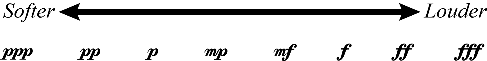
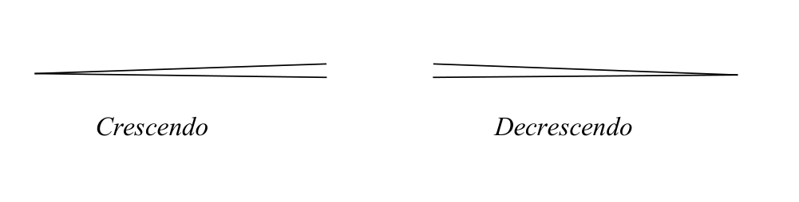
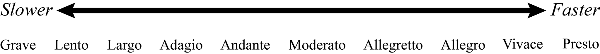
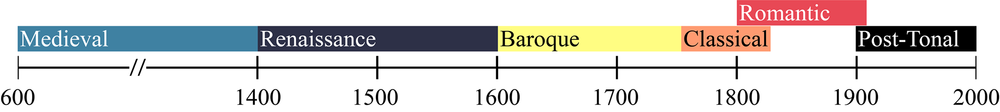

# Другие элементы музыкальной нотации

**Авторы: Chelsey Hamm и Mark Gotham.**

> **Черновик перевода.** Источник — [OMT2, Nebraska, Fall 2023](https://pressbooks.nebraska.edu/openmusictheory/chapter/other-aspects-of-notation/). С текущей редакцией VIVA не сверено. Перевод — участники Open Music Theory RU. [CC BY-SA 4.0](https://creativecommons.org/licenses/by-sa/4.0/).

## Главное

- **Динамика** указывает громкость музыки. В западной музыкальной нотации для этого используют различные итальянские слова.
- **Крещендо** означает усиление громкости, а **декрещендо** или **диминуэндо** — её ослабление.
- **Артикуляция** описывает связность или раздельность звуков, а также степень акцентирования начала звука — его **атаки**.
- Указание **темпа** сообщает музыканту, насколько быстро или медленно следует играть или петь произведение.
- Музыканты делят историю музыки на периоды; полезно запомнить основные из них. Произведения одного периода обычно имеют сходные стилевые черты.
- **Структурные обозначения** помогают членить произведение или его часть на более мелкие разделы.

В этой главе мы рассмотрим элементы музыки помимо высоты звука, о которой шла речь в предыдущих главах, и длительности, которой посвящены следующие главы: динамику, артикуляцию, темп, стилевые периоды и структурные обозначения.

## Динамика

**Динамика** (*dynamics*) указывает громкость музыки. В западной нотации её часто обозначают итальянскими словами, набранными курсивом; эти слова могут сокращаться. Динамическое обозначение *forte* означает «громко», а *piano* — «тихо». В нотах их помещают над нотным станом или под ним.

Несколько итальянских слов и суффиксов изменяют значения *piano* и *forte*, образуя диапазон от очень тихой до очень громкой динамики ([пример 1](#example-1)). Итальянское *mezzo* означает «умеренно»: *mezzo forte* — умеренно громко, а *mezzo piano* — умеренно тихо. Суффикс *-issimo* означает «очень» или «чрезвычайно»: *pianissimo* — очень тихо, *fortissimo* — очень громко. Суффикс можно наращивать: *pianississimo* означает «очень-очень тихо», а *fortississimo* — «очень-очень громко».

<figure id="example-1">

<figcaption>Пример 1. Динамические обозначения от самого тихого к самому громкому. Английские подписи: Softer — тише, Louder — громче.</figcaption>
</figure>

В западной нотации динамические указания часто сокращают следующим образом:

| Сокращение | Полное обозначение |
|---|---|
| *fff* | *fortississimo* |
| *ff* | *fortissimo* |
| *f* | *forte* |
| *mf* | *mezzo forte* |
| *mp* | *mezzo piano* |
| *p* | *piano* |
| *pp* | *pianissimo* |
| *ppp* | *pianississimo* |

Некоторые композиторы добавляют ещё больше *-issimo*, хотя это бывает редко. Возможно, в музыке, которую вы играете или поёте, вам однажды встретятся *pppppp* или *ffffff*!

Ещё три итальянских слова часто обозначают изменение громкости. **Крещендо** (*crescendo*, *cresc.*) означает постепенное усиление, а **декрещендо** (*decrescendo*, *decresc.*) и **диминуэндо** (*diminuendo*, *dim.*) — постепенное ослабление громкости. Крещендо и декрещендо обозначают двумя способами: сокращением *cresc.* или *decresc.*, за которым могут следовать точки, либо **вилочками** (*hairpins*). Английское название *hairpin* буквально означает «шпилька»: эти знаки отдалённо напоминают её форму ([пример 2](#example-2)).

<figure id="example-2">

<figcaption>Пример 2. Крещендо и декрещендо, обозначенные вилочками.</figcaption>
</figure>

## Артикуляция

**Артикуляция** (*articulation*) — это связность или раздельность звуков и степень акцентирования их начала, то есть **атаки** (*attack*). Несколько видов артикуляции рассматриваются в примерах 3–7. Ударные, щипковые струнные, смычковые струнные, деревянные и медные духовые инструменты, а также певческий голос имеют разные способы выполнения конкретных атак и приёмов артикуляции. Обратитесь к своему преподавателю или руководителю ансамбля за помощью в их применении к вашему инструменту или голосу.

> **Ограничение материалов.** В сохранённой редакции источника для примеров 3–7 есть приведённые ниже пояснения, но нет самих нотных рисунков или ссылок на них. Здесь сохранены пояснения и номера; отсутствующие партитуры не реконструировались.

**Пример 3. Легато.** **Легато** (*legato*) означает плавное, связное исполнение. Этот вид артикуляции обозначают изогнутой **лигой легато** (*slur*).

**Пример 4. Тенуто.** Ещё один способ указать на плавное, связное исполнение — знаки *tenuto*: короткие горизонтальные чёрточки над нотами или под ними.

> **Примечание переводчиков.** В источнике *tenuto* здесь представлено как способ указать связное исполнение. Это упрощение: основной смысл тенуто — выдержать звук в его полной длительности; в зависимости от контекста возможен и оттенок подчёркивания. Тенуто не является синонимом легато.

**Пример 5. Стаккато.** **Стаккато** (*staccato*) означает более раздельное исполнение, с промежутками между звуками. Обычно его обозначают точкой над нотой или под ней.

**Пример 6. Акцент.** **Акцент** (*accent*), обозначаемый знаком в виде повёрнутой набок буквы V, требует дополнительного выделения звука при игре или пении.

**Пример 7. Маркато.** Знак **маркато** (*marcato*) в форме перевёрнутой буквы V требует более сильного акцента.

Акцентированные ноты могут также обозначаться курсивными сокращениями *sfz*, *sf* или *fz* (*sforzando*, *forzando* или *forzato*). Обычно их трактуют как несколько более сильные, то есть более громкие, чем обычные акценты. Эти знаки действуют подобно динамическим обозначениям и ставятся непосредственно над той нотой или под той нотой, к которой относятся.

## Темп

**Темп** (*tempo*; итальянское множественное число — *tempi*) — это скорость исполнения произведения. Обычно его задают либо точно, **метрономическим обозначением** (*metronome marking*), либо менее точно — словесным указанием. Метрономическое обозначение обычно выражают числом долей в минуту (*beats per minute*, *bpm*). При ♩ = 60 за минуту проходят 60 четвертных длительностей, то есть одна четверть в секунду. Бесплатное приложение-метроном на телефоне, например [Pro Metronome](http://eumlab.com/pro-metronome/), позволяет проверить темп произведения, которое вы играете или поёте.

Подобно динамическим указаниям, большинство темповых обозначений пишут по-итальянски. Обычно они стоят в начале произведения, части или раздела, слева над первым нотным станом или системой. Вот наиболее распространённые обозначения:

- Быстрые темпы: *vivace*, *presto*, *allegro*, *allegretto*; итальянский суффикс *-etto* имеет уменьшительное значение.
- Умеренные темпы: *moderato*, *andante*.
- Медленные темпы: *adagio*, *largo*, *lento*, *grave*.

В [примере 8](#example-8) темпы расположены от самого медленного к самому быстрому.

<figure id="example-8">

<figcaption>Пример 8. Темпы от самого медленного к самому быстрому. Английские подписи: Slower — медленнее, Faster — быстрее.</figcaption>
</figure>

Композиторы иногда уточняют темп дополнительными итальянскими словами, особенно обозначениями характера исполнения. Такие слова, как *assai* («очень» или «довольно»), *espressivo* («выразительно») и *cantabile* («певуче»), часто следуют за темповым указанием, особенно в произведениях, написанных после 1800 года. Например, можно встретить *allegro assai* («очень быстро»), *andante cantabile* («в умеренном темпе, певуче») или *adagio espressivo* («медленно и выразительно»). Обязательно выясняйте значение незнакомых слов в исполняемой музыке.

Ещё два итальянских слова часто обозначают изменение темпа: **ритардандо** (*ritardando*, *rit.*) — постепенное замедление, **аччелерандо** (*accelerando*, *accel.*) — постепенное ускорение. Обычно эти слова набирают курсивом и часто сокращают до *rit.* и *accel.* соответственно. Если указание действует на протяжении нескольких тактов, после него нередко ставят ряд точек, который продолжается до конца действия указания.

## Структурные обозначения

Следующие слова и знаки указывают на **структурные особенности** (*structural features*) произведения. Они помогают разделить произведение или его часть на более мелкие разделы.

> **Ограничение материалов.** Для примеров 9–11 в сохранённом источнике есть только следующие пояснения; нотные рисунки и ссылки на них отсутствуют.

**Пример 9. Фермата.** **Фермата** (*fermata*, 𝄐) указывает, что ноту следует выдержать дольше её обычной длительности. Ферматы часто встречаются в начале или в конце музыкального раздела.

**Пример 10. Цезура.** **Цезура** (*caesura*) обозначает перерыв или прекращение звучания.

**Пример 11. Знак дыхания.** **Знак дыхания** (*breath mark*) указывает духовикам и вокалистам место для вдоха. Для исполнителей на ударных, клавишных или струнных инструментах он означает паузу, по длительности сопоставимую со вдохом.

**Знаки репризы** (*repeat signs*, 𝄆 и 𝄇) указывают, что раздел музыки нужно повторить ([пример 12](#example-12)). Если при повторении раздел заканчивается иначе, это обозначают первой и второй вольтами ([пример 13](#example-13)).

**Пример 12. Четыре ноты в басовом ключе между знаками репризы.** [Открыть оригинальный нотный пример в MuseScore](https://musescore.com/user/32728834/scores/6275123/embed). Внешний материал не локализован; его содержимое и воспроизведение в этом проходе не проверены. Описание переведено из подписи источника.

**Пример 13. Знак репризы с первой и второй вольтами в скрипичном ключе.** [Открыть оригинальный нотный пример в MuseScore](https://musescore.com/user/32728834/scores/6275124/embed). Внешний материал не локализован; его содержимое и воспроизведение в этом проходе не проверены. Описание переведено из подписи источника.

Иногда встречается музыка более чем с двумя окончаниями повторяемого раздела. Третьи и даже четвёртые вольты обычны для некоторых жанров, например бродвейских мюзиклов. Они действуют так же, как первая и вторая: третью вольту исполняют при третьем проведении раздела, четвёртую — при четвёртом и так далее.

> **Примечание переводчиков.** Английское «after the third time the section is repeated» допускает двусмысленность в счёте. Здесь номер вольты соотнесён с номером проведения раздела, включая первое исполнение, а не с числом дополнительных повторов после него.

## Стилевые периоды

В начале изучения теории музыки полезно познакомиться с тем, как теоретики и **музыковеды** (*musicologists*, исследователи музыки) **периодизируют** (*periodize*) историю западной классической музыки, то есть делят её на периоды. Их границы условны, но общая схема, позволяющая объединять произведения со сходными стилевыми чертами, полезна музыкантам.

Согласно источнику, большинство музыковедов в целом придерживается следующих периодов, представленных в [примере 14](#example-14):

| Период | Приблизительные даты |
|---|---|
| Средневековье (*Medieval*) | 600–1400 |
| Возрождение (*Renaissance*) | 1400–1600 |
| Барокко (*Baroque*) | 1600–1750 |
| Классицизм (*Classical*) | 1750–1820 |
| Романтизм (*Romantic*) | 1800–1910 |
| Посттональная музыка (*Post-tonal*) | 1900 — настоящее время |

<figure id="example-14">

<figcaption>Пример 14. Временная шкала с обычно принимаемыми датами музыкальных стилевых периодов. Надписи внутри исходного изображения не переведены; русские названия и даты приведены в таблице выше.</figcaption>
</figure>

> **Примечание переводчиков.** Это учебная схема западной классической музыки из источника, а не универсальная периодизация всей музыки. Даты перекрываются; термин «посттональная музыка» не означает, что после 1900 года вся музыка стала посттональной.

## Определения из всплывающего глоссария источника

Здесь собраны определения, которые в оригинале открываются при нажатии на термины. Они дополняют основной текст; краткость определений сохранена.

| Термин | Определение |
|---|---|
| Динамика (*dynamics*) | Музыкальный термин для громкости. |
| Крещендо (*crescendo*) | Постепенное усиление громкости; иногда обозначается в нотах вилочкой. |
| Декрещендо (*decrescendo*) | Постепенное ослабление громкости; иногда обозначается в нотах вилочкой. |
| Диминуэндо (*diminuendo*) | Постепенное ослабление громкости; декрещендо. |
| Артикуляция (*articulation*) | Относится как к продолжительности звука, так и к степени акцентирования его атаки. |
| Атака (*attack*) | Начало звука, в отличие от последующего поддержания или затухания. |
| Темп (*tempo*) | Скорость исполнения произведения; многие темповые указания написаны по-итальянски или на другом языке, отличном от английского. |
| Периодизировать (*periodize*) | Делить время на отдельные периоды. |
| Структурные особенности (*structural features*) | Особенности музыки, относящиеся к членению на разделы и к форме. |
| *Forte* | Громко. |
| *Piano* | Тихо. |
| *Mezzo* | Умеренно. |
| *-issimo* | Итальянский суффикс со значением «очень». |
| Вилочка (*hairpin*) | Знак крещендо или декрещендо. |
| Легато (*legato*) | Плавное, связное исполнение. |
| Лига легато (*slur*) | Изогнутая линия над нотами, указывающая, что их следует играть или петь без разделения. |
| Стаккато (*staccato*) | Более раздельное исполнение с промежутками между звуками. |
| Маркато (*marcato*) | Исполнение с более сильным акцентом или подчёркиванием. |
| Метрономическое обозначение (*metronome marking*) | Указание темпа в долях в минуту (*BPM*). |
| Ритардандо (*ritardando*) | Постепенное замедление темпа. |
| Аччелерандо (*accelerando*) | Постепенное ускорение темпа. |
| Фермата (*fermata*) | Знак 𝄐, требующий выдержать ноту дольше записанной длительности. |
| Цезура (*caesura*) | Обозначает перерыв и/или прекращение звучания. |
| Знак дыхания (*breath mark*) | Указывает вдох для духовиков и вокалистов или паузу для исполнителей на ударных и струнных инструментах. |
| Знаки репризы (*repeat signs*) | Знаки 𝄆 и 𝄇, указывающие на повторение раздела музыки. |
| Музыковеды (*musicologists*) | Исследователи музыки. |

> **Примечание переводчиков.** Всплывающая запись для акцента в сохранённом оригинале повреждена: вместо определения содержит CSS-код. Ещё одна запись глоссария пуста и не содержит названия термина. Они не воспроизводятся как определения; объяснение акцента сохранено в примере 6.

## Ресурсы в интернете

Материалы ниже оставлены на языке оригинала. Переведены названия ссылок; содержимое и доступность внешних страниц, приложения и заданий в этом проходе не проверены.

- [Урок о динамике — Music Theory Academy](https://www.musictheoryacademy.com/how-to-read-sheet-music/dynamics/).
- [Урок о динамике — Lumen’s Music Appreciation](https://courses.lumenlearning.com/musicappreciation_with_theory/chapter/dynamics-and-dynamics-changes/).
- [Тест по динамике — quizizz.com](https://quizizz.com/admin/quiz/582cdc06d362ea52778e0761/dynamics-quiz).
- [Артикуляция — BBC](https://www.bbc.co.uk/bitesize/guides/zp4d97h/revision/2).
- [Артикуляция — LibreTexts](https://human.libretexts.org/Bookshelves/Music/Understanding_Basic_Music_Theory_(OpenSTAX)/2%3A_Notation/2.3%3A_Style/2.3.2%3A_Articulation).
- [Темп — BBC](https://www.bbc.co.uk/bitesize/guides/zs9wk2p/revision/1).
- [Темп — Music Theory Academy](https://www.musictheoryacademy.com/how-to-read-sheet-music/tempo/).
- [Заметки о периодизации в музыковедении — Oxford History of Western Music](https://www.oxfordwesternmusic.com/view/Volume1/actrade-9780195384819-div1-010008.xml).
- [Исторические эпохи в музыковедении — Naxos](https://www.naxos.com/education/brief_history.asp).
- [Руководство по оформлению нотной записи — Университет Индианы](https://blogs.iu.edu/jsomcomposition/music-notation-style-guide/).

## Задания в интернете

Задания на английском языке; сами рабочие листы не переведены, их доступность и содержимое не проверены.

A. Динамика: с. 13–17 ([PDF — Music Theory Packet, Level 3](https://static1.squarespace.com/static/51c35901e4b039fd32fd4191/t/57fbcc7bb3db2bf57a4d7d5a/1476119676956/Music+Theory+Packet+Level+3.pdf)); с. 2–4, 18 и 22 ([PDF — Musical Terminology](https://www.crsd.org/cms/lib/PA01000188/Centricity/Domain/739/musical-terminology.pdf)).

B. Артикуляция: с. 1 ([PDF — Musical Terminology](https://www.crsd.org/cms/lib/PA01000188/Centricity/Domain/739/musical-terminology.pdf)).

C. Темп: с. 12 и 21 ([PDF — Musical Terminology](https://www.crsd.org/cms/lib/PA01000188/Centricity/Domain/739/musical-terminology.pdf)); с. 13 ([PDF — Rhythm, 6th Grade, Fall 2018](https://www.sgasd.org/cms/lib/PA01001732/Centricity/Domain/172/Rhythm%206th%20-%20Fall%202018.pdf)).

D. Структурные обозначения: с. 9 ([PDF — Musical Terminology](https://www.crsd.org/cms/lib/PA01000188/Centricity/Domain/739/musical-terminology.pdf)).

E. Разные термины: с. 13–17 и 23 ([PDF — Musical Terminology](https://www.crsd.org/cms/lib/PA01000188/Centricity/Domain/739/musical-terminology.pdf)).

## Задания

1. Динамика, артикуляция, темп, стилевые периоды и структурные обозначения: [PDF](https://pressbooks.nebraska.edu/app/uploads/sites/379/2023/09/WK-Other-Aspects-of-Notation-13.pdf), [страница файла DOCX](https://pressbooks.nebraska.edu/openmusictheorymusc165fall2023/wk-other-aspects-of-notation-13-2/). Оригинальный рабочий лист на английском языке; его содержимое, ответы и доступность не проверены, лист не переведён. Ссылка, подписанная в источнике «.docx», ведёт на страницу вложения, а не непосредственно на файл.
