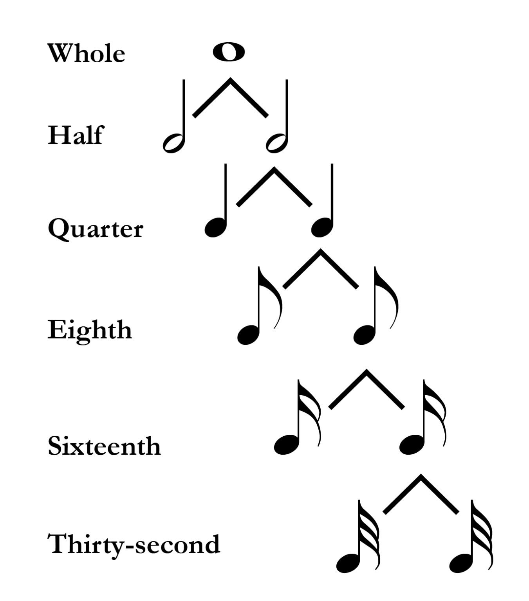
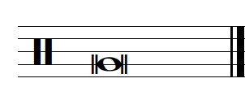
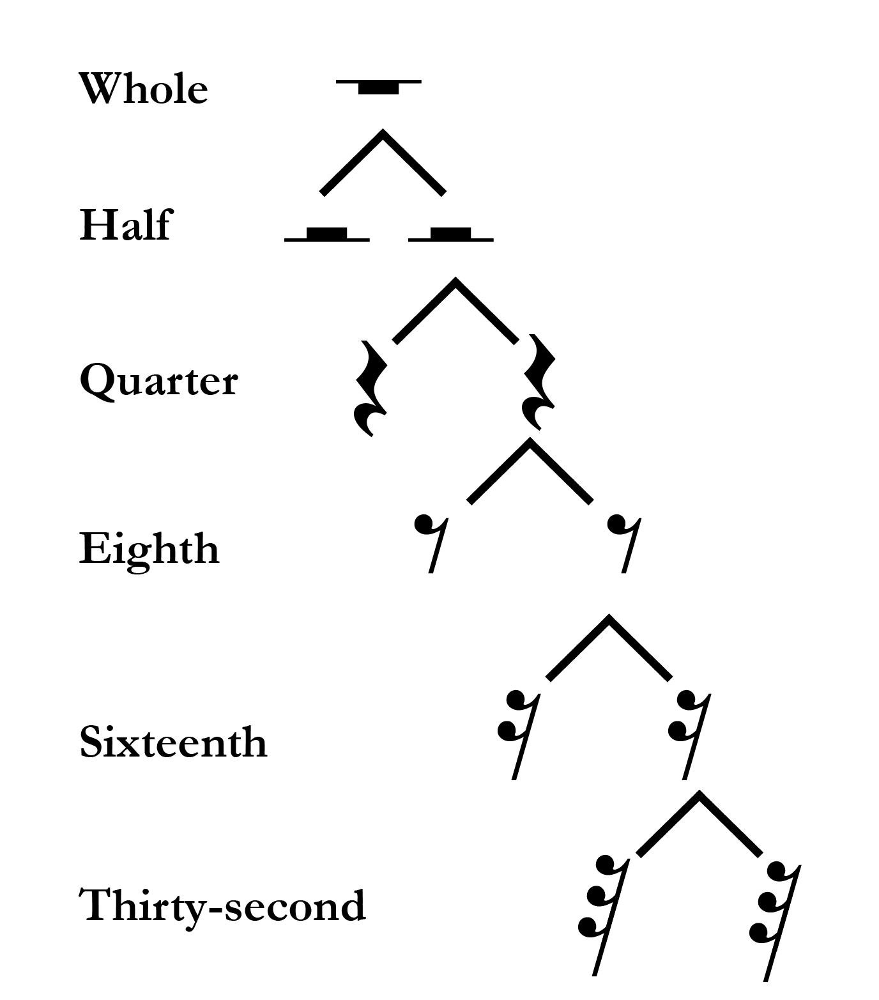
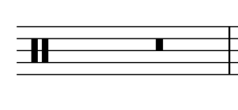
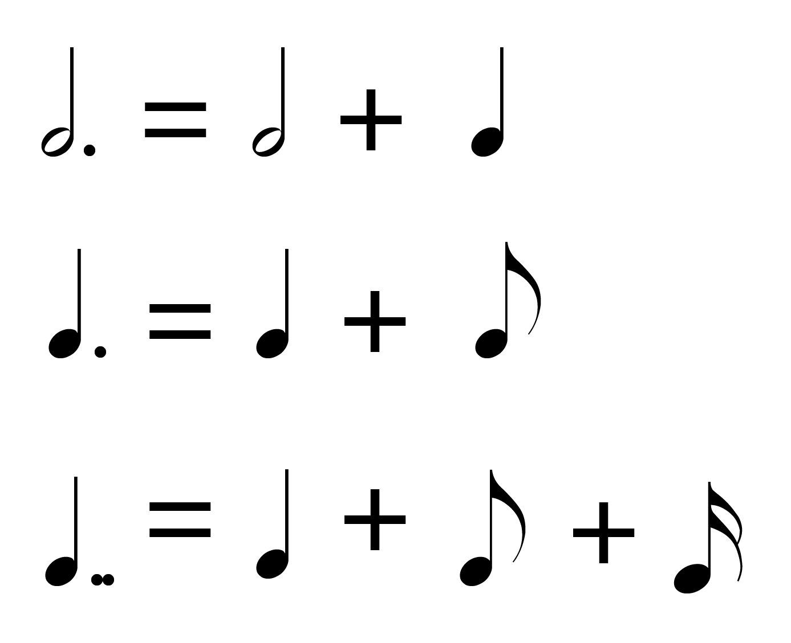

# Длительности нот и пауз

**Авторы: Chelsey Hamm, Mark Gotham и Bryn Hughes.**

> **Черновик перевода.** Источник — [OMT2, Nebraska, Fall 2023](https://pressbooks.nebraska.edu/openmusictheory/chapter/rhythmic-rest-values/), снимок от 20 сентября 2026 года. С текущей редакцией VIVA не сверено. Перевод — участники Open Music Theory RU. [CC BY-SA 4.0](https://creativecommons.org/licenses/by-sa/4.0/).

## Главное

- У **ноты** есть несколько составных частей: **головка**, **штиль**, **вязка** и **флажок**.
- К распространённым длительностям нот относятся **целая**, **половинная**, **четвертная**, **восьмая** и **шестнадцатая**.
- К распространённым длительностям пауз относятся **целая**, **половинная**, **четвертная**, **восьмая** и **шестнадцатая**.
- Британские названия длительностей нот и пауз отличаются от американских.
- **Точка** увеличивает длительность ноты на половину её исходной длительности. Каждая следующая точка добавляет половину длительности, добавленной предыдущей точкой.
- **Соединительная лига** (*tie*) соединяет две или несколько нот одной высоты. После первой ноты остальные не извлекают заново.

Музыка — **временное** искусство: время является одной из её составляющих, поэтому его организация необходима для западной музыкальной нотации. Следующие несколько глав посвящены временной стороне **ритма** и **метра**. В этой главе мы начнём с основных длительностей нот и пауз в данной системе записи.

## Длительности нот

В широком смысле **ритм** (*rhythm*) — это длительности музыкальных звуков и пауз во времени. Как вы помните из главы [«Ноты, ключи и добавочные линейки»](02-notes-clefs.md), нотный знак может состоять из нескольких частей; они показаны в [примере 1](#example-1).

<figure id="example-1">

<figcaption>Пример 1. Головки нот с обозначенными штилями, вязками и флажками.</figcaption>
</figure>

В западной музыкальной нотации существует много распространённых **длительностей нот** (*note values*). Они образуют **иерархию**, то есть определяются относительно друг друга. Каждую длительность можно разделить на две меньшие, как показано в [примере 2](#example-2). Подобно тому как целую пиццу можно разделить на две половины, четыре четверти, восемь восьмых и так далее, целую ноту можно разделить на две половинные, четыре четвертные, восемь восьмых и так далее.

<figure id="example-2">

<figcaption>Пример 2. Соотношения распространённых длительностей нот.</figcaption>
</figure>

Обратите внимание ещё на несколько особенностей [примера 2](#example-2):

- Головки нот бывают закрашенными (чёрными) и незакрашенными (белыми). У четвертных нот и более коротких длительностей головки закрашены.
- У незакрашенной головки может быть штиль, но она может быть и без него; у закрашенной головки штиль есть всегда.
- Флажки добавляют только к штилям нот с закрашенными головками.

Кроме того, есть три способа уменьшить длительность ноты вдвое:

- добавить штиль — превратить целую в половинную;
- закрасить головку — превратить половинную в четвертную;
- добавить флажок — например, превратить четвертную в восьмую или восьмую в шестнадцатую.

В *Open Music Theory* используются преимущественно североамериканские названия длительностей, но полезно знать и британские: ниже они приведены в скобках. Изображения соответствующих нот можно увидеть в [примере 2](#example-2).

- **Целая нота — whole note (британское semibreve):** незакрашенный овал с толстым контуром, без штиля. Во многих современных произведениях это самая длинная из используемых длительностей.
- **Половинная нота — half note (minim):** тоже овал, но с несколько более тонким контуром и со штилем. Её длительность составляет половину целой: две половинные равны одной целой.
- **Четвертная нота — quarter note (crotchet):** похожа на половинную, но её головка закрашена. Её длительность составляет половину половинной и четверть целой: две четвертные равны одной половинной, а четыре четвертные — одной целой.
- **Восьмая нота — eighth note (quaver):** похожа на четвертную, но к её штилю добавлен флажок. Её длительность составляет половину четвертной и одну восьмую целой: две восьмые равны одной четвертной, а восемь восьмых — одной целой.
- **Шестнадцатая нота — sixteenth note (semiquaver):** похожа на восьмую, но имеет ещё один флажок. Её длительность составляет половину восьмой и одну шестнадцатую целой: две шестнадцатые равны одной восьмой, а шестнадцать шестнадцатых — одной целой.

> **Примечание переводчиков.** В этом месте исходный снимок содержит сообщение `[table “74” not found /]`: таблица 74 отсутствует в источнике. Её содержимое не восстановлено и не переведено; приведённый выше перечень соответствует сохранившемуся тексту, а не заменяет неизвестную таблицу.

Длительности короче шестнадцатой — тридцать вторую, шестьдесят четвёртую и так далее — получают, добавляя новые флажки. Вы можете встретить ещё одну, менее распространённую длительность: **двойную целую ноту, или бревис** (*double whole note*; британское *breve*; [пример 3](#example-3)). Иногда её записывают лишь с одной вертикальной чертой по каждую сторону головки. В старых системах записи её головка больше похожа на квадрат, чем на овал. Двойная целая делится на целые: две целые составляют одну двойную целую.

<figure id="example-3">

<figcaption>Пример 3. Двойная целая нота на линейке.</figcaption>
</figure>

## Длительности пауз

В широком смысле **паузы** (*rests*) обозначают длительности молчания в музыке. Каждой длительности ноты в иерархии соответствует длительность паузы, как показано в [примере 4](#example-4). Подобно нотам, каждую длительность паузы можно разделить на две меньшие. Обратите внимание ещё на несколько особенностей [примера 4](#example-4):

- Целая пауза свисает с линейки вниз, а половинная располагается над линейкой. Чтобы это запомнить, представьте, что целая пауза «тяжелее» половинной и поэтому свисает вниз. Половинная пауза похожа на шляпу-цилиндр: можно представить, что она стоит на линейке, как шляпа на голове.
- Потренируйтесь аккуратно рисовать четвертные паузы: многим учащимся это даётся нелегко.
- Добавление флажка к паузе, например превращение восьмой в шестнадцатую, уменьшает её длительность вдвое.

<figure id="example-4">

<figcaption>Пример 4. Соотношения распространённых длительностей пауз.</figcaption>
</figure>

Хотя это редкость, вам может встретиться **двойная целая пауза**, или пауза бревис ([пример 5](#example-5)). По длительности она равна двум целым паузам. Она выглядит как закрашенный прямоугольник и располагается во втором промежутке сверху.

<figure id="example-5">

<figcaption>Пример 5. Двойная целая пауза.</figcaption>
</figure>

## Точки и соединительные лиги

Точки и лиги позволяют увеличивать длительности: точками удлиняют ноты и паузы, а соединительными лигами — звучание нот. **Точку** (*dot*) ставят непосредственно после ноты или паузы; она увеличивает её длительность на половину ([пример 6](#example-6)). Например, четвертная нота равна по длительности двум восьмым, поэтому четвертная с точкой равна *трём* восьмым. Точно так же целая нота равна двум половинным, а целая с точкой — *трём* половинным. К ноте или паузе можно добавить несколько точек; каждая последующая прибавляет половину длительности, добавленной предыдущей. Например, четвертная с двумя точками равна сумме четвертной, восьмой и шестнадцатой. Иными словами, длительность ноты с двумя точками составляет 1¾ исходной длительности.

<figure id="example-6">

<figcaption>Пример 6. Разложение двух нот с точкой и одной ноты с двумя точками на составляющие длительности.</figcaption>
</figure>

**Соединительная лига** (*tie*) — дугообразная линия, соединяющая две или несколько нот одной высоты. Ноты после первой не извлекают заново. Иными словами, лига объединяет длительности нескольких нот. Соединительная лига между первыми двумя нотами в [примере 7](#example-7) означает, что при исполнении этих половинной и четвертной нот четвертную не нужно извлекать отдельно: первый звук следует выдержать в течение трёх четвертей вместо двух. Ту же длительность можно записать половинной нотой с точкой.

[Открыть пример 7 в MuseScore](https://musescore.com/user/32728834/scores/6805289/s/Qwz0ek/embed).

*Пример 7. Соединительная лига связывает первые две ноты.*

> **Примечание переводчиков.** Это внешний нотный пример из оригинала. Он не локализован; его доступность, нотное содержимое и воспроизведение не проверены. Описание выше переведено из текста главы, а не получено путём проверки партитуры.

Вы правы, если заметили, что соединительная лига похожа на **лигу легато** (*slur*; см. [«Другие элементы музыкальной нотации»](07-other-notation.md)). Различие в том, что в данном объяснении лига легато соединяет ноты разной высоты и указывает исполнять их связно, без разрывов, тогда как соединительная лига связывает ноты одной высоты в один звук большей длительности.

> **Примечание переводчиков.** В этом предложении оригинал использует слово *tenuto*, а его всплывающее определение — «исполняется плавно или связно». Здесь переведено описанное источником связное исполнение — легато; ошибочное обозначение *tenuto* не перенесено как синоним. Различие соединительной лиги и лиги легато сохранено. Начальная фраза раздела также уточнена: паузы можно удлинять точками, но соединительные лиги относятся к нотам.

## Определения из всплывающего словаря

В исходной странице следующие определения открываются при выборе терминов. Здесь они собраны в доступные для чтения таблицы.

| Термин | Определение |
|---|---|
| Нота (*note*) | Музыкальный звук, обладающий высотой и ритмической составляющей; его знак может включать штиль, вязку и/или флажок. |
| Головка ноты (*notehead*) | Овальная часть ноты. Бывает закрашенной (чёрной) или контурной (белой). |
| Штиль (*stem*) | Вертикальная линия, начинающаяся у головки ноты; используется для обозначения ритма и голосов. |
| Вязка (*beam*) | Горизонтальные линии, соединяющие определённые группы нот. |
| Флажок (*flag*) | Изогнутая линия на конце штиля. Каждый добавленный флажок вдвое уменьшает длительность ноты со штилем. Например, восьмая выглядит как четвертная с флажком и равна половине её длительности. |
| Временной (*temporal*) | Относящийся ко времени. |
| Ритм (*rhythm*) | Длительности музыкальных звуков и пауз во времени. |
| Метр (*meter*) | Повторяющаяся во времени последовательность акцентов. В нотной записи метр обозначают с помощью тактового размера. |
| Длительность ноты (*note value*) | Относительная продолжительность ноты. |
| Иерархический (*hierarchical*) | Упорядоченный по уровням. |
| Пауза (*rest*) | Молчание определённой длительности в музыкальном произведении. |
| Точка (*dot*) | Увеличивает длительность ноты или паузы на половину. |
| Соединительная лига (*tie*) | Соединяет две или несколько нот одной высоты; после первой ноты остальные не извлекают заново. |
| Лига легато (*slur*) | Дугообразная линия над нотами, указывающая, что их следует играть или петь без разрывов. |
| *Tenuto* — обозначение в источнике | Всплывающее определение источника: «Исполняется плавно или связно». Об ошибочном названии этого определения см. примечание переводчиков выше. |

| Длительность | Определение и знак |
|---|---|
| Целая нота (*whole note*) | Равна двум половинным. Знак: 𝅝. |
| Половинная нота (*half note*) | Равна половине целой или двум четвертным. Знак: 𝅗𝅥. |
| Четвертная нота (*quarter note*) | Равна половине половинной или двум восьмым. Знак: 𝅘𝅥. |
| Восьмая нота (*eighth note*) | Равна половине четвертной или двум шестнадцатым. Знак: 𝅘𝅥𝅮. |
| Шестнадцатая нота (*sixteenth note*) | Равна половине восьмой. Знак: 𝅘𝅥𝅯. |
| Двойная целая нота (*double whole note*) | Равна двум целым. Знак: 𝅜. |
| Целая пауза (*whole rest*) | Равна двум половинным паузам. Знак: 𝄻. |
| Половинная пауза (*half rest*) | Равна половине целой паузы или двум четвертным паузам. Знак: 𝄼. |
| Четвертная пауза (*quarter rest*) | Равна половине половинной паузы или двум восьмым паузам. Знак: 𝄽. |
| Восьмая пауза (*eighth rest*) | Равна половине четвертной паузы или двум шестнадцатым паузам. Знак: 𝄾. |
| Шестнадцатая пауза (*sixteenth rest*) | Равна половине восьмой паузы. Знак: 𝄿. |

> **Примечание переводчиков.** Во всплывающем определении половинной паузы оригинал повторяет знак целой паузы 𝄻. Здесь он исправлен на знак половинной паузы 𝄼; словесное определение сохранено.

## Дополнительные материалы

Все материалы ниже — внешние англоязычные ресурсы из исходной главы. Названия переведены; сами материалы не локализованы. Их доступность и содержимое, а у видео также воспроизведение, не проверены.

- [Длительности нот — musictheory.net](https://www.musictheory.net/lessons/11)
- [Ритмические длительности — learnmusictheory.net, PDF](http://learnmusictheory.net/PDFs/pdffiles/01-01-04-RhythmicValues.pdf)
- [Длительности нот — Essentials of Harmony](http://essentialsofharmony.com/Basics/Rhythmic_Values.html)
- [Точки и соединительные лиги — YouTube](https://www.youtube.com/watch?v=kgF1eCz7-rE)
- [Точки и соединительные лиги — musictheory.net](https://www.musictheory.net/lessons/14)

## Упражнения из внешних источников

Рабочие листы на английском языке; названия переведены. Содержимое, ответы и доступность файлов не проверены; упражнения не локализованы.

1. Уравнения с длительностями: целые и половинные ноты — [PDF](https://makingmusicfun.net/pdf/worksheets/it-all-adds-up-worksheet-three.pdf).
2. Уравнения с длительностями: половинные, четвертные и восьмые ноты — [PDF](https://makingmusicfun.net/pdf/worksheets/it-all-adds-up-worksheet-two.pdf).
3. Уравнения с длительностями: четвертные и восьмые ноты — [PDF](https://makingmusicfun.net/pdf/worksheets/it-all-adds-up-worksheet-four.pdf).
4. Уравнения с длительностями: четвертные, восьмые и шестнадцатые ноты — [PDF](https://makingmusicfun.net/pdf/worksheets/it-all-adds-up-worksheet-five.pdf).
5. Запись нот и пауз, уравнения с длительностями, с. 3–7 — [PDF](https://www.cornerstonecharter.com/ourpages/auto/2018/9/8/52864067/Music%20Theory%20-%20Note%20Duration%20Worksheet%20Packet.pdf).
6. Усложнённые уравнения с длительностями, с. 3 — [PDF](https://www.bgsu.edu/content/dam/BGSU/musical-arts/documents/Music-Theory-Placement-Exam-Theory-Worksheets.pdf).
7. Лиги легато и соединительные лиги — [PDF](http://static1.1.sqspcdn.com/static/f/801966/20395336/1348462947917/Music-Theory-Worksheet-15-Ties-Slurs.pdf?token=CakCUnzLTjg7iTFOJHhUeiMJAIc%3D).

## Задания

Исходные рабочие листы на английском языке. Названия переведены; задания не локализованы, доступность файлов, содержимое и ответы не проверены.

1. Длительности нот и пауз — [PDF](https://pressbooks.nebraska.edu/app/uploads/sites/379/2023/09/WK-Rhythmic-and-Rest-Values-1.pdf), [DOCX](https://pressbooks.nebraska.edu/app/uploads/sites/379/2023/09/WK-Rhythmic-and-Rest-Values-1.docx).
2. Точки и соединительные лиги — [PDF](https://pressbooks.nebraska.edu/app/uploads/sites/379/2023/09/WK-Rhythmic-and-Rest-Values-2-1.pdf), [DOCX](https://pressbooks.nebraska.edu/app/uploads/sites/379/2023/09/WK-Rhythmic-and-Rest-Values-2-1.docx).

---

Иллюстрации примеров 1–6: Open Music Theory, адаптация Nebraska Fall 2023, CC BY-SA 4.0. Подписи и alt-тексты переведены; надписи внутри рисунков оставлены в оригинале. На MuseScore, видео и внешние рабочие листы приведены ссылки; эти материалы не включены в лицензию перевода.
