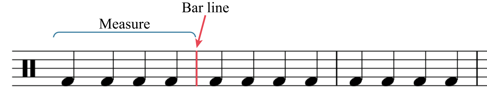
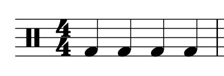
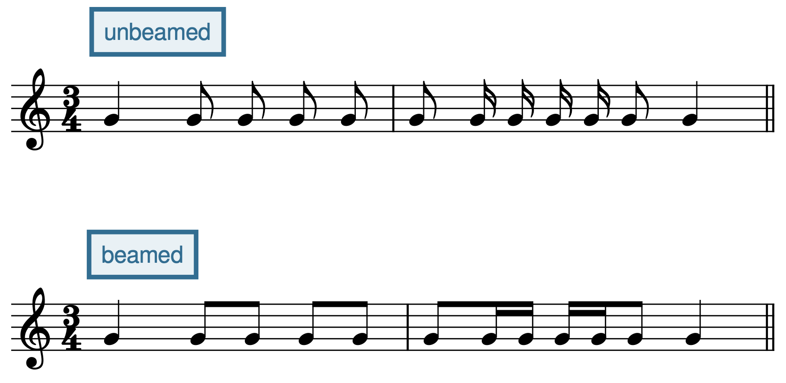
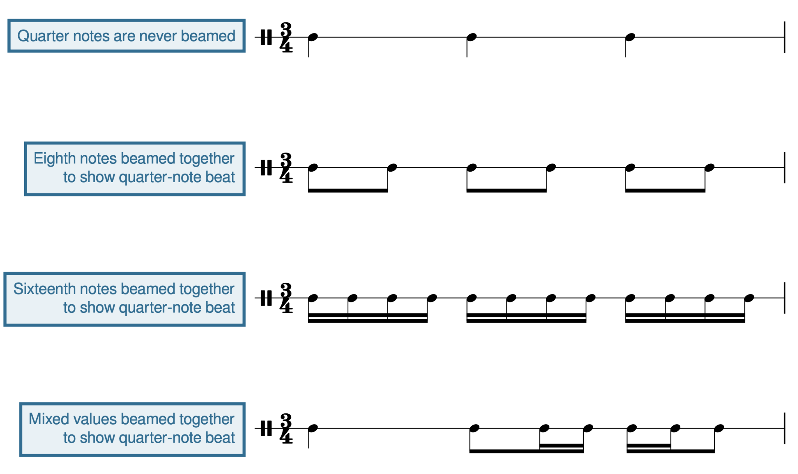
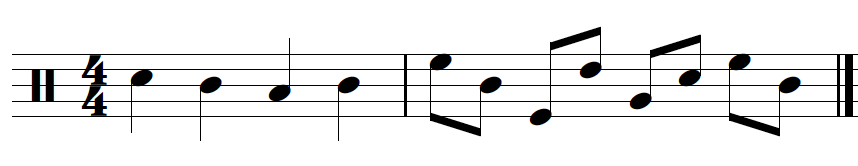
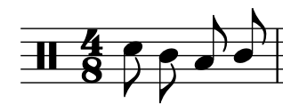
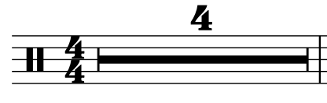

# Метр с двухчастным делением доли и тактовые размеры

**Авторы: Chelsey Hamm, Kris Shaffer и Mark Gotham.**

> **Черновик перевода.** Источник — [OMT2, Nebraska, Fall 2023](https://pressbooks.nebraska.edu/openmusictheory/chapter/simple-meter-and-time-signatures/), снимок от 20 сентября 2026 года. С текущей редакцией VIVA не сверено. Перевод — участники Open Music Theory RU. [CC BY-SA 4.0](https://creativecommons.org/licenses/by-sa/4.0/). Для сторонних материалов могут действовать отдельные условия.

## Главное

- **Доля** (*beat*) — регулярно повторяющийся импульс музыкальной пульсации.
- В **метре с двухчастным делением доли** (*simple meter*) доля делится на две части, а при дальнейшем делении — на четыре.
- В **двухдольном метре** (*duple meter*) доли объединяются по две, в **трёхдольном** (*triple meter*) — по три, в **четырёхдольном** (*quadruple meter*) — по четыре.
- Для двухдольного, трёхдольного и четырёхдольного метров существуют разные схемы дирижирования.
- **Такт** соответствует одной группе долей: из двух, трёх или четырёх. Такты разделяются **тактовыми чертами**.
- При двухчастном делении доли **обозначение тактового размера** сообщает число долей в каждом такте (верхнее число) и **длительность доли** (*beat unit*, нижнее число): какая нотная длительность принимается за долю.
- **Вязка** зрительно соединяет ноты, группируя их по долям. Группировка меняется в зависимости от размера.
- У нот ниже средней линейки нотного стана штили направлены вверх, а у нот выше неё — вниз. Направление **флажка** также связано с направлением штиля; уточнение формулировки источника приведено у [примера 20](#example-20).

[Плейлист главы в Spotify — внешний англоязычный ресурс](https://open.spotify.com/playlist/7wFqS1zSEiUQ6YHdhghMB1). Доступность и воспроизведение не проверены.

В главе [«Длительности нот и пауз»](08-rhythmic-rest-values.md) мы рассмотрели различные длительности **нот** и **пауз**. Музыканты организуют длительности в различные **метры**. В общих чертах метр возникает благодаря повторяющимся последовательностям акцентов при исполнении музыки.

> **Примечание переводчиков.** Здесь *simple* относится к делению доли на две части. Это не безусловный эквивалент русского «простой размер». Число долей в такте и способ деления каждой доли — разные свойства метра; противопоставление *simple/compound* подробно продолжается в [следующей главе](10-compound-meter.md).

## Терминология

Послушайте современную группу Postmodern Jukebox в [примере 1](#example-1). Музыканты исполняют кавер на песню Spice Girls «Wannabe», первоначально выпущенную в 1996 году. Начиная с 0:11 под запись легко отстукивать пульс или хлопать. Этот регулярно повторяющийся музыкальный импульс называется **долей** (*beat*).

**Пример 1.** Кавер на «Wannabe» в исполнении Postmodern Jukebox; слушайте с 0:11. [Видео YouTube — внешний англоязычный материал; воспроизведение не проверено](https://www.youtube.com/embed/u9jGGiqjwf4?feature=oembed&rel=0).

В примере 1 используется **метр с двухчастным делением доли**: доля делится на две части, а при дальнейшем делении — на четыре. Чтобы почувствовать это, попробуйте отстукивать пульс вдвое чаще. Можно представить, что вы делите каждую долю на два меньших импульса.

Разное число долей образует разные метры. В **двухдольном** метре доли группируются по две, в **трёхдольном** — по три, а в **четырёхдольном** — по четыре.

## Слушаем метры с двухчастным делением доли

Послушаем двухдольный, трёхдольный и четырёхдольный метры с двухчастным делением доли. **Двухдольный метр с двухчастным делением** (*simple duple*) содержит две доли; каждая делится на две части, а затем — на четыре. Такой метр используется в марше Джона Филипа Сузы «The Stars and Stripes Forever» («Звёзды и полосы навсегда», 1896).

Послушайте [пример 2](#example-2) и отстукивайте пульс, ощущая объединение долей по две.

**Пример 2.** «The Stars and Stripes Forever» в исполнении Dallas Winds. [Видео YouTube — внешний англоязычный материал; воспроизведение не проверено](https://www.youtube.com/embed/TvWWXv59apY?feature=oembed&rel=0).

**Трёхдольный метр с двухчастным делением** (*simple triple*) содержит три доли; каждая делится на две части, а затем — на четыре. Такой метр используется в «Менуэте фа мажор», K.2, Вольфганга Амадея Моцарта; в источнике указана дата 1774. Послушайте [пример 3](#example-3) и отстукивайте пульс, ощущая объединение долей по три.

**Пример 3.** «Менуэт фа мажор» Моцарта в исполнении Alan Huckleberry. [Видео YouTube — внешний англоязычный материал; воспроизведение не проверено](https://www.youtube.com/embed/7b9OMt6D1TA?feature=oembed&rel=0).

> **Примечание переводчиков.** Дата «1774» перенесена как утверждение выбранного источника; датировка произведения отдельно не проверена.

Наконец, **четырёхдольный метр с двухчастным делением** (*simple quadruple*) содержит четыре доли; каждая делится на две части, а затем — на четыре. Такой метр используется в песне Flo Rida «Cake» (2017). Послушайте [пример 4](#example-4), начиная с 0:45, и отстукивайте пульс, ощущая объединение долей по четыре.

**Пример 4.** «Cake» исполнителя Flo Rida; слушайте с 0:45. [Видео Flo Rida & 99 Percent — внешний англоязычный материал; воспроизведение не проверено](https://www.youtube.com/embed/rmuudxyM0t4?feature=oembed&rel=0).

Как можно услышать и почувствовать, отстукивая пульс, метр организует музыку самых разных стилей. Попробуйте определить, какие из любимых песен или произведений имеют двухдольный, трёхдольный или четырёхдольный метр с двухчастным делением доли. Лучше всего внимательно слушать и отстукивать доли. Учтите, что четырёхдольный метр ощущается похоже на двухдольный: четыре доли можно разделить на две группы по две. Только на слух не всегда сразу ясно, двухдольный метр у произведения или четырёхдольный.

## Схемы дирижирования

Если вы пели в хоре или играли в духовом либо симфоническом оркестре, то, вероятно, уже работали с **дирижёром** (*conductor*), руководителем ансамбля. У дирижёра много задач. Одна из них — показывать участникам хора или оркестра схему дирижирования. Она выполняет две основные функции: устанавливает темп и показывает метр.

Три наиболее распространённые схемы соответствуют двухдольному, трёхдольному и четырёхдольному метрам:

- В двухдольном метре рука движется вниз и наружу (шаг 1), затем вверх (шаг 2), как указано в ссылке источника на пример 5.
- В трёхдольном — вниз (шаг 1), наружу (шаг 2), вверх (шаг 3), как указано для примера 6.
- В четырёхдольном — вниз (шаг 1), внутрь (шаг 2), наружу (шаг 3), вверх (шаг 4), как указано для примера 7.

> **Примечание переводчиков — примеры 5–7.** В выбранном снимке есть отсылки к трём схемам, но сами рисунки отсутствуют. Словесное описание выше переведено полностью; отсутствующие изображения не восстанавливались по догадке.

Первая доля каждого такта называется **downbeat**. Ей соответствует движение руки вниз; на слух и по ощущению она может иметь больший «вес», чем остальные доли. **Upbeat** здесь означает последнюю долю такта. Её дирижируют движением вверх; она может восприниматься как подготовка к следующему такту.

> **Примечание переводчиков.** В этом разделе *upbeat* — последняя доля в схеме дирижирования. Затакт (*anacrusis, pickup*) рассматривается отдельно ниже; эти понятия не следует автоматически отождествлять.

Короткое видео в [примере 8](#example-8) демонстрирует все три схемы.

**Пример 8.** Dr. John Lopez (Texas A&M University, Kingsville) показывает двухдольную, трёхдольную и четырёхдольную схемы дирижирования. [Видео YouTube — внешний англоязычный материал; воспроизведение не проверено](https://www.youtube.com/watch?v=EEQezQNVldo).

Потренируйтесь показывать эти схемы, слушая [пример 2](#example-2) (двухдольный), [пример 3](#example-3) (трёхдольный) и [пример 4](#example-4) (четырёхдольный).

## Тактовые размеры

В западной музыкальной нотации группировку долей — по две, три, четыре и так далее — показывают **тактовые черты**: они разделяют музыку на **такты** (*measures*, также *bars*), как в [примере 9](#example-9). Каждый такт соответствует одной группе долей.

<figure id="example-9">

<figcaption>Пример 9. Тактовые черты и такты.</figcaption>
</figure>

При двухчастном делении доли **обозначение тактового размера** (*time signature*, также *meter signature*) сообщает: 1) сколько долей в каждом такте; 2) какая нотная длительность принимается за долю (*beat unit*). Размер обозначают двумя числами, расположенными одно над другим после ключа ([пример 10](#example-10)).

<figure id="example-10">

<figcaption>Пример 10. Два числа — 4 и 4 — образуют обозначение тактового размера.</figcaption>
</figure>

Хотя обозначение размера похоже на дробь, оно **не является дробью**: между числами нет черты. При двухчастном делении верхнее число показывает число долей в такте, а нижнее — длительность доли.

В рассматриваемых метрах верхнее число всегда равно 2, 3 или 4, что соответствует двухдольной, трёхдольной или четырёхдольной группировке. Нижнее число обычно имеет одно из следующих значений:

- **2** — за долю принимается половинная нота;
- **4** — четвертная;
- **8** — восьмая.

Внизу также могут стоять **16** (доля — шестнадцатая) или **1** (доля — целая).

Есть ещё два обозначения размеров с двухчастным делением доли: **𝄴** (*common time*) и **𝄵** (*cut time*). Знак 𝄴 равнозначен **4/4**: это четырёхдольный метр, четыре доли в такте. Знак 𝄵 равнозначен **2/2**: двухдольный метр, две доли в такте.

> **Примечание переводчиков.** Запись вида `4/4` в тексте — удобная строковая передача двух чисел обозначения размера, а не указание на математическую дробь.

## Счёт при двухчастном делении доли

Считать ритм вслух важно для исполнения: певец или инструменталист должен уметь воспроизводить ритмы, записанные в западной нотации. Очень полезно дирижировать во время счёта — это помогает удерживать ровный темп. Ваш преподаватель может использовать другую систему счёта. В *Open Music Theory* принята традиционная американская система, но она не единственная.

В [примере 11](#example-11) дан ритм в размере **4/4**, то есть в четырёхдольном метре с двухчастным делением доли. Верхняя четвёрка означает четыре доли в такте, нижняя — что за долю принимается четвертная нота.

- Каждой четверти в такте соответствует счёт, записанный **арабскими цифрами**: «1, 2, 3, 4».
- Если нота длится дольше одной доли, как половинная или целая в этом примере, её счётный слог протягивают через несколько долей. Числа для долей, которые не произносят вслух, записывают в скобках.
- При делении доли надвое добавляют слог **and**, обычно обозначаемый знаком плюс (**+**). Если доля — четверть, вторая восьмая каждой доли приходится на *and*.
- При дальнейшем делении до шестнадцатых используют слоги **e** (долгий английский гласный, как в слове *see*) и **a** (произносится *uh*). На уровне тридцать вторых между всеми предыдущими слогами добавляют **ta**.

> **Примечание переводчиков.** Слоги оригинала сохранены, чтобы счёт совпадал с английскими нотными примерами: *and* приблизительно «энд», *e* — «и», *a* — краткое нейтральное «э/а», *ta* — «та». Это счётные слоги, а не названия нот. При четвертной доле последовательность для шестнадцатых — `1 e + a`, затем `2 e + a` и так далее.

**Пример 11.** Ритм в размере 4/4. [Партитура MuseScore — внешний англоязычный материал; нотное содержимое и воспроизведение не проверены](https://musescore.com/user/32728834/scores/6293132/embed).

В двухдольном метре всего две доли, а в трёхдольном — три, но части доли считаются точно так же ([пример 12](#example-12)).

**Пример 12.** В двухдольном метре с двухчастным делением — две доли в такте, в трёхдольном — три. [Партитура MuseScore — внешний англоязычный материал; нотное содержимое и воспроизведение не проверены](https://musescore.com/user/32728834/scores/6296048/embed).

Как и у нот продолжительностью две доли или более, счёт не произносят заново на долях, где нет новой атаки из-за паузы, соединительной лиги или точки. Такие числа обычно записывают в скобках, как в [примере 13](#example-13).

**Пример 13.** Числа, которые не произносят вслух, заключают в скобки. [Партитура MuseScore — внешний англоязычный материал; нотное содержимое и воспроизведение не проверены](https://musescore.com/user/32728834/scores/6296065/embed).

<figure id="example-14">

<figcaption>Пример 14. Затакт.</figcaption>
</figure>

Если пример начинается с **затакта** (*pickup, anacrusis*), счёт начинается не с «1», как показано в [примере 14](#example-14). Затакт считают как последнюю ноту или последние ноты воображаемого такта. Когда произведение начинается с затакта, заключительный такт обычно сокращают на его длительность. В примере 14 затакт равен одной четверти, поэтому в последнем такте только три доли: одной четверти не хватает.

## Счёт при нижних числах размера 2, 8 и 16

При других длительностях доли, указанных нижним числом размера, для долей и их частей используют ту же систему счёта, но ей соответствуют другие нотные длительности. В [примере 15](#example-15) сначала показан ритм в размере **4/4**, а затем тот же ритм при других длительностях доли. Все варианты звучат одинаково и считаются одинаково. Все они относятся к четырёхдольному метру с двухчастным делением доли. Различается нижнее число обозначения размера, то есть нотная длительность, принимаемая за долю: четверть, половинная, восьмая или шестнадцатая.

**Пример 15.** Один и тот же ритм с одинаковым счётом, записанный при доле, равной: (a) четверти, (b) половинной, (c) восьмой, (d) шестнадцатой. [Партитура MuseScore — внешний англоязычный материал; нотное содержимое и воспроизведение не проверены](https://musescore.com/user/32728834/scores/8422379/embed).

## Вязки, штили, флажки и многотактовые паузы

**Вязки** объединяют ноты по долям. Поэтому, как видно из [примера 16](#example-16), группировка меняется с размером. В первом такте шестнадцатые объединены по четыре: в размере **4/4** четыре шестнадцатые составляют одну долю. Во втором такте шестнадцатые объединены по две: в размере **4/8** одна доля равна только двум шестнадцатым.

**Пример 16.** Группировка вязками в двух разных размерах. [Партитура MuseScore — внешний англоязычный материал; нотное содержимое и воспроизведение не проверены](https://musescore.com/user/32728834/scores/6296072/embed).

<figure id="example-17">

<figcaption>Пример 17. Вязки облегчают чтение ритма, показывая длительность доли.</figcaption>
</figure>

В вокальной музыке вязками иногда соединяют только ноты, исполняемые на один слог. Если вы привыкли читать ноты без вязок, уделите особое внимание правилам группировки, пока не освоите их. На верхнем стане [примера 17](#example-17) восьмые не объединены вязками, поэтому трудно увидеть начало второй и третьей долей трёхдольного метра. Нижний стан показывает, что объединение нот одной доли вязкой делает чтение гораздо проще. Несмотря на разную группировку, оба ритма **звучат одинаково**. Способность организовывать события иерархически — важная особенность человеческого восприятия. Поэтому вязки помогают зрительно разбирать записанный ритм: метрическая структура задаёт иерархию, а средства записи, в том числе вязки, делают её видимой.

В [примере 18](#example-18) различные длительности объединены вязками, чтобы показать долю. В первой строке вязки не нужны: четвертные ноты ими не соединяют. Во всех последующих строках вязки нужны, чтобы яснее обозначить доли.

<figure id="example-18">

<figcaption>Пример 18. Разные нотные длительности можно объединять вязками, показывая долю. В размере 3/4 восьмые и шестнадцатые объединяются в группы, соответствующие четвертной доле.</figcaption>
</figure>

<figure id="example-19">

<figcaption>Пример 19. Вязки при разных направлениях штилей.</figcaption>
</figure>

Второй такт [примера 19](#example-19) показывает: у нот, объединённых вязкой, направление штилей определяется нотой, наиболее удалённой от средней линейки. На первой доле второго такта это ми второй октавы (**E5**) над средней линейкой, поэтому штили направлены вниз. На второй доле штили направлены вверх: самая удалённая нота — ми первой октавы (**E4**) под средней линейкой.

> **Примечание переводчиков.** На рисунке 19 стоит нейтральный ключ ударных инструментов. Обозначения E5 и E4 перенесены из авторского текста: такие высоты соответствовали бы показанным позициям при скрипичном ключе, но не определяются самим нейтральным ключом. Здесь рисунок иллюстрирует направление штилей.

<figure id="example-20">

<figcaption>Пример 20. Запись флажка зависит от направления штиля.</figcaption>
</figure>

Запись флажка зависит от направления штиля ([пример 20](#example-20)). У нот выше средней линейки штиль располагается слева и направлен вниз, а флажок направлен внутрь, вправо. У нот ниже средней линейки штиль располагается справа и направлен вверх, а флажок направлен наружу, вправо (см. примечание ниже). Для нот на средней линейке возможны оба направления штиля с соответствующим флажком; выбор обычно зависит от контура музыкальной линии.

> **Примечание переводчиков.** В английском тексте наружное направление флажка у штиля вверх пояснено словами *facing left* («влево»). Это противоречит самому примеру 20: на нём флажки находятся справа от штилей при обоих их направлениях. В переводе ошибочное уточнение «влево» исправлено явно. Указание на левую или правую сторону головки относится к положению штиля, а не к стороне прикрепления флажка.

При группировке разных длительностей могут использоваться **неполные вязки** (*partial beams*), как в [примере 21](#example-21). Эти правила иногда кажутся непривычными ученикам с небольшим опытом чтения нот с вязками. Если это относится к вам, внимательно рассмотрите группировку в примере 21.

**Пример 21.** Неполные вязки в некоторых группах разных длительностей. [Партитура MuseScore — внешний англоязычный материал; нотное содержимое и воспроизведение не проверены](https://musescore.com/user/32728834/scores/8422418/embed).

<figure id="example-22">

<figcaption>Пример 22. Многотактовая пауза длительностью в четыре такта.</figcaption>
</figure>

Паузы на несколько полных тактов иногда записывают, как в [примере 22](#example-22). Этот знак предписывает музыканту молчать в течение четырёх полных тактов.

## Ещё о соединительных лигах

Мы уже встречали **соединительные лиги**, позволяющие продлить ноту через тактовую черту. Но, подобно вязкам, лиги могут также прояснять метрическую структуру внутри такта. В первом такте [примера 23](#example-23) вторая доля начинается в середине восьмой ноты, поэтому метрическую структуру трудно увидеть. Если разделить восьмую на две шестнадцатые и соединить их лигой, как во втором такте, начало второй доли станет хорошо заметно.

<figure id="example-23">

<figcaption>Пример 23. Соединительные лиги и правильная группировка вязками помогают ясно показать доли.</figcaption>
</figure>

> **Примечание переводчиков.** Подписи и альтернативные описания локальных иллюстраций переведены. Английские надписи внутри исходных рисунков сохранены; изображения не перерисованы. Ссылки источника на дополнительные версии: [пример 14](https://viva.pressbooks.pub/app/uploads/sites/12/2020/01/pickup.png), [пример 17](https://viva.pressbooks.pub/app/uploads/sites/12/2020/01/withoutbeams.png), [пример 18](https://viva.pressbooks.pub/app/uploads/sites/12/2020/01/beaming-beat-unit.png), [пример 23](https://viva.pressbooks.pub/app/uploads/sites/12/2020/01/ties-clarify-beat.png). Эти внешние версии не проверены.

## Интернет-ресурсы

Все ресурсы ниже — **внешние англоязычные материалы**. Названия переведены, содержимое не локализовано; доступность, воспроизведение и содержание не проверены.

- [Урок о метре с двухчастным делением доли — musictheory.net](https://www.musictheory.net/lessons/15).
- [Видеоурок о двухчастном делении доли, долях и вязках — YouTube](https://www.youtube.com/watch?v=1Q7OyL-2cX0).
- [Схемы дирижирования — YouTube](https://www.youtube.com/watch?v=DdvHUJ88tao).
- [Тактовые размеры при двухчастном делении доли — liveabout.com](https://www.liveabout.com/what-is-a-simple-meter-2455908).
- [Видеоурок о счёте при двухчастном делении доли — One Minute Music Lessons](https://oneminutemusiclesson.com/blog/how-to-read-music-eastman-counting-system-simple-meters).
- [Счёт при двухчастном делении доли — YouTube](https://www.youtube.com/watch?v=NHxVoGTdymY).
- [Правила группировки вязками — Music Notes Now](https://www.musicnotes.com/now/musictheory/note-beaming-and-grouping-in-music-theory/).
- [Примеры группировки вязками — Dr. Sebastian Anthony Birch](http://www.personal.kent.edu/~sbirch/Common/Encyclopedia/Rudiments/beaming_rules.htm).

## Задания из интернета

**Внешние англоязычные задания:** содержимое, доступность и наличие ответов не проверены; сами задания не переведены. Буквы A–H сохраняют порядок исходного списка.

- **A.** Тактовые размеры и ритмы ([PDF](https://www.musicfun.com.au/pdf_files/time_signatures.pdf)).
- **B.** Терминология, тактовые черты, заполнение ритмов, перегруппировка вязками ([PDF](http://web.pdx.edu/~jnewton/assignments/bas_mat_assignments/bas_mat_2_2.pdf)).
- **C.** Метры, тактовые размеры, перегруппировка вязками ([сайт](http://musictheory.pugetsound.edu/mt21c/BasicsOfRhythmPracticeExercises.html)).
- **D.** Тактовые черты, размеры, счёт ([PDF](https://www.gmajormusictheory.org/Fundamentals/Ch03.pdf)).
- **E.** Размеры, перегруппировка вязками, с. 4 ([PDF](https://www.bgsu.edu/content/dam/BGSU/musical-arts/documents/Music-Theory-Placement-Exam-Theory-Worksheets.pdf)).
- **F.** Заполнение ритмов ([PDF](http://www.sheetmusic1.com/rhythm/circle.missing.note/circnote.pdf)).
- **G.** Тактовые размеры ([PDF 1](http://www.sheetmusic1.com/rhythm/identify.time.sigs/idts1.pdf), [PDF 2](http://www.sheetmusic1.com/rhythm/identify.time.sigs/idts.2.pdf)).
- **H.** Тактовые черты ([PDF 1](http://www.sheetmusic1.com/rhythm.barlines/rhythm.dbl/dbl3.pdf), [PDF 2](http://www.sheetmusic1.com/rhythm.barlines/rhythm.dbl/dbl2.pdf), [PDF 3](http://www.sheetmusic1.com/rhythm.barlines/rhythm.dbl/dbl1.pdf)).

## Задания

**Внешние англоязычные материалы:** задания не переведены, доступность, содержимое и ответы не проверены.

1. Ноты, паузы, тактовые черты ([PDF](https://pressbooks.nebraska.edu/app/uploads/sites/379/2023/09/WK-Simple-Meter-and-Time-Signatures-1-1.pdf), [DOCX](https://pressbooks.nebraska.edu/app/uploads/sites/379/2023/09/WK-Simple-Meter-and-Time-Signatures-1-1.docx)).
2. Перегруппировка вязками ([PDF](https://pressbooks.nebraska.edu/app/uploads/sites/379/2023/09/WK-Simple-Meter-and-Time-Signatures-2.pdf), [нотный файл, обозначенный в источнике как .musx](https://viva.pressbooks.pub/app/uploads/sites/12/2021/10/WK-Simple-Meter-and-Time-Signatures-2.mscz#fixme)).

> **Примечание переводчиков.** В последней ссылке подпись `.musx` не совпадает с расширением адреса `.mscz`; адрес также содержит `#fixme`. Ссылка сохранена точно по источнику, файл не проверен.

## Определения терминов

Следующая таблица передаёт все всплывающие определения источника в доступном для чтения виде.

| Термин | Определение |
|---|---|
| Доля (*beat*) | Импульс музыкальной пульсации, под который можно отстукивать или хлопать. Иерархически организованные группы долей образуют метр. |
| Метр с двухчастным делением доли (*simple meter*) | Метр, в котором доля делится на две части. |
| Двухдольный метр (*duple meter*) | Метр с двумя долями в такте. |
| Трёхдольный метр (*triple meter*) | Метр с тремя долями в такте. |
| Четырёхдольный метр (*quadruple meter*) | Метр с четырьмя долями в такте. |
| Такт (*measure, bar*) | Отрезок, выделенный тактовыми чертами и соответствующий одной группе долей. |
| Тактовые черты (*bar lines*) | Вертикальные линии, разделяющие музыку на такты. |
| Обозначение тактового размера (*time signature*) | Обозначение метра в западной нотации, часто из двух чисел, расположенных одно над другим. |
| Длительность доли (*beat unit*) | Нотная длительность, принимаемая за долю: например, четверть в 4/4 или четверть с точкой в 6/8. |
| Вязка (*beam*) | Горизонтальные линии, соединяющие определённые группы нот. |
| Флажок (*flag*) | Изогнутая линия на конце штиля. Каждый добавленный флажок уменьшает длительность ноты вдвое. Например, знак восьмой похож на четверть с флажком; восьмая длится вдвое меньше четверти. |
| Нота (*note*) | Музыкальный звук с определённой высотой и ритмической составляющей; его знак может включать штиль, вязку и/или флажок. |
| Пауза (*rest*) | Тишина определённой длительности в музыкальном произведении. |
| Метр (*meter*) | Повторяющаяся во времени последовательность акцентов. В нотной записи метр обозначают тактовым размером. |
| Двухдольный метр с двухчастным делением (*simple duple*) | Две доли, каждая из которых делится надвое. Верхнее число размера всегда 2; наиболее распространены 2/4 и 2/2 (*cut time*, 𝄵). |
| Трёхдольный метр с двухчастным делением (*simple triple*) | Три доли, каждая из которых делится надвое. Верхнее число всегда 3; наиболее распространён размер 3/4. |
| Четырёхдольный метр с двухчастным делением (*simple quadruple*) | Четыре доли, каждая из которых делится надвое. Верхнее число всегда 4; наиболее распространён размер 4/4 (*common time*, 𝄴). |
| Дирижёр (*conductor*) | Руководитель ансамбля. |
| Первая доля такта (*downbeat*) | Первая доля, которой соответствует движение руки вниз при дирижировании. |
| Последняя доля такта (*upbeat*, в этом контексте) | Последняя доля, которой соответствует движение руки вверх при дирижировании. |
| Арабские цифры (*Arabic numerals*) | Цифры 0, 1, 2, 3, 4, 5, 6, 7, 8 и 9. |
| Затакт (*anacrusis*) | Нота или ноты перед первой сильной долей фразы; в исходном определении — ноты на *upbeat*, ведущие к первому *downbeat*. |

> **Примечание переводчиков.** В последних фразах исходных определений *simple triple* и *simple quadruple* вместо *simple* ошибочно стоит *compound*. Здесь 3/4 и 4/4 отнесены к двухчастному делению, в согласии с началом тех же определений и основным объяснением главы. Исправление оговорено явно; это не утверждение об эквивалентности американской и русской классификаций размеров.
