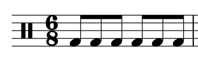

# Метр с трёхчастным делением доли и тактовые размеры

**Авторы: Chelsey Hamm и Mark Gotham.**

> **Черновик перевода.** Источник — [OMT2, Nebraska, Fall 2023](https://pressbooks.nebraska.edu/openmusictheory/chapter/compound-meters-and-time-signatures/), снимок от 20 сентября 2026 года. С текущей редакцией VIVA не сверено. Перевод — участники Open Music Theory RU. [CC BY-SA 4.0](https://creativecommons.org/licenses/by-sa/4.0/).

## Главное

- В **метре с трёхчастным делением доли** (*compound meter*) доля делится на три части, а при дальнейшем делении — на шесть.
- В **двухдольном метре** доли объединяются по две, в **трёхдольном** — по три, в **четырёхдольном** — по четыре. Эти группы можно определить на слух, внимательно слушая музыку и отстукивая доли.
- Для двухдольного, трёхдольного и четырёхдольного метра существуют разные схемы дирижирования. Каждая схема одинакова при двухчастном и трёхчастном делении доли.
- **Обозначение тактового размера** при трёхчастном делении сообщает две вещи: сколько частей долей содержится в такте (верхнее число) и какова **единица деления доли**, то есть какая нотная длительность соответствует одной такой части (нижнее число).
- Счёт ритмов соотносится с длительностью единицы деления доли. Номера долей, на которых нет новой атаки звука — из-за ноты длиннее доли, соединительной лиги, паузы или точки, — заключают в скобки.

> **Примечание переводчиков.** Английское *compound* здесь относится к делению одной доли на три, а слова *duple*, *triple* и *quadruple* — к числу долей в такте. Это разные признаки. Поэтому *compound meter* не переводится автоматически как «сложный размер». Точка у ноты, равной одной доле, сама по себе не означает пропуска счёта: ниже это различие объясняется подробнее.

[Плейлист главы в Spotify](https://open.spotify.com/playlist/38gepJH1X5U19PF3Vsudgv?si=Xk1AI26VQNGeR6JSfiuk4g).

В предыдущей главе, [«Метр с двухчастным делением доли и тактовые размеры»](09-simple-meter.md), мы рассматривали ритм и обозначения размеров в *simple meters*: доля в них делится на две части, а при дальнейшем делении — на четыре. В этой главе мы познакомимся с *compound meters*: доля в них делится на три части, а при дальнейшем делении — на шесть.

## Слушаем и дирижируем

Метр с трёхчастным делением доли, как и метр с двухчастным делением, бывает **двухдольным** (*duple*), **трёхдольным** (*triple*) и **четырёхдольным** (*quadruple*). Иначе говоря, доли объединяются в группы по две, три или четыре. Отличие состоит в том, что каждая доля делится на три части вместо двух. Внимательно послушайте следующие примеры, чтобы услышать это различие.

[Встроенный плейлист оригинала: OMT Compound Meter and Time Signatures](https://open.spotify.com/embed/playlist/38gepJH1X5U19PF3Vsudgv?si=0069b65dc4e542d8&utm_source=oembed).

> **Примечание переводчиков.** Вместо встроенного проигрывателя дана ссылка. Названия произведений сохранены; внешнее содержимое Spotify не локализовано, доступность и воспроизведение не проверены.

- «End of the Road» (1992) группы Boyz II Men написана в двухдольном метре: доли объединяются по две. Отстукивайте доли вместе с музыкой и обратите внимание, что каждая делится на три части, а не на две. Если разделить эти части ещё пополам, отстукивая их вдвое чаще, вы почувствуете деление доли на шесть частей.
- Вторая часть (менуэт) Сонаты № 42 соль мажор (1784) Франца Йозефа Гайдна написана в трёхдольном метре с трёхчастным делением доли. Слушайте группы из трёх долей, каждая из которых делится на три части.
- Наконец, в четырёхдольном метре с трёхчастным делением четыре доли, и каждая делится на три части. Послушайте «Exogenesis Symphony Part III» (2010) альтернативной рок-группы Muse. Здесь используется именно такой метр: доли объединяются по четыре.

В целом музыка в метрах с трёхчастным делением доли встречается реже. Тем не менее, чтобы овладеть западной музыкальной нотацией, необходимо научиться читать и исполнять музыку и в этих метрах.

Повторите схемы дирижирования из [предыдущей главы](09-simple-meter.md): при трёхчастном делении доли они остаются такими же.

## Тактовые размеры

При трёхчастном делении доли **такт** (*measure*, *bar*) соответствует одной группе долей — из двух, трёх или четырёх, — как и при двухчастном делении. Однако два числа в **обозначении тактового размера** (*time signature*) сообщают здесь другую информацию. Верхнее число показывает количество частей долей в такте, а нижнее — **единицу деления доли** (*division unit*), то есть длительность одной такой части. В [примере 1](#example-1) показан распространённый размер с трёхчастным делением доли.

<figure id="example-1">

<figcaption>Пример 1. Два числа, 6 и 8, образуют распространённое обозначение размера с трёхчастным делением доли.</figcaption>
</figure>

Как и при двухчастном делении, обозначение размера не является дробью: черты между числами нет. Его помещают на нотном стане после ключа. В [примере 1](#example-1) верхнее число, 6, означает, что в каждом такте шесть частей долей, а нижнее, 8, — что каждой части соответствует восьмая нота. Таким образом, суммарная длительность такта равна шести восьмым; это можно проверить по примеру.

В метрах с трёхчастным делением доли верхнее число всегда кратно трём. Разделив его на три, вы получите число долей в такте: 6 соответствует двухдольному метру, 9 — трёхдольному, а 12 — четырёхдольному. Нижним числом обычно бывает одно из следующих:

- 8: единица деления доли — восьмая нота;
- 4: единица деления доли — четвертная нота;
- 16: единица деления доли — шестнадцатая нота.

Следующая таблица должна обобщать шесть рассмотренных категорий метра.

**Пример 2. Категории метра.**

> **Примечание переводчиков.** Таблица отсутствует уже в сохранённом оригинале: вместо неё стоит сообщение `[table “36” not found /]`. Её содержимое не восстановлено по догадке.

## Счёт при трёхчастном делении доли

Считая ритмы с трёхчастным делением доли, рекомендуется дирижировать, чтобы сохранять устойчивый темп. Поскольку доля делится на три части, её длительность всегда записывается нотой с точкой:

- при нижнем числе 8 доля — четвертная с точкой, равная трём восьмым;
- при нижнем числе 4 доля — половинная с точкой, равная трём четвертным;
- при нижнем числе 16 доля — восьмая с точкой, равная трём шестнадцатым.

При двухчастном делении первая часть доли акцентирована, а вторая — нет. При трёхчастном делении акцентирована первая часть, а вторая и третья — нет. Поэтому счёт различается. Это показано в [примере 3](#example-3), записанном в размере 6/8.

[Пример 3 в MuseScore](https://musescore.com/user/32728834/scores/8394558/embed).

**Пример 3. Счёт в двухдольном метре с трёхчастным делением доли.**

> **Примечание переводчиков.** Внешний нотный пример оставлен в оригинале; его содержимое, доступность и воспроизведение не проверены. Подпись и авторское объяснение переведены.

В этом размере в каждом такте две доли (6 ÷ 3 = 2), поэтому метр двухдольный. Каждая четвертная с точкой, то есть каждая доля, получает номер, записанный арабской цифрой, как и при двухчастном делении. Если нота длится больше одной доли — например, половинная с точкой в четвёртом такте [примера 3](#example-3), — номера долей, не произносимые вслух, записываются в скобках. Между номерами долей произносят слоги **la** и **li**. При дальнейшем делении на шестнадцатые, как в последнем такте примера 3, добавляют слог **ta**, а слоги **la** и **li** сохраняются на соответствующих восьмых.

> **Примечание переводчиков.** Сохраняем слоги американской системы счёта. Три части доли считаются «1 — la — li», а шесть — «1 — ta — la — ta — li — ta». В оригинале *la* названо «первым делением», а *li* — «вторым»: это два момента после начала доли; сама первая часть доли получает номер.

Третий такт [примера 3](#example-3) содержит два наиболее распространённых ритма с делением доли на три части. Если такой метр вам пока незнаком, внимательно разберите этот такт.

Ваш преподаватель может использовать другую систему счёта. В *Open Music Theory* предпочтение отдаётся традиционной американской системе, но она не единственная.

В [примере 4](#example-4) приведены ритмы в (a) двухдольном, (b) трёхдольном и (c) четырёхдольном метре. Как и при двухчастном делении, здесь соответственно две, три и четыре доли; каждую из них делят на три части.

[Пример 4 в MuseScore](https://musescore.com/user/32728834/scores/8394447/embed).

**Пример 4. При трёхчастном делении доли: (a) в двухдольном метре две доли, (b) в трёхдольном — три, (c) в четырёхдольном — четыре.**

> **Примечание переводчиков.** Внешний пример не локализован; содержимое, доступность и воспроизведение не проверены.

Как и при двухчастном делении, номера долей, на которых нет новой атаки из-за пауз или соединительных лиг, записывают в скобках и не произносят вслух; это показано в [примере 5](#example-5). Однако при трёхчастном делении сама доля выражается нотой с точкой. Поэтому точка у такой ноты не требует заключать следующий номер доли в скобки, как это происходит у длительности с точкой, захватывающей часть следующей доли при двухчастном делении.

[Пример 5 в MuseScore](https://musescore.com/user/32728834/scores/6296091/embed).

**Пример 5. Номера долей, не произносимые вслух, заключают в скобки.**

> **Примечание переводчиков.** Внешний пример не локализован; содержимое, доступность и воспроизведение не проверены.

## Счёт при нижних числах 4 и 16

До сих пор мы рассматривали главным образом размеры, в которых доле соответствует четвертная с точкой. При других длительностях доли счёт долей и их частей остаётся тем же, но ему соответствуют другие нотные длительности ([пример 6](#example-6)).

> **Примечание переводчиков.** В начале этого раздела оригинал неточно связывает нижнее число непосредственно с длительностью доли. При трёхчастном делении нижнее число задаёт единицу **деления** доли; длительность самой доли втрое больше.

[Пример 6 в MuseScore](https://musescore.com/user/32728834/scores/8394456/embed).

**Пример 6. Один ритм записан с тремя разными длительностями доли: (a) четвертная с точкой, (b) половинная с точкой, (c) восьмая с точкой.**

> **Примечание переводчиков.** Внешний пример не локализован; содержимое, доступность и воспроизведение не проверены.

Все три ритма звучат одинаково и считаются одинаково. Все три относятся к трёхдольному метру с трёхчастным делением доли. Различается нижнее число — указание на то, какая длительность служит единицей деления: восьмая, четвертная или шестнадцатая. От неё, в свою очередь, зависит длительность доли.

## Вязки, штили и флажки

При трёхчастном делении доли **вязки** (*beams*) по-прежнему объединяют ноты по долям, поэтому в разных размерах группировка меняется. В первом такте [примера 7](#example-7) шестнадцатые объединены по шесть: в размере 6/8 шесть шестнадцатых составляют одну долю. Во втором такте они объединены по три: в размере 6/16 одной доле соответствуют три шестнадцатые.

[Пример 7 в MuseScore](https://musescore.com/user/32728834/scores/8394474/embed).

**Пример 7. Группировка вязками в двух разных размерах.**

> **Примечание переводчиков.** Внешний пример не локализован; содержимое, доступность и воспроизведение не проверены.

Если в музыке встречаются длительности короче четвертной, вязками следует ясно показывать метр независимо от того, делится доля на две или на три части. В [примере 8](#example-8) двенадцать шестнадцатых правильно сгруппированы в двух размерах. В первом такте доля делится на две части, поэтому на каждую долю приходится группа из четырёх шестнадцатых. Во втором такте доля делится на три части, и на неё приходится группа из шести шестнадцатых.

<figure id="example-8">

<figcaption>Пример 8. Правильная группировка вязками необходима при двухчастном и при трёхчастном делении доли.</figcaption>
</figure>

При трёхчастном делении действуют те же правила направления штилей, что и при двухчастном: у нот выше средней линейки штиль направлен вниз и находится слева от головки; у нот ниже средней линейки — вверх и справа. У нот на средней линейке направление зависит от соседних нот.

> **Примечание переводчиков.** Оригинал относит это правило одновременно к штилям и флажкам, утверждая, что при штиле вниз флажок оказывается слева. Это неточность: флажок располагается справа от штиля при обоих направлениях. Правило о левой или правой стороне головки относится к штилю.

Как и при двухчастном делении, при сочетании разных длительностей используются неполные вязки. Если вы пока не освоили эти правила, внимательно рассмотрите группировку нот в [примере 9](#example-9).

[Пример 9 в MuseScore](https://musescore.com/user/32728834/scores/6296096/embed).

**Пример 9. Наиболее распространённые варианты неполных вязок, когда единица деления доли — восьмая нота.**

> **Примечание переводчиков.** Внешний пример не локализован; содержимое, доступность и воспроизведение не проверены.

## Определения из оригинала

> **Примечание переводчиков.** Всплывающие определения оригинала собраны здесь в видимую таблицу. Это не восстановление отсутствующей таблицы из примера 2.

| Термин | Определение |
|---|---|
| Метр с трёхчастным делением доли (*compound meter*) | Метр, в котором доля делится на три части. |
| Двухдольный метр (*duple meter*) | Метр с двумя долями в такте. |
| Трёхдольный метр (*triple meter*) | Метр с тремя долями в такте. |
| Четырёхдольный метр (*quadruple meter*) | Метр с четырьмя долями в такте. |
| Обозначение тактового размера (*time signature*) | Указание метра в западной музыкальной нотации, часто состоящее из двух чисел одно над другим. |
| Единица деления доли (*division unit*) | Длительность каждой из двух или трёх равных частей доли — соответственно в *simple meter* или *compound meter*. Например, восьмая нота в размерах 4/4 и 6/8. |
| Метр с двухчастным делением доли (*simple meter*) | Метр, в котором доля делится на две части. |
| Такт (*measure*, *bar*) | Участок, выделенный тактовыми чертами и соответствующий одной группе долей. |
| Вязки (*beams*) | Горизонтальные линии, соединяющие определённые группы нот. |

## Дополнительные материалы

Все материалы ниже внешние и англоязычные. Переведены названия ссылок; содержимое не локализовано, доступность и воспроизведение не проверены.

- [Метр с трёхчастным делением доли: урок на musictheory.net](https://www.musictheory.net/lessons/15) — соответствующая часть начинается примерно с середины урока.
- [Видеоурок о метре с трёхчастным делением доли и долях, YouTube](https://www.youtube.com/watch?v=F3xsoi-NKw8&t=140s) — в оригинале рекомендовано начать с 1:49. **Примечание переводчиков:** сохранённый URL запускает видео с 2:20; содержимое видео и правильная отметка времени не проверены.
- [Счёт и обозначения размеров при трёхчастном делении доли — John Ellinger](https://people.carleton.edu/~jellinge/m101s12/Pages/06/06CompoundMeter.html).
- [Счёт при трёхчастном делении доли, YouTube](https://www.youtube.com/watch?v=W_hNLfLvLig).
- [Ритмическая практика при трёхчастном делении доли, YouTube](https://www.youtube.com/watch?v=ZhDq0JuytoU).
- [Группировка вязками при трёхчастном делении доли — Michael Sult](https://www.guitarland.com/Music10/MusFund/Beaming/Beaming.html).

## Упражнения из внешних источников

Ниже сохранены все задания и ссылки оригинала. Англоязычные рабочие листы, их задания и ответы не переведены; содержимое и доступность не проверены.

1. Определение метра с двухчастным и трёхчастным делением доли ([PDF](https://www2.lawrence.edu/fast/BIRINGEG/media/theory_funds/pdf/ws05-meter_id_i.pdf)); определение метра с расстановкой тактовых черт ([PDF](https://www2.lawrence.edu/fast/BIRINGEG/media/theory_funds/pdf/ws06-meter_id_ii.pdf)).
2. Группировка вязками при двухчастном и трёхчастном делении доли ([PDF](https://www2.lawrence.edu/fast/BIRINGEG/media/theory_funds/pdf/ws04-meter_drills.pdf)); также с. 4–5 [этого сборника PDF](https://www.bgsu.edu/content/dam/BGSU/musical-arts/documents/Music-Theory-Placement-Exam-Theory-Worksheets.pdf).
3. Тактовые размеры с двухчастным и трёхчастным делением доли ([PDF](https://www2.lawrence.edu/fast/BIRINGEG/media/theory_funds/pdf/ws03-meter_sig_table.pdf)).
4. Счёт в размере 6/8: [часть 1](https://shedthemusic.com/progressive-compound-meter-1), [часть 2](https://shedthemusic.com/progressive-compound-meter-2), [часть 3](https://shedthemusic.com/progressive-compound-meter-3). В оригинале ссылки подписаны как PDF; фактический формат материалов на страницах не проверен.
5. Тактовые размеры: [PDF 1](https://drive.google.com/file/d/0B0ZI8di-pEDvbG95NHpOZDJKdkE/view), [PDF 2](https://drive.google.com/file/d/0B0ZI8di-pEDvU0o2LWcta3F3NVU/view), [PDF 3](https://drive.google.com/file/d/0B0ZI8di-pEDvRUtuRVBSV3lsZTg/view).
6. Тактовые черты ([изображение GIF](https://www.guitarland.com/Music10/MusFund/Meter/Images/Gifs/BarlineWsNo2.GIF)); также с. 2 [этого PDF](https://s3.amazonaws.com/graceimmanuel.gracemusic/theory/worksheets/2.13.pdf). **Примечание переводчиков:** первая ссылка в оригинале подписана как PDF, но URL указывает на GIF.

## Задания

Англоязычные материалы по ссылкам не локализованы; их содержимое, ответы и доступность не проверены.

1. Ноты, паузы и тактовые черты ([PDF](https://pressbooks.nebraska.edu/app/uploads/sites/379/2023/09/WK-Compound-Meters-and-Time-Signatures-1-1.pdf), [DOCX](https://pressbooks.nebraska.edu/app/uploads/sites/379/2023/09/WK-Compound-Meters-and-Time-Signatures-1-1.docx)).
2. Изменение группировки вязками ([PDF](https://pressbooks.nebraska.edu/app/uploads/sites/379/2023/09/WK-Compound-Meters-and-Time-Signatures-2.pdf), [нотный файл по ссылке оригинала](https://viva.pressbooks.pub/app/uploads/sites/12/2021/10/WK-Compound-Meters-and-Time-Signatures-2.mscz#fixme)). **Примечание переводчиков:** в оригинале второй формат подписан `.musx`, но адрес оканчивается на `.mscz#fixme`. Адрес сохранён без предположения о работоспособности; это ссылка на файл VIVA из Nebraska-оригинала, а не замена редакции главы.
