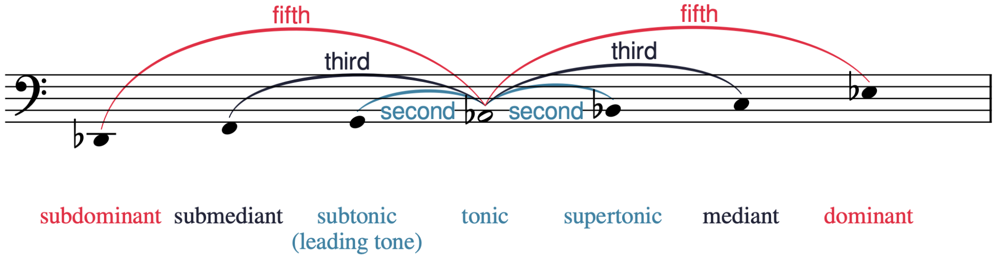
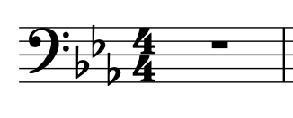
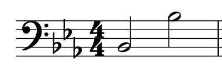
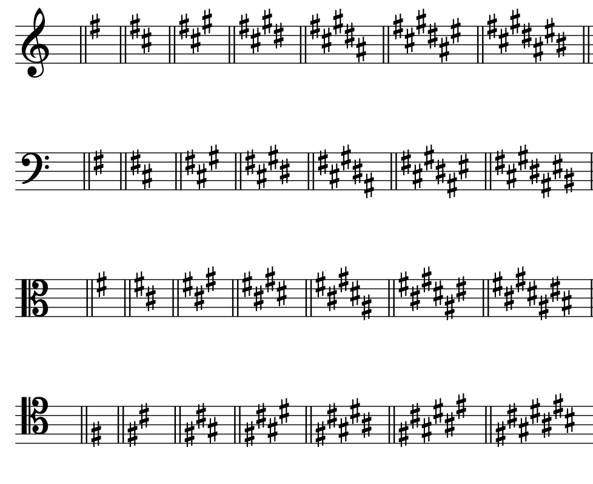
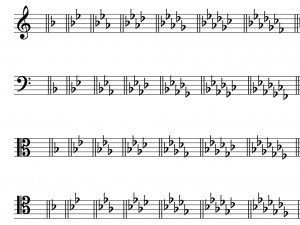
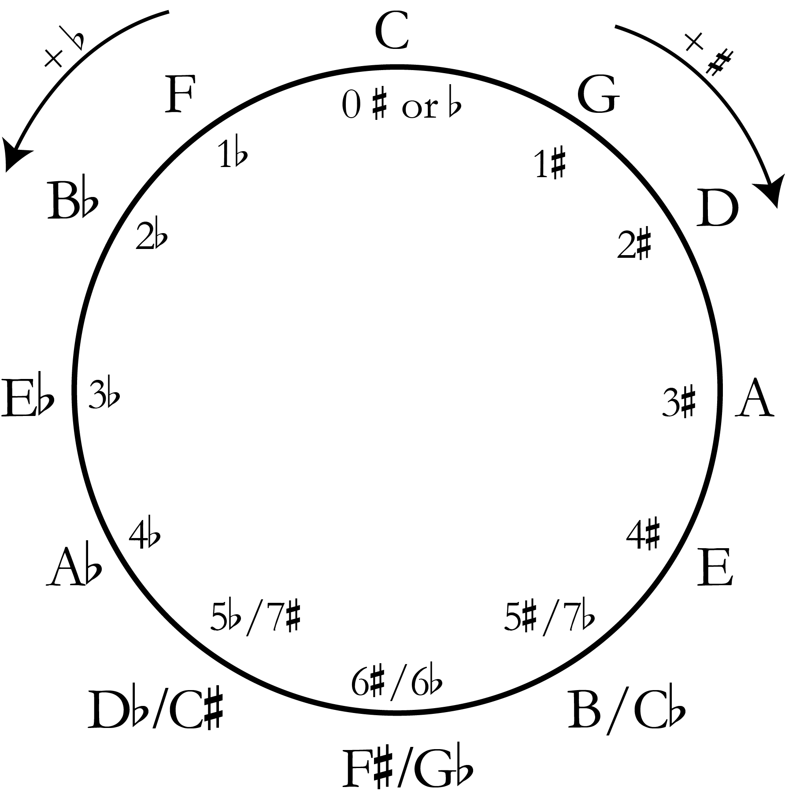

# Мажорные гаммы, ступени и ключевые знаки

**Авторы: Chelsey Hamm и Bryn Hughes.**

> **Черновик перевода.** Источник — [OMT2, Nebraska, Fall 2023](https://pressbooks.nebraska.edu/openmusictheory/chapter/major-scales/), снимок от 20 сентября 2026 года. С текущей редакцией VIVA не сверено. Перевод — участники Open Music Theory RU. [CC BY-SA 4.0](https://creativecommons.org/licenses/by-sa/4.0/).

## Главное

- **Мажорная гамма** — упорядоченная последовательность тонов и полутонов: при движении вверх **тон — тон — полутон — тон — тон — тон — полутон** (`W–W–H–W–W–W–H`).
- Название мажорной гаммы определяется её первой нотой, которая является и последней; в название включают относящийся к этой ноте знак альтерации.
- **Ступени гаммы** обозначают арабскими цифрами со знаком «крышки» сверху: 1̂–2̂–3̂–4̂–5̂–6̂–7̂.
- Другой способ назвать звуки мажорной гаммы — **сольмизационные слоги** *do, re, mi, fa, sol, la, ti*.
- Ступени мажорной гаммы имеют также названия: **тоника, супертоника, медианта, субдоминанта, доминанта, субмедианта и вводный тон**.
- **Ключевые знаки**, состоящие из диезов или бемолей, записывают в начале произведения после ключа, но перед обозначением тактового размера.
- Порядок диезов при ключе — F, C, G, D, A, E, B; порядок бемолей обратный: B, E, A, D, G, C, F. Последний диез находится на полутон ниже тоники — первой ступени гаммы. Предпоследний бемоль указывает на тонику.
- **Квинтовый круг** помогает запомнить ключевые знаки мажорных тональностей: тональности располагаются по кругу в порядке количества знаков альтерации.

**Гамма** (*scale*) — упорядоченная последовательность тонов и полутонов. При необходимости повторите главу [«Полутоны, тоны и знаки альтерации»](05-half-whole-steps.md).

## Мажорные гаммы

В **мажорной гамме** (*major scale*) тоны и полутоны следуют при движении вверх в порядке `W–W–H–W–W–W–H`. Здесь `W` обозначает тон (*whole step*), а `H` — полутон (*half step*). Послушайте восходящую мажорную гамму в примере 1. Каждый тон отмечен квадратной скобкой и буквой `W`, каждый полутон — угловой скобкой и буквой `H`.

**Пример 1. Восходящая мажорная гамма.**

<iframe src="https://musescore.com/user/32728834/scores/6815731/embed" title="Пример 1. Мажорные гаммы, ступени и ключевые знаки — MuseScore" width="100%" height="440" loading="lazy" allowfullscreen></iframe>

<a href="https://musescore.com/user/32728834/scores/6815731">Открыть пример 1 в MuseScore</a> — если плеер не загрузился или нужен полноэкранный просмотр.

Плеер загружается с MuseScore и требует подключения к интернету. Нотный пример оставлен на языке оригинала.

> **Внешние нотные примеры.** Примеры 1, 2, 3, 5 и 15 встроены из исходных партитур MuseScore; под каждым плеером сохранена прямая ссылка. Их содержимое и воспроизведение не проверены; внутренние надписи не переведены. Русские подписи и описания передают текст главы, а не свидетельствуют о просмотре партитур.

Мажорная гамма начинается и заканчивается нотами с одинаковым буквенным названием на расстоянии **октавы**. Эта начальная и конечная нота определяет название гаммы. Поэтому в примере 1 показана гамма до мажор (C major): её первая и последняя ноты — C.

В название гаммы включают знак альтерации первой и последней нот. В примере 2 показана гамма си-бемоль мажор (B♭ major), а не си мажор (B major): для си мажора потребовался бы другой набор высот. Последовательность тонов и полутонов одинакова во всех мажорных гаммах, как показывают примеры 1 и 2.

**Пример 2. Гамма си-бемоль мажор.**

<iframe src="https://musescore.com/user/32728834/scores/6823280/embed" title="Пример 2. Мажорные гаммы, ступени и ключевые знаки — MuseScore" width="100%" height="440" loading="lazy" allowfullscreen></iframe>

<a href="https://musescore.com/user/32728834/scores/6823280">Открыть пример 2 в MuseScore</a> — если плеер не загрузился или нужен полноэкранный просмотр.

Плеер загружается с MuseScore и требует подключения к интернету. Нотный пример оставлен на языке оригинала.

## Ступени, сольмизация и названия ступеней

Музыканты называют звуки мажорной гаммы несколькими способами. **Ступень гаммы** (*scale degree*) указывает положение звука относительно тоники. Ступени обозначают **арабскими цифрами** с **«крышкой»** (*caret*, циркумфлексом) сверху. Первая нота гаммы — 1̂; далее номера возрастают, а последнюю ноту снова обозначают 1̂, хотя некоторые преподаватели предпочитают 8̂. В примере 3 каждая ступень гаммы ре мажор (D major) обозначена цифрой с «крышкой».

> **Примечание переводчиков.** В основных выводах и этом абзаце оригинала ступени названы «сольмизационными слогами, записываемыми цифрами». Это смешивает положение звука в гамме с одним из способов его назвать. Здесь использовано определение ступени из всплывающего пояснения того же источника; цифровые обозначения и слоги далее различаются.

**Пример 3. Гамма ре мажор.**

<iframe src="https://musescore.com/user/32728834/scores/8452298/embed" title="Пример 3. Мажорные гаммы, ступени и ключевые знаки — MuseScore" width="100%" height="440" loading="lazy" allowfullscreen></iframe>

<a href="https://musescore.com/user/32728834/scores/8452298">Открыть пример 3 в MuseScore</a> — если плеер не загрузился или нужен полноэкранный просмотр.

Плеер загружается с MuseScore и требует подключения к интернету. Нотный пример оставлен на языке оригинала.

Под номерами ступеней в примере 3 показан другой способ называть звуки мажорной гаммы: сольмизационные слоги. **Сольмизация** (*solmization*) сопоставляет каждому звуку гаммы определённый слог; применение этих слогов к ступеням в оригинале называется *solfège*. Слоги *do, re, mi, fa, sol, la, ti* можно присвоить первым семи звукам любой мажорной гаммы. Они соответствуют ступеням 1̂, 2̂, 3̂, 4̂, 5̂, 6̂, 7̂. Последний звук снова называется *do* (1̂), поскольку повторяет первый на октаву выше.

Поскольку высота *do* (1̂) зависит от первой ноты выбранной мажорной гаммы, такой способ называют **системой подвижного до** (*movable do*). В **системе фиксированного до** (*fixed do*), напротив, *do* всегда соответствует классу высоты C, *re* — D и так далее, независимо от гаммы.

> **Примечание переводчиков.** Сохраняем исходные слоги латиницей, в том числе *ti*: в системе подвижного до это названия ступеней, а не постоянные названия нот до–ре–ми–фа–соль–ля–си. Например, *do* в ре мажоре означает ноту ре. Упоминание «*do* (1̂)» в предложении оригинала о фиксированном до неточно: в этой системе *do* означает C, но C не всегда является первой ступенью. Скобочное 1̂ здесь опущено.

Каждая ступень мажорной гаммы имеет также **название по своей функции** (*scale-degree name*): тоника, супертоника, медианта, субдоминанта, доминанта, субмедианта, вводный тон, затем снова тоника. В примере 4 оригинал сопоставляет эти названия с номерами ступеней и сольмизационными слогами.

**Пример 4. Номера ступеней, сольмизационные слоги и названия ступеней.**

> **Примечание переводчиков.** Таблица отсутствует в полученном источнике: вместо неё сохранено сообщение `[table “37” not found /]`. Мы перевели подпись, но не восстанавливали содержимое таблицы по догадке.

В примере 5 названия ступеней применены к гамме ля-бемоль мажор (A♭ major).

**Пример 5. Гамма ля-бемоль мажор с названиями ступеней.**

<iframe src="https://musescore.com/user/32728834/scores/8452340/embed" title="Пример 5. Мажорные гаммы, ступени и ключевые знаки — MuseScore" width="100%" height="440" loading="lazy" allowfullscreen></iframe>

<a href="https://musescore.com/user/32728834/scores/8452340">Открыть пример 5 в MuseScore</a> — если плеер не загрузился или нужен полноэкранный просмотр.

Плеер загружается с MuseScore и требует подключения к интернету. Нотный пример оставлен на языке оригинала.

В примере 6 звуки ля-бемоль мажора и названия ступеней расположены так, чтобы показать происхождение этих названий. Дуги над нотным станом показывают [интервалы](https://pressbooks.nebraska.edu/openmusictheorymusc165fall2023/chapter/intervals/) между каждой ступенью и тоникой (ссылка ведёт к англоязычной главе).

- Слово **доминанта** (*dominant*) унаследовано от средневековой теории музыки и отражает важность квинты над тоникой в диатонической музыке.
- **Медианта** (*mediant*) означает «средняя»: эта ступень находится посередине между тоникой и доминантой.
- Латинская приставка *super-* означает «над»: **супертоника** (надтоника) находится на секунду выше тоники. Это единственное название в этой группе с приставкой *super-*.
- Латинская приставка *sub-* означает «под». **Субтоника, субмедианта и субдоминанта** располагаются на соответствующих интервалах ниже тоники, как супертоника, медианта и доминанта — выше неё. Обратите внимание: для ступени на полутон ниже тоники авторы предпочитают название **вводный тон** (*leading tone*), а не «субтоника». Такое название связано с тем, что этот звук часто воспринимается как «ведущий» к тонике.

**Пример 6.** Звуки ля-бемоль мажора расположены так, чтобы показать происхождение названий ступеней.

> **Иллюстрации.** Нотные рисунки примеров 6–14 и 16 сохранены в исходном виде. Подписи и текстовые описания переведены; английские надписи внутри изображений не локализованы.

## Ключевые знаки

**Ключевые знаки** (*key signature*) — диезы или бемоли, которые записывают в начале произведения после ключа, но перед обозначением тактового размера. Этот порядок удобно запомнить по алфавитной последовательности английских слов: *clef* — ключ, *key* — ключевые знаки, *time* — размер. В примере 7 ключевые знаки находятся между басовым ключом и обозначением размера.

**Пример 7.** Ключевые знаки располагаются после ключа, но перед обозначением тактового размера.

**Пример 8.** Оба звука B понижаются бемолем независимо от октавы.

Ключевые знаки собирают знаки альтерации гаммы в начале произведения: так легче следить за тем, какие звуки следует изменять. В примере 7 бемоли стоят на линейках и в промежутках, соответствующих нотам B, E и A, если читать слева направо. Поэтому при таких ключевых знаках все ноты си, ми и ля понижаются бемолем независимо от октавы. В примере 8 оба звука B являются си-бемолями, поскольку B♭ входит в ключевые знаки.

Бемоли добавляются при ключе в определённом порядке; то же справедливо и для диезов. Этот порядок не зависит от ключа. В примере 9 показаны последовательности диезов и бемолей во всех четырёх изученных ключах.

**Пример 9.** Порядок диезов и бемолей в скрипичном, басовом, альтовом и теноровом ключах.

**Порядок диезов всегда F, C, G, D, A, E, B** — фа, до, соль, ре, ля, ми, си. Его можно запомнить по английской фразе *“Fat Cats Go Down Alleys (to) Eat Birds”*: начальные буквы слов, кроме служебного *to*, дают нужную последовательность. Диезы образуют зигзаг, чередуя движение вниз и вверх. В скрипичном, басовом и альтовом ключах этот рисунок «ломается» после D♯, а затем возобновляется. В теноровом ключе излома нет, но F♯ и G♯ записаны октавой ниже, чем при продолжении верхнего расположения.

**Порядок бемолей обратный: B, E, A, D, G, C, F** — си, ми, ля, ре, соль, до, фа. Для запоминания предлагается английская фраза *“Birds Eat And Dive Going Copiously Far”*, начальные буквы которой дают B–E–A–D–G–C–F. Бемоли всегда образуют непрерывный зигзаг: попеременно вверх и вниз независимо от ключа, как в примере 9.

> **Примечание переводчиков.** Оригинал называет порядок диезов и бемолей «палиндромами». Точнее сказать, что это две взаимно обратные последовательности: каждая по отдельности не читается одинаково в обоих направлениях. Английские мнемонические фразы оставлены без замены: их приём основан именно на английских начальных буквах.

Есть простые способы определить, какой мажорной гамме соответствуют ключевые знаки. В диезных тональностях **последний диез находится на полутон ниже тоники**, первой ступени гаммы. В примере 10 показаны три набора диезных ключевых знаков в разных ключах. Определим тональности этим способом.

**Пример 10.** Три набора диезных ключевых знаков в скрипичном, басовом и альтовом ключах.

1. Последний — здесь единственный — диез F♯ находится на полутон ниже G. Это ключевые знаки соль мажора (G major).
2. Последний диез G♯ находится на полутон ниже A. Это ключевые знаки ля мажора (A major).
3. Последний диез E♯ находится на полутон ниже F♯. Это ключевые знаки фа-диез мажора (F♯ major).

В бемольных тональностях **предпоследний бемоль указывает на тонику**, первую ступень гаммы. В примере 11 показаны три набора бемольных ключевых знаков в разных ключах. Определим тональности этим способом.

**Пример 11.** Три набора бемольных ключевых знаков в басовом, скрипичном и теноровом ключах.

1. Предпоследний бемоль — B♭. Это ключевые знаки си-бемоль мажора (B♭ major).
2. Предпоследний бемоль — A♭. Это ключевые знаки ля-бемоль мажора (A♭ major).
3. Предпоследний бемоль — G♭. Это ключевые знаки соль-бемоль мажора (G♭ major).

**Пример 12.** Ключевые знаки до мажора вверху и фа мажора внизу.

Две тональности придётся просто запомнить: для них эти приёмы не подходят. В **до мажоре** при ключе нет ни диезов, ни бемолей, а в **фа мажоре** стоит один бемоль — B♭ (пример 12).

В примере 13 сначала показан до мажор без ключевых знаков, затем все диезные мажорные тональности по порядку во всех четырёх ключах: соль, ре, ля, ми, си, фа-диез и до-диез мажор.

**Пример 13.** Ключевые знаки C, G, D, A, E, B, F♯ и C♯ мажора во всех четырёх ключах.

В примере 14 также сначала показан до мажор без ключевых знаков, а затем все бемольные мажорные тональности по порядку во всех четырёх ключах: фа, си-бемоль, ми-бемоль, ля-бемоль, ре-бемоль, соль-бемоль и до-бемоль мажор.

**Пример 14.** Ключевые знаки C, F, B♭, E♭, A♭, D♭, G♭ и C♭ мажора во всех четырёх ключах.

Итак, в примере 14 после до мажора без знаков следуют фа, си-бемоль, ми-бемоль, ля-бемоль, ре-бемоль, соль-бемоль и до-бемоль мажор во всех четырёх ключах.

Ещё один приём облегчает запоминание: в **до мажоре** нет ни диезов, ни бемолей; в **до-бемоль мажоре** все ноты имеют бемоль — всего семь бемолей; в **до-диез мажоре** все ноты имеют диез — всего семь диезов.

Авторы называют мажорные тональности **«реальными»** (*real*), если они соответствуют одному из наборов ключевых знаков в примерах 13 или 14. Если для записи ключевых знаков понадобился бы **дубль-диез** или **дубль-бемоль**, такая тональность называется здесь **«воображаемой»** (*imaginary*). Иногда музыка встречается и в таких тональностях. В примере 15 показана гамма фа-бемоль мажор (F♭ major); её ключевые знаки были бы «воображаемыми», поскольку среди них потребовался бы B𝄫 — си-дубль-бемоль.

**Пример 15. Гамма фа-бемоль мажор в скрипичном ключе.**

<iframe src="https://musescore.com/user/32728834/scores/6817049/embed" title="Пример 15. Мажорные гаммы, ступени и ключевые знаки — MuseScore" width="100%" height="440" loading="lazy" allowfullscreen></iframe>

<a href="https://musescore.com/user/32728834/scores/6817049">Открыть пример 15 в MuseScore</a> — если плеер не загрузился или нужен полноэкранный просмотр.

Плеер загружается с MuseScore и требует подключения к интернету. Нотный пример оставлен на языке оригинала.

## Квинтовый круг

**Квинтовый круг** (*circle of fifths*) — удобная наглядная схема. Все мажорные тональности располагаются по кругу в порядке количества ключевых знаков. Круг называется квинтовым потому, что тоники соседних тональностей находятся на расстоянии квинты. В примере 16 показан квинтовый круг мажорных тональностей.

**Пример 16.** Квинтовый круг мажорных тональностей.

Вверху круга, в положении «12 часов», находится до мажор без диезов и бемолей. При движении по часовой стрелке идут диезные тональности: каждая следующая добавляет один диез. При движении от до мажора против часовой стрелки идут бемольные тональности: каждая следующая добавляет один бемоль. В нижних трёх положениях круга — «7, 6 и 5 часов» — находятся **энгармонически равные** тональности. Например, у си мажора и до-бемоль мажора разные ключевые знаки — пять диезов и семь бемолей соответственно, — но гаммы звучат одинаково, поскольку ноты B и C♭ энгармонически равны.

> **Примечание переводчиков.** В оригинале сказано, что «три нижних набора ключевых знаков» энгармонически равны. Речь о парах в каждом из трёх положений круга, а не о равенстве тональностей между всеми тремя положениями.

## Определения из всплывающих пояснений

Всплывающие пояснения источника приведены ниже обычным текстом. Два пустых элемента (`term_171_1174` и `term_171_1175`) не содержат определения и не восстановлены.

| Термин | Определение источника в переводе |
|---|---|
| Гамма (*scale*) | Упорядоченная последовательность полутонов и тонов. |
| Ступень гаммы (*scale degree*) | Положение ноты в диатонической гамме относительно её тоники; обозначается номером от 1 до 7. |
| Сольмизация (*solmization*) | Система, сопоставляющая каждому звуку гаммы определённый слог. |
| Арабские цифры (*Arabic numerals*) | Цифры 0, 1, 2, 3, 4, 5, 6, 7, 8 и 9. |
| «Крышка» (*caret*) | Знак, похожий на угловую скобку, над арабской цифрой для обозначения ступени; циркумфлекс. |
| *Solfège* | Применение сольмизационных слогов (*do, re, mi, fa, sol* и т. д.) к ступеням гаммы. |
| Названия ступеней (*scale-degree names*) | Подвижная система названий, основанная на функции ступеней в гамме: например, тоника (*do*, 1̂) и доминанта (*sol*, 5̂). |
| Диез (*sharp*) | Повышает ноту на полутон. |
| Бемоль (*flat*) | Понижает ноту на полутон. |
| Мажорная гамма (*major scale*) | Упорядоченная последовательность полутонов (`H`) и тонов (`W`): при движении вверх `W–W–H–W–W–W–H`. |
| Октава (*octave*) | Интервал в двенадцать полутонов между нотами с одинаковым буквенным названием. Частоты звуков относятся как 2:1. Сокращённое обозначение — `8ve`. |
| Подвижное до (*movable do*) | Система, в которой *do* обозначает первую ступень гаммы, в отличие от фиксированного до, где *do* всегда означает класс высоты C. |
| Фиксированное до (*fixed do*) | Система, в которой *do* всегда означает класс высоты C, *re* — D и т. д., независимо от гаммы. |
| Диатонический (*diatonic*) | 1. Гамма, лад или набор звуков с последовательностью тонов и полутонов `W–W–H–W–W–W–H` либо любым её циклическим сдвигом. 2. Принадлежащий действующей в данном фрагменте тональности, в отличие от «хроматического». |
| Вводный тон (*leading tone*) | Ступень 7̂, находящаяся на полутон ниже 1̂. В мажоре вводный тон диатонический, а в миноре требует знака альтерации. |
| Дубль-диез (*double sharp*) | Повышает ноту на два полутона. |
| Дубль-бемоль (*double flat*) | Понижает ноту на два полутона. |
| Энгармоническое равенство (*enharmonic equivalence*) | Отношение между нотами, интервалами или аккордами, которые звучат одинаково, но записаны по-разному. |

> **Примечание переводчиков.** Продолжение темы: [минорные гаммы](13-minor-scales.md) и [диатонические лады и хроматическая гамма](14-modes.md).

## Онлайн-ресурсы

Внешние материалы ниже — **на английском языке**. Переведены названия ссылок; содержимое, доступность и воспроизведение не проверены.

- [Мажорные гаммы: учебное объяснение](http://www.musictheory.net/lessons/21) — musictheory.net.
- [Мажорные гаммы](https://www.practical-chords-and-harmony.com/major-scales.html) — Practical Chords and Harmonies.
- [Мажорные гаммы](https://www.youtube.com/watch?v=v44NY4fyxHA&t=13s) — YouTube.
- [Названия ступеней](http://musictheoryfundamentals.com/MusicTheory/scaleDegreeNames.php) — musictheoryfundamentals.com.
- [Названия ступеней](https://www.musictheory.net/lessons/23) — musictheory.net.
- [Сольмизация: история и учебное объяснение](http://legacy.earlham.edu/~tobeyfo/musictheory/Book1/FFH1_CH1/1K_Solfege.html) — Earlham College.
- [Ступени, сольмизация и названия ступеней](https://www.youtube.com/watch?v=TB8r2M8oU5Y) — YouTube.
- [Ключевые знаки мажорных тональностей](http://www.musictheory.net/lessons/24) — musictheory.net.
- [Диезные ключевые знаки](https://www.youtube.com/watch?v=TJEM4FS9WSg) — YouTube.
- [Бемольные ключевые знаки](https://www.youtube.com/watch?v=0mF6vwduEdY) — YouTube.
- [Карточки для изучения ключевых знаков мажорных тональностей](https://music-theory-practice.com/key-signatures/key-signature-flashcards.html) — music-theory-practice.com.
- [Квинтовый круг](https://www.youtube.com/watch?v=NocewRDr3bk) — YouTube.
- [Квинтовый круг](https://www.classicfm.com/discover-music/music-theory/what-is-the-circle-of-fifths/) — Classic FM.

## Задания из интернета

Рабочие листы **на английском языке**; переведены только названия. Содержимое и доступность файлов не проверены, ответы не проверены и не добавлены.

A. Запись мажорных гамм: [первый лист PDF](https://www2.lawrence.edu/fast/BIRINGEG/media/theory_funds/pdf/ws10-major_scales_i.pdf); построение от тоники и других ступеней — [второй лист PDF](https://www2.lawrence.edu/fast/BIRINGEG/media/theory_funds/pdf/ws12-major_scales-scale_degrs.pdf).

B. Запись ключевых знаков мажорных тональностей: [PDF](https://www2.lawrence.edu/fast/BIRINGEG/media/theory_funds/pdf/ws11-key_sigs-major.pdf).

C. Определение мажорных тональностей по ключевым знакам: [PDF](https://www.wku.edu/music/documents/keysig.pdf).

D. Рабочие листы по мажорным тональностям для детей: [PDF](http://www.musicfun.net.au/pdf_files/keysign_n_scales.pdf).

E. Ступени или сольмизационные слоги: [первый лист PDF](https://www2.lawrence.edu/fast/BIRINGEG/media/theory_funds/pdf/ws13-scale_degrs-major.pdf), [второй лист PDF](https://people.carleton.edu/~jellinge/m101s12/Pages/12/Media12/12pdf/Worksheet12-4.pdf).

## Задания

Файлы **на английском языке**; переведены только названия. Содержимое и доступность PDF и MuseScore не проверены. Исходные ссылки MuseScore содержат фрагмент `#fixme`; он сохранён без утверждения об исправности адресов.

1. Запись мажорных гамм: [PDF](https://pressbooks.nebraska.edu/app/uploads/sites/379/2023/09/WK-Major-Scales-1.pdf), [файл MuseScore (.mscx)](https://viva.pressbooks.pub/app/uploads/sites/12/2021/10/WK-Major-Scales-1.mscx#fixme).
2. Ключевые знаки: мажор: [PDF](https://pressbooks.nebraska.edu/app/uploads/sites/379/2023/09/WK-Major-Scales-2.pdf), [файл MuseScore (.mscx)](https://viva.pressbooks.pub/app/uploads/sites/12/2021/10/WK-Major-Scales-2.mscx#fixme).
