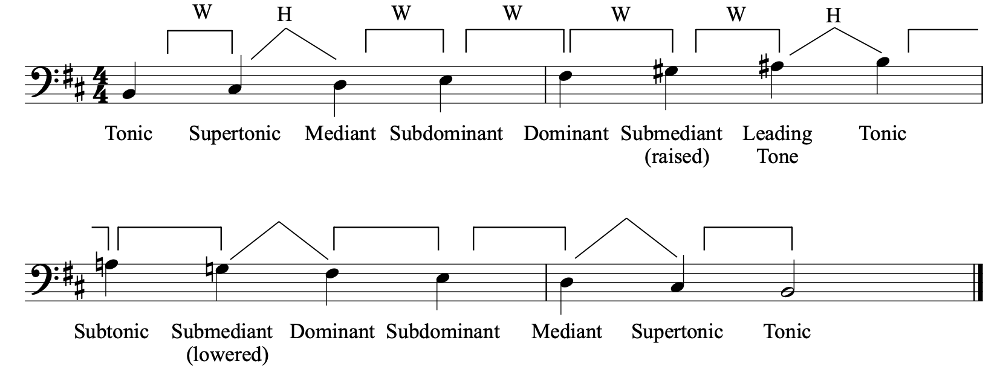
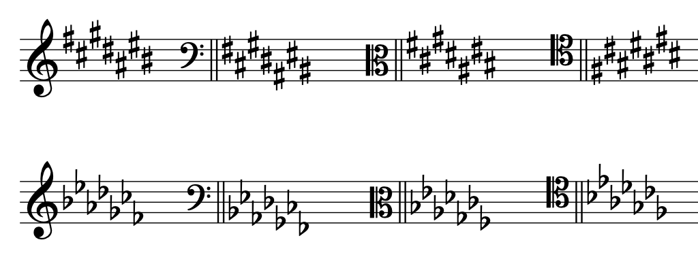
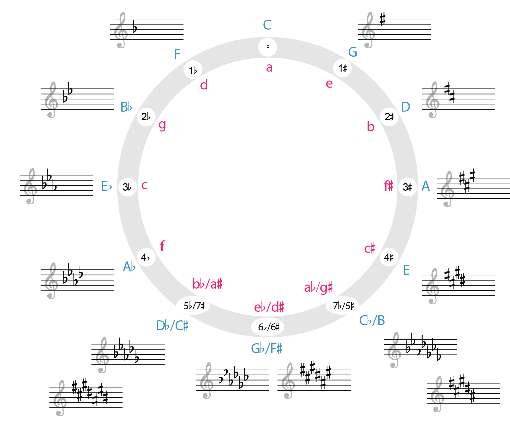

# Минорные гаммы, ступени и ключевые знаки

**Авторы: Chelsey Hamm и Bryn Hughes.**

> **Черновик перевода.** Источник — [OMT2, Nebraska, Fall 2023](https://pressbooks.nebraska.edu/openmusictheory/chapter/minor-scales/), снимок от 20 сентября 2026 года. С текущей редакцией VIVA не сверено. Перевод — участники Open Music Theory RU. [CC BY-SA 4.0](https://creativecommons.org/licenses/by-sa/4.0/).

## Главное

- Третья нота минорной **гаммы** всегда на полутон ниже третьей ноты одноимённой мажорной гаммы.
- Существуют три вида минорной гаммы: **натуральный**, **гармонический** и **мелодический минор**.
- В каждом из них тоны и полутоны располагаются в определённом порядке. Здесь `W` — тон, `H` — полутон, `3Hs` — три полутона:
  - натуральный минор: `W–H–W–W–H–W–W` вверх;
  - гармонический минор: `W–H–W–W–H–3Hs–H` вверх;
  - мелодический минор: `W–H–W–W–W–W–H` вверх и `W–W–H–W–W–H–W` вниз.
- Хотя видов минорной гаммы три, минорные тональности и их ключевые знаки называют просто «минорными»: ля минор, ре минор и так далее. Ключевые знаки соответствуют натуральному минору.
- Нумерация **ступеней гаммы** в миноре такая же, как в мажоре. В **сольмизации** появляются новые слоги: *me* (↓3̂), *le* (↓6̂) и *te* (↓7̂).
- У каждой ноты минорной гаммы есть также **название ступени**. Почти все эти названия совпадают с мажорными; новое название — **субтоника** (*te*, ↓7̂).
- Мажорные и минорные тональности могут находиться в двух отношениях. **Одноимённые** тональности имеют общую тонику, а **параллельные** — одинаковые ключевые знаки.
- Каждой мажорной тональности соответствует параллельная минорная с теми же ключевыми знаками. Её тоника на три полутона ниже тоники параллельного мажора. Порядок диезов и бемолей при ключе в мажоре и миноре одинаков.

[Плейлист к главе — Spotify](https://open.spotify.com/playlist/2wylP85ygXkX1tWtUPqcgm?si=f62d6967860244ce). Внешний материал из оригинала; доступность, состав и воспроизведение не проверены.

## Минорная гамма

Третья нота минорной **гаммы** (*minor scale*) всегда на полутон ниже третьей ноты одноимённой мажорной гаммы — например, си мажора и си минора. Есть три вида минорной гаммы: **натуральный минор** (*natural minor*), **гармонический минор** (*harmonic minor*) и **мелодический минор** (*melodic minor*). Их можно сравнить со вкусами мороженого: шоколадное, ванильное или клубничное мороженое всё равно остаётся мороженым. Так и о произведении говорят просто, что оно «минорное» или написано «в миноре»; музыканты не считают, что оно написано «в» определённом виде минорной гаммы — натуральном, гармоническом или мелодическом. Иными словами, хотя видов минорной гаммы три, тональности и их ключевые знаки называют просто минорными: ля минор, ре минор и так далее. Ключевые знаки при этом соответствуют натуральному минору.

Деление на три вида минорной гаммы полезно прежде всего исполнителям-инструменталистам. Играя эти гаммы на инструменте, музыкант осваивает наиболее распространённые в западной классической музыке минорные последовательности. Как и мажорные, минорные гаммы называют по первой ноте с учётом её знака альтерации, если он есть. Эта же нота завершает гамму.

## Натуральный минор

**Натуральный минор** строится из тонов и полутонов в следующем порядке при движении вверх: `W–H–W–W–H–W–W` ([пример 1](#example-1)). Каждый тон в примере отмечен квадратной скобкой и буквой `W`, каждый полутон — угловой скобкой и буквой `H`. Внимательно послушайте пример 1: при движении вверх и вниз натуральный минор сохраняет один и тот же состав ступеней и интервалы между ними.

> **Примечание переводчиков.** Здесь и в описании гармонического минора оригинал говорит об «одинаковой последовательности» вверх и вниз. Речь о неизменном составе гаммы: при движении вниз интервалы между соседними ступенями проходятся в обратном порядке. Это не означает, что записанная слева направо цепочка `W` и `H` остаётся той же.

<iframe src="https://musescore.com/user/32728834/scores/6825960/embed" title="Пример 1. Минорные гаммы, ступени и ключевые знаки — MuseScore" width="100%" height="440" loading="lazy" allowfullscreen></iframe>

<a href="https://musescore.com/user/32728834/scores/6825960">Открыть пример 1 в MuseScore</a> — если плеер не загрузился или нужен полноэкранный просмотр.

Плеер загружается с MuseScore и требует подключения к интернету. Нотный пример оставлен на языке оригинала.

*Пример 1. Гамма соль натурального минора.*

> **Примечание переводчиков.** Примеры 1–5 оставлены как внешние нотные материалы оригинала. Их англоязычное содержимое не локализовано; доступность, ноты и воспроизведение не проверены. Подписи и объяснения переведены из главы, а не составлены по проверенным партитурам.

## Гармонический минор

В **гармоническом миноре** тоны и полутоны следуют вверх в порядке `W–H–W–W–H–3Hs–H`, где `3Hs` означает три полутона ([пример 2](#example-2)). Дугообразная скобка обозначает расстояние в три полутона, то есть тон плюс полутон. Внимательно послушайте пример 2: при движении вверх и вниз гармонический минор сохраняет один и тот же состав ступеней и интервалы между ними.

<iframe src="https://musescore.com/user/32728834/scores/6826003/embed" title="Пример 2. Минорные гаммы, ступени и ключевые знаки — MuseScore" width="100%" height="440" loading="lazy" allowfullscreen></iframe>

<a href="https://musescore.com/user/32728834/scores/6826003">Открыть пример 2 в MuseScore</a> — если плеер не загрузился или нужен полноэкранный просмотр.

Плеер загружается с MuseScore и требует подключения к интернету. Нотный пример оставлен на языке оригинала.

*Пример 2. Гамма соль гармонического минора. Внешний пример, содержимое и воспроизведение не проверены.*

## Мелодический минор

В **мелодическом миноре** порядок тонов и полутонов при движении вверх — `W–H–W–W–W–W–H`, а при движении вниз — `W–W–H–W–W–H–W` ([пример 3](#example-3)). Слушая пример 3, обратите внимание: восходящая и нисходящая формы мелодического минора различаются. Восходящая последовательность характерна именно для мелодического минора, а нисходящая совпадает с натуральным минором.

<iframe src="https://musescore.com/user/32728834/scores/8455586/embed" title="Пример 3. Минорные гаммы, ступени и ключевые знаки — MuseScore" width="100%" height="440" loading="lazy" allowfullscreen></iframe>

<a href="https://musescore.com/user/32728834/scores/8455586">Открыть пример 3 в MuseScore</a> — если плеер не загрузился или нужен полноэкранный просмотр.

Плеер загружается с MuseScore и требует подключения к интернету. Нотный пример оставлен на языке оригинала.

*Пример 3. Гамма соль мелодического минора. Внешний пример, содержимое и воспроизведение не проверены.*

В [примере 4](#example-4) показаны четыре гаммы от до: [мажорная](12-major-scales.md), натуральная минорная, гармоническая минорная и мелодическая минорная. Указаны номера ступеней (см. [ниже](#minor-scale-degrees)). Внимательно послушайте пример и сравните звучание гамм.

<iframe src="https://musescore.com/user/32728834/scores/8383329/s/WuOIXN/embed" title="Пример 4. Минорные гаммы, ступени и ключевые знаки — MuseScore" width="100%" height="440" loading="lazy" allowfullscreen></iframe>

<a href="https://musescore.com/user/32728834/scores/8383329/s/WuOIXN">Открыть пример 4 в MuseScore</a> — если плеер не загрузился или нужен полноэкранный просмотр.

Плеер загружается с MuseScore и требует подключения к интернету. Нотный пример оставлен на языке оригинала.

*Пример 4. Мажорная, натуральная минорная, гармоническая минорная и мелодическая минорная гаммы от до. Внешний пример, содержимое и воспроизведение не проверены.*

## Ступени минора, сольмизация и названия ступеней

Номера ступеней, **сольмизация** (*solfège*) и названия ступеней в миноре похожи на соответствующие обозначения в мажоре, но не во всём совпадают с ними. [Пример 5](#example-5) обобщает три вида минорной гаммы и показывает для каждого номера ступеней и слоги сольмизации. Нумерация ступеней та же, что в мажорной гамме. Нижняя строка содержит слоги сольмизации; некоторые из них отличаются от мажорных, отражая расположение тонов и полутонов в миноре.

> **Примечание переводчиков.** Сохраняем слоги системы подвижного до, принятой в этом объяснении: *do* обозначает тонику любой рассматриваемой тональности, а не обязательно ноту до. Знаки ↓3̂, ↓6̂ и ↓7̂ показывают понижение соответствующих ступеней относительно одноимённого мажора. Это не смена их порядковых номеров. Вариант сольмизации с тоникой минора *la* в данном снимке не рассматривается.

<iframe src="https://musescore.com/user/32728834/scores/8383293/embed" title="Пример 5. Минорные гаммы, ступени и ключевые знаки — MuseScore" width="100%" height="440" loading="lazy" allowfullscreen></iframe>

<a href="https://musescore.com/user/32728834/scores/8383293">Открыть пример 5 в MuseScore</a> — если плеер не загрузился или нужен полноэкранный просмотр.

Плеер загружается с MuseScore и требует подключения к интернету. Нотный пример оставлен на языке оригинала.

*Пример 5. Ступени и слоги сольмизации трёх видов минора: a) натурального, b) гармонического, c) мелодического. Внешний пример, содержимое и воспроизведение не проверены.*

В натуральном миноре (пример 5a) *mi* (3̂) заменяется на *me* (↓3̂), которое произносится как английское *may* («мэй»); *la* (6̂) — на *le* (↓6̂), как английское *lay* («лэй»); *ti* (7̂) — на *te* (↓7̂), как английское *tay* («тэй»). Если вы споёте или сыграете этот пример, то заметите, что в конце нет такого же ощущения завершённости, как в мажоре. В мажорной гамме это ощущение отчасти создаёт восходящий полутон между *ti* (7̂) и *do* (1̂).

В гармоническом миноре (пример 5b) *mi* (3̂) заменяется на *me* (↓3̂), а *la* (6̂) — на *le* (↓6̂). Слог *ti* (7̂) соответствует ступени, которая создаёт ощущение завершённости, отсутствующее в натуральном миноре.

Как уже отмечалось, мелодический минор имеет разные восходящую и нисходящую формы (пример 5c). В восходящей форме *mi* (3̂) заменяется на *me* (↓3̂), а остальные слоги те же, что в мажоре. В нисходящей форме *mi* (3̂) заменяется на *me* (↓3̂), *la* (6̂) — на *le* (↓6̂), а *ti* (7̂) — на *te* (↓7̂), как в натуральном миноре. Поэтому восходящая форма мелодического минора даёт ощущение завершённости, знакомое по мажору, а нисходящая следует строению натурального минора.

Как и в мажоре, у каждой ноты минорной гаммы есть также **название ступени** (*scale-degree name*). В [примере 6](#example-6) оригинал сопоставляет названия ступеней минора с их номерами и слогами сольмизации.

*Пример 6. Названия ступеней минорных гамм.*

> **Примечание переводчиков.** Вместо таблицы пример 6 содержит в источнике сообщение `[table “39” not found /]`. Таблица 39 отсутствует; её неизвестное содержимое не восстановлено и не переведено.

Как объяснялось в [главе о мажорных гаммах](12-major-scales.md), латинская приставка *sub* означает «под»: субмедианта находится на терцию ниже тоники, а субдоминанта — на квинту ниже. Теперь к названиям ступеней можно добавить ещё одно: **субтоника** (*subtonic*) — пониженная VII ступень (↓7̂). Супертоника (*supertonic*) располагается на тон выше тоники, а субтоника — на тон ниже неё.

В [примере 7](#example-7) показана гамма си мелодического минора вверх и вниз с названиями ступеней. В восходящей форме мелодический минор использует **вводный тон** (*leading tone*), а в нисходящей — субтонику.

> **Примечание переводчиков.** Вводный тон находится на полутон ниже тоники, субтоника — на тон ниже. В данном примере B означает си, а не си-бемоль. Слоги *ti* и *te* показывают функцию ступени в системе подвижного до и не являются постоянными названиями нот.

<figure id="example-7">

<figcaption>Пример 7. Гамма си мелодического минора.</figcaption>
</figure>

[Пример 8](#example-8) в оригинале предназначен для наглядного сравнения трёх видов минорной гаммы. Порядок отражает число пониженных ступеней по сравнению с мажорной гаммой от той же ноты.

*Пример 8. Пониженные ступени минора.*

> **Примечание переводчиков.** Вместо таблицы пример 8 содержит в источнике сообщение `[table “40” not found /]`. Таблица 40 отсутствует; её неизвестное содержимое не восстановлено и не переведено. Следующий абзац переведён из сохранившегося текста главы.

В натуральном миноре понижены три ступени, в гармоническом — две, а в восходящем мелодическом — одна. Помните: нисходящая форма мелодического минора совпадает с натуральным минором и содержит три пониженные ступени.

## Одноимённые и параллельные тональности

При сравнении мажорных и минорных тональностей важны два отношения. **Одноимёнными тональностями** (*parallel keys*) называют мажорную и минорную тональности с общей тоникой (*do*, 1̂). Например, до мажор и до минор, ля-бемоль мажор и ля-бемоль минор, фа-диез мажор и фа-диез минор — одноимённые. Поэтому до мажор называют одноимённым мажором до минора, а до минор — одноимённым минором до мажора.

**Параллельными тональностями** (*relative keys*) называют мажорную и минорную тональности с одинаковыми ключевыми знаками. Например, ни в до мажоре, ни в ля миноре при ключе нет диезов или бемолей. До мажор — параллельный мажор ля минора, а ля минор — параллельный минор до мажора. Тоника минорной тональности всегда на три полутона ниже тоники параллельного мажора: отсчитав три полутона вниз от до, вы получите ля (`C–B`, `B–B♭`, `B♭–A`). Чтобы найти параллельный мажор заданного минора, отсчитайте три полутона вверх.

Считая полутоны для определения параллельного мажора или минора, помните: у параллельных тональностей одинаковые ключевые знаки. Диезная тональность не может быть параллельной бемольной, и наоборот, поэтому необходимо выбрать правильное **энгармоническое** написание. Например, звук на три полутона ниже ре-бемоля (`D♭`) можно записать как си-бемоль (`B♭`) или ля-диез (`A♯`). Но параллельным минором ре-бемоль мажора с пятью бемолями будет именно си-бемоль минор, тоже с пятью бемолями: в ля-диез миноре другие ключевые знаки — семь диезов.

## Ключевые знаки минорных тональностей

Ключевые знаки минора, как и мажора, располагаются после ключа, но перед обозначением тактового размера. Каждой мажорной тональности соответствует параллельная минорная с теми же ключевыми знаками. Поэтому порядок диезов и бемолей одинаков: они занимают те же линейки и промежутки нотного стана. [Пример 9](#example-9), повторённый из предыдущей главы, показывает порядок ключевых знаков во всех четырёх ключах.

<figure id="example-9">

<figcaption>Пример 9. Порядок диезов и бемолей во всех четырёх ключах.</figcaption>
</figure>

Как уже говорилось, если вы знаете мажорную тональность с данными ключевыми знаками, отсчитайте от её тоники три полутона вниз, чтобы найти минорную тональность с теми же знаками. В примере 10 оригинал указывает последовательность всех диезных минорных тональностей, а в примере 11 — всех бемольных.

> **Примечание переводчиков.** Примеры 10 и 11 упомянуты в тексте источника, но в сохранённом снимке нет соответствующих изображений, партитур или подписей. Они не восстановлены по догадке; сохранившееся объяснение переведено полностью.

Минорные тональности, подобно мажорным, тоже могут быть «воображаемыми» (*imaginary keys*), если их ключевые знаки включают двойные знаки альтерации.

## Минорные тональности и квинтовый круг

**Квинтовый круг** (*circle of fifths*) помогает наглядно представить ключевые знаки и мажорных, и минорных тональностей. Рядом с каждой группой ключевых знаков указаны соответствующие мажорная и минорная тональности. В [примере 12](#example-12) показан квинтовый круг для обоих ладов.

<figure id="example-12">

<figcaption>Пример 12. Квинтовый круг мажорных и минорных тональностей. Ссылка ведёт к крупному изображению из оригинала; его доступность не проверена.</figcaption>
</figure>

В примере 12 мажорные тональности обозначены синими прописными буквами снаружи круга, а минорные — красными строчными буквами внутри. Ключевые знаки снова расположены по их количеству. Если начать сверху, на отметке «12 часов», и двигаться по часовой стрелке, будут добавляться диезы; если двигаться против часовой стрелки — бемоли. Три нижние позиции допускают запись и диезами, и бемолями: соответствующие тональности **энгармонически равны**.

## Мажор или минор?

В нотах произведения, которое вам предстоит играть или петь, часто указаны ключевые знаки. Они помогают сузить выбор до двух тональностей: мажорной и параллельной ей минорной.[^modes] Но как определить, в какой из них написано произведение? Попробуйте послушать первые и последние звуки и посмотреть, как они записаны. Произведения часто начинаются и заканчиваются на тонике, поэтому эти звуки могут помочь отличить мажор от минора.

[Пример 13](#example-13) показывает первые три такта песни Луизы Рейхардт (1779–1826) «Durch die bunten Rosenhecken» («Сквозь пёстрые розовые изгороди»).

<figure id="example-13">

<figcaption>Пример 13. Первые три такта «Durch die bunten Rosenhecken». Ссылка на изображении ведёт к крупному оригиналу; его доступность не проверена.</figcaption>
</figure>

[Послушать песню на Spotify](https://open.spotify.com/track/6VaRf356HZBxo5RIryWiV4?si=9b3f8b4d00ea4660). Внешняя запись из оригинала; доступность, содержание и воспроизведение не проверены.

В этом примере вокальная партия записана на верхнем нотном стане, а фортепианная — на объединённом нотном стане под ней. Четыре бемоля при ключе позволяют ограничить выбор ля-бемоль мажором или фа минором. В примере 13 первая обведённая нота в самой высокой партии — у певца — фа. Первая обведённая нота в самой низкой партии, то есть нижний звук фортепиано, — тоже фа. Поэтому произведение, вероятно, написано в фа миноре, а не в ля-бемоль мажоре.

[^modes]: Подавляющее большинство произведений западной классической музыки 1700–1900 годов написано в мажоре или миноре. Но за пределами этого времени и культурного контекста следует учитывать возможность [диатонического лада](14-modes.md). Тогда одни и те же ключевые знаки допускают больше возможных тоник.

## Определения из всплывающего словаря

В исходной странице следующие определения открываются при выборе термина; здесь их перевод собран в таблицу.

| Термин | Определение источника |
|---|---|
| Гамма (*scale*) | Упорядоченная последовательность тонов и полутонов. |
| Ступень гаммы (*scale degree*) | Относительное положение ноты внутри диатонической гаммы. Обозначается числом от 1 до 7, показывающим её положение относительно тоники этой гаммы. |
| Сольмизация (*solfège*) | Применение слогов сольмизации — *do, re, mi, fa, sol* и так далее — к ступеням гаммы. |
| Названия ступеней (*scale-degree names*) | Подвижная система названий ступеней по их функции внутри гаммы: например, тоника (*do*, 1̂) и доминанта (*sol*, 5̂). |
| Мажорная гамма (*major scale*) | Упорядоченная последовательность полутонов (`H`) и тонов (`W`), при движении вверх имеющая вид `W–W–H–W–W–W–H`. |
| Энгармоническое равенство (*enharmonic*) | Отношение между нотами, интервалами или аккордами, которые звучат одинаково, но записываются по-разному. |

> **Примечание переводчиков.** Семь других словарных блоков в снимке пусты: `term_178_1177`, `term_178_1178`, `term_178_1179`, `term_178_1180`, `term_178_1181`, `term_178_1174`, `term_178_1175`. Их отсутствующие определения не восстановлены. Объяснения терминов, сохранившиеся в основном тексте, переведены выше.

## Дополнительные материалы

Все материалы ниже — внешние англоязычные ресурсы оригинала. Названия переведены, сами материалы не локализованы. Доступность и содержание, а для видео также воспроизведение, не проверены.

- [Урок о минорных гаммах — musictheory.net](https://www.musictheory.net/lessons/22)
- [Минорные гаммы — Practical Chords and Harmonies](https://www.practical-chords-and-harmony.com/minor-scales.html)
- [Минорные гаммы — YouTube](https://www.youtube.com/watch?v=rxaNn1gXg-E&t=5s)
- [Названия ступеней в мажоре и миноре — musictheory.net](https://www.musictheory.net/lessons/23)
- [История сольмизации и учебное объяснение — Earlham College](http://legacy.earlham.edu/~tobeyfo/musictheory/Book1/FFH1_CH1/1K_Solfege.html)
- [Ключевые знаки минора и мажора — musictheory.net](http://www.musictheory.net/lessons/24)
- [Ключевые знаки минора — YouTube](https://www.youtube.com/watch?v=tZNm-aMzYm0)
- [Карточки для изучения ключевых знаков минора — music-theory-practice.com](https://music-theory-practice.com/key-signatures/key-signature-flashcards.html); обязательно выберите в меню «minor».
- [Квинтовый круг для минора и мажора — YouTube](https://www.youtube.com/watch?v=_UxzDjU3-hM)
- [Квинтовый круг — Classic FM](https://www.classicfm.com/discover-music/music-theory/what-is-the-circle-of-fifths/)

## Упражнения из внешних источников

Рабочие листы на английском языке; названия переведены. Доступность, содержимое и ответы не проверены; упражнения не локализованы.

1. Натуральные минорные гаммы — [PDF](http://static1.1.sqspcdn.com/static/f/801966/23104413/1373760933937/Music-Theory-Worksheet-20-Natural-Minor-Scale.pdf?token=p5u%2FxM6nxDDUwdQRJcyLzXl%2FkE4%3D).
2. Гармонические минорные гаммы — [PDF](http://static1.1.sqspcdn.com/static/f/801966/23104415/1373760934860/Music-Theory-Worksheet-21-Harmonic-Minor-Scale.pdf?token=4yKed27OpsAexv%2FR8ENxgwx%2FRzY%3D).
3. Мелодические минорные гаммы — [PDF](http://static1.1.sqspcdn.com/static/f/801966/23104411/1373760932463/Music-Theory-Worksheet-22-Melodic-Minor-Scale.pdf?token=Ee9AnqSriTJqWPX5kQJJKQVtDWc%3D).
4. Запись минорных гамм — [PDF 1](https://www2.lawrence.edu/fast/BIRINGEG/media/theory_funds/pdf/ws14-minor_scales_i.pdf), [PDF 2](https://www2.lawrence.edu/fast/BIRINGEG/media/theory_funds/pdf/ws16-minor_scales_ii.pdf).
5. Запись ключевых знаков минора — [PDF](https://www2.lawrence.edu/fast/BIRINGEG/media/theory_funds/pdf/ws15-key_sigs-minor.pdf).
6. Запись и определение ключевых знаков минора — [PDF](https://dsmusic.com.au/wp-content/uploads/2012/01/key_sig_worksheet.pdf).
7. Вопросы об одноимённых и параллельных минорных тональностях — [PDF](https://people.carleton.edu/~jellinge/m101s12/Pages/08/Media08/08pdf/Worksheet8-3.pdf).
8. Названия и номера ступеней — [PDF](https://www2.lawrence.edu/fast/BIRINGEG/media/theory_funds/pdf/ws17-scale_degrees-minor.pdf).

## Задания

Исходные рабочие листы на английском языке. Названия переведены; задания не локализованы. Доступность файлов, их содержимое и ответы не проверены. Исходные ссылки на MuseScore-файлы сохранены вместе с пометкой `#fixme`; её наличие не означает, что ссылки исправлены.

1. Запись минорных гамм — [PDF](https://pressbooks.nebraska.edu/app/uploads/sites/379/2023/09/WK-Minor-Scales-1.pdf), [MSCX](https://viva.pressbooks.pub/app/uploads/sites/12/2021/10/WK-Minor-Scales-1.mscx#fixme).
2. Ключевые знаки минора — [PDF](https://pressbooks.nebraska.edu/app/uploads/sites/379/2023/09/WK-Minor-Scales-2.pdf), [MSCX](https://viva.pressbooks.pub/app/uploads/sites/12/2021/10/WK-Minor-Scales-2.mscx#fixme).

---

Иллюстрации примеров 7, 9, 12 и 13 воспроизведены из Open Music Theory, адаптация Nebraska Fall 2023, в рамках атрибуции источника CC BY-SA 4.0; индивидуальные права на рисунки отдельно не проверены. Подписи и alt-тексты переведены; надписи внутри изображений оставлены в оригинале. Ссылки на крупные изображения, MuseScore, Spotify, видео и внешние рабочие листы сохранены; эти внешние материалы не включены в лицензию перевода.
