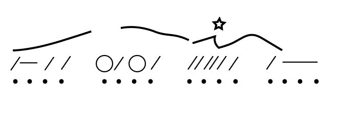
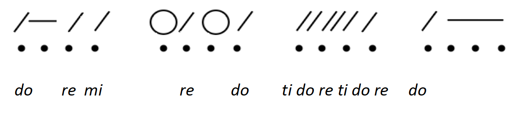

# Основы пения с листа и музыкального диктанта

**Авторы: Kris Shaffer, Chelsey Hamm и Samuel Brady.**

> **Черновик перевода.** Источник — [OMT2, Nebraska, Fall 2023](https://pressbooks.nebraska.edu/openmusictheory/chapter/the-basics-of-sight-singing-and-dictation/), снимок от 23 сентября 2026 года. С текущей редакцией VIVA не сверено. Перевод — участники Open Music Theory RU. [CC BY-SA 4.0](https://creativecommons.org/licenses/by-sa/4.0/).

## Главное

- **Пение с листа** (*sight-singing*) — пение по нотам музыки, которую вы прежде не слышали и не видели. **Ритмическое чтение с листа** (*sight-counting*) — произнесение счёта для ритма, который вы прежде не слышали и не видели.
- Всегда упражняйтесь в пении с листа с помощью тех систем ритмической и мелодической **сольмизации** (*solmization*), которым научил вас преподаватель. Чем больше вы занимаетесь, тем легче будет пользоваться сольмизацией!
- По возможности дирижируйте во время пения и ритмического чтения с листа. Если возникают трудности, занимайтесь в более медленном темпе.
- **Музыкальный диктант** (*dictation*) — запись на нотном стане услышанных ритмов, мелодий, аккордовых последовательностей или других звучаний, которые вы прежде не видели в нотах, не играли и не пели.
- При записи ритмического диктанта помогают сетки из точек, **запись косыми штрихами** (*slash notation*) и **протонотация** (*protonotation*). Дирижирование и/или отбивание долей также может помочь.
- При записи мелодического диктанта помогают **линии мелодического контура** (*contour lines*), запись сольмизационных слогов и протонотация. Дирижирование и/или отбивание долей также может помочь.

Независимо от того, поёте вы, играете на инструменте или делаете и то и другое, вам, скорее всего, предстоит учиться **пению с листа**. Это пение по нотам музыки, которую вы прежде не слышали и не видели. Близкий навык — **ритмическое чтение с листа**, то есть произнесение счёта для незнакомого ритма. Освоить эти навыки помогают разные приёмы.

> **Примечание переводчиков.** Здесь *sight-counting* означает чтение ритма с произнесением счётных слогов, без обязательного пения высот. В пяти всплывающих определениях источника — *sight-singing*, *sight-counting*, *dictation*, *slash notation*, *contour lines* — вместо текста сохранился код CSS. Он не воспроизводится как определение; объяснения этих понятий в основном тексте переведены полностью. Четыре сохранившихся определения включены ниже в текст.

## Приёмы пения и ритмического чтения с листа

Если вы учитесь пению и ритмическому чтению с листа на занятиях, то, вероятно, будете упражняться сидя. Важно следить за осанкой: сядьте прямо, на край стула, так, чтобы бёдра были параллельны полу. Дышите диафрагмой, а не грудью, и произносите слоги при пении и счёте как можно отчётливее.

В **примере 1** показана правильная посадка при пении сидя.

**Пример 1. Правильная посадка при пении сидя.** [Видео «Perfect Singing Posture While Sitting» на YouTube](https://www.youtube.com/watch?v=OIe4tB1vYVs) — на английском; содержание и воспроизведение не проверены.

При ритмическом чтении с листа полезно пользоваться системой ритмической **сольмизации**. В *Open Music Theory* предпочтение отдаётся стандартному американскому счёту, хотя существуют и многие другие хорошие системы. Вот ещё несколько советов.

- Не подписывайте счёт в нотах. Это сэкономит время и поможет научиться читать ритм с листа.
- Впервые взглянув на ритм, который предстоит прочитать с листа, обратите внимание на тактовый размер. Сколько долей в каждом такте и какой длительностью выражена доля?
- Дирижируйте во время чтения ритма. Это помогает удерживать ровный темп и помнить, какую долю вы сейчас считаете.
- Если вы не дирижируете, попробуйте равномерно отбивать доли. Это помогает удерживать ровный темп.
- Если сохранять ровный темп всё ещё трудно, занимайтесь с приложением-метрономом.
- Если возникают трудности с ритмом или сольмизационными слогами, занимайтесь медленнее либо разбейте ритм на небольшие фрагменты.

При пении с листа очень полезно пользоваться системой мелодической **сольмизации**: например, петь номера **ступеней гаммы** (*scale degrees*) или сольмизационные слоги (*solfège*). См. главы «[Мажорные гаммы, ступени и ключевые знаки](12-major-scales.md)» и «[Минорные гаммы, ступени и ключевые знаки](13-minor-scales.md)». Сольмизация — система, которая ставит каждому звуку гаммы в соответствие определённый слог. Ступень гаммы — относительное положение звука в диатонической гамме; его обозначают числом от 1 до 7 по отношению к её тонике. *Solfège* здесь означает применение слогов сольмизации (*do, re, mi, fa, sol* и т. д.) к ступеням гаммы.

Обе системы подходят; главное — заниматься регулярно: чем больше вы практикуетесь, тем легче пользоваться сольмизацией. Вот ещё несколько советов для пения с листа.

- Не подписывайте в нотах слоги или номера ступеней. Это сэкономит время и поможет научиться петь с листа.
- Впервые взглянув на мелодию, обратите внимание на ключ, тактовый размер и ключевые знаки. Какой здесь ключ? Сколько долей в каждом такте и какой длительностью выражена доля? В какой тональности написана музыка?
- Обратите внимание на мелодический контур. Верно спеть направление движения — вверх, вниз или на той же ноте — уже половина дела!
- Дирижируйте во время пения. Это помогает удерживать ровный темп и помнить, какую долю вы сейчас поёте.
- Если вы не дирижируете, попробуйте равномерно отбивать доли во время пения. Это помогает удерживать ровный темп.
- Если при пении с листа трудно сохранять ровный темп, занимайтесь с приложением-метрономом.
- Если мелодия вызывает затруднения, занимайтесь медленнее либо разбейте её на небольшие фрагменты.
- Если трудности связаны с ритмом, уберите высоты звуков и поработайте только над ритмом.
- Если трудности связаны с высотами, уберите исходный ритм и пропойте звуки одинаковыми длительностями.

Учиться пению и ритмическому чтению с листа полезно, но для свободного владения этими навыками нужны годы. Именно поэтому во многих программах музыкального бакалавриата им посвящены четыре полных курса, часто под названием *Aural Skills* («Слуховые навыки»). Будьте терпеливы к себе; если возникают трудности, обращайтесь к преподавателю за помощью, не откладывая.

## Приёмы работы над диктантом

**Музыкальный диктант** — ещё один важный предмет занятий музыканта. Преподаватель, скорее всего, будет исполнять ритмы, мелодии, аккордовые последовательности или другие звучания, которые вы прежде не видели в нотах, не играли и не пели. Вам предстоит перевести услышанное в запись на нотном стане. В этом помогают различные приёмы.

### Ритмический диктант

**Пример 2. Ритм для диктанта.** [Исходная аудиозапись, MP3](https://pressbooks.nebraska.edu/app/uploads/sites/379/2023/09/untitled-2.mp3).

> **Примечание переводчиков.** Две аудиозаписи этой главы оставлены по исходным внешним ссылкам. Они не прослушаны; их содержание описывается по авторскому тексту, доступность и воспроизведение не подтверждены.

Послушайте **пример 2** — запись ритма для диктанта. Один из способов записывать ритмический диктант — построить **сетку из точек** (*dot grid*). Это ряд точек, обозначающих доли и такты. В **примере 3** показана такая сетка для четырёх тактов размера 4/4 (*common time*).

<figure id="example-3">

<figcaption>Пример 3. Сетка из точек для четырёх тактов размера 4/4.</figcaption>
</figure>

Построив сетку, можно отмечать косыми штрихами моменты, когда вы слышите начало звука, горизонтальными чёрточками — его продолжение, а кружками — паузы. Это **запись косыми штрихами** (*slash notation*). Затем её нужно перевести в запись на нотном стане. В **примере 4** сначала дана запись косыми штрихами, а затем обычная нотная запись.

**Пример 4. Запись примера 2 косыми штрихами и на нотном стане.** [Открыть партитуру в MuseScore](https://musescore.com/user/32728834/scores/8455859/embed).

> **Примечание переводчиков.** Пять партитур MuseScore в этой главе оставлены исходными внешними ссылками. Они не локализованы; их содержимое, доступность и воспроизведение не проверены. Подписи переведены по источнику.

При записи ритмического диктанта полезно дирижировать или отбивать доли. Отбивание долей помогает услышать, совпадает ли начало ноты с долей или приходится ли на долю пауза. Дирижирование помогает определить, на каких долях звук начинается, продолжается или сменяется паузой.

### Мелодический диктант

**Пример 4 (аудио). Мелодия с тем же ритмом, что и в примере 2.** [Исходная аудиозапись, MP3](https://pressbooks.nebraska.edu/app/uploads/sites/379/2023/09/untitled-2-1.mp3).

> **Примечание переводчиков.** В источнике номер 4 использован дважды: для нотной записи ритма и для следующей аудиозаписи мелодии. Номера сохранены; вторую позицию обозначаем «Пример 4 (аудио)», чтобы не смешивать ссылки.

Послушайте **пример 4 (аудио)**: здесь к ритмическому диктанту из **примера 2** добавлены высоты звуков. Первый шаг в записи мелодического диктанта — записать ритм мелодии, как описано в предыдущем разделе; затем к ритму добавляют высоты. Для этого есть несколько приёмов. Первый — использовать **линии мелодического контура**, показывающие, движется ли следующий звук вверх, вниз или остаётся на той же высоте (**пример 5**). Звёздочками или другими символами можно отмечать места, где вы слышите скачок. Другой приём — записывать услышанные слоги вашей системы мелодической сольмизации (**пример 6**).

<figure id="example-5">

<figcaption>Пример 5. К записи косыми штрихами добавлены линии мелодического контура.</figcaption>
</figure>

<figure id="example-6">

<figcaption>Пример 6. К записи косыми штрихами добавлены сольмизационные слоги.</figcaption>
</figure>

> **Примечание переводчиков.** Иллюстрации 3, 5 и 6 сохранены как в источнике. Переведены подписи и описания; слоги внутри примера 6 оставлены в исходной записи и не являются русскими названиями абсолютных высот.

Следующий шаг — перевести линии контура и сольмизационные слоги в запись на нотном стане (**пример 7**).

**Пример 7. Примеры 5–6 в записи на нотном стане.** [Открыть партитуру в MuseScore](https://musescore.com/user/32728834/scores/8455769/embed).

При записи мелодического диктанта полезно дирижировать или отбивать доли по тем же причинам, что и при записи ритмического диктанта.

## Протонотация

**Протонотация** (*protonotation*) — упрощённая система музыкальной записи из книги Gary Karpinski *Manual for Ear Training and Sight Singing* (2007, с. 1–28). Она убирает усложняющие элементы и сосредоточивается на основах метра, ритма и ступенях гаммы. Эта система также подходит для записи ритмического и мелодического диктанта, и многие находят её очень полезной. В **примере 8** мелодия представлена в протонотации и в записи на нотном стане.

**Пример 8. Мелодия в протонотации и в записи на нотном стане.** [Открыть партитуру в MuseScore](https://musescore.com/user/32728834/scores/8455748/embed).

Протонотация не содержит сведений о том, какой нотной длительностью выражена доля, и о тональности. Она передаёт только основные звуковысотные и ритмические элементы; подробнее об этом — [ниже](#converting-protonotation-to-staff-notation).

### Элементы протонотации

**Примеры 9–11** показывают незаполненные сетки протонотации для двухдольного, трёхдольного и четырёхдольного метра.

> **Примечание переводчиков.** В закреплённом источнике после упоминания примеров 9–11 нет самих сеток, их изображений или ссылок на них. Это пробел источника; схемы по описанию не восстанавливались.

В двухдольном и трёхдольном метре первые доли тактов обозначаются длинными вертикальными линиями, а неакцентированные доли — короткими. В четырёхдольном метре третья доля каждого такта несёт промежуточный по силе акцент, поэтому ей соответствует линия средней длины.

В протонотации длительности нот обозначают горизонтальными линиями, а высоты — сольмизационными слогами системы подвижного до; вместо слогов можно использовать номера ступеней. Стрелками обозначают направление мелодических скачков. Пауза показана отсутствием горизонтальной линии на соответствующей доле или её части. Вместо пустого места полезно также ставить **X**: так вы отличите паузу, в которой уверены, от ещё не заполненного участка записи.

### Перевод протонотации в запись на нотном стане

Если вам известны 1) ключ, 2) высота тоники и 3) длительность доли либо нижнее число обозначения размера, то мелодию в протонотации легко перевести в запись на нотном стане.

1. Запишите основные сведения о примере.
   1. Нарисуйте указанный ключ или выберите подходящий, исходя из того, в каком регистре звучит мелодия.
   2. Определите ключевые знаки по заданной тонике и ладу — мажору или минору, — который вы услышали или который был указан.
   3. Определите тактовый размер по заданной длительности доли или нижнему числу размера и по метру, отражённому в протонотации.
2. Каждая длинная вертикальная линия протонотации становится тактовой чертой в нотной записи.
3. Впишите ноты в каждый такт.
   1. Регистр, сольмизационный слог и тоника определяют высоты звуков.
   2. По тактовому размеру определите, как перевести ритм протонотации в конкретные нотные длительности. Например, нота длиной в две доли при размере 4/4 с четвертной долей — половинная (2 × 𝅘𝅥), а при размере 2/2 с половинной долей — целая (2 × 𝅗𝅥).

Если ключ, высота тоники и/или размер не заданы, одну и ту же протонотацию можно перевести в нотную запись несколькими способами. В **примере 12** мелодия из протонотации записана в двух разных ключах, размерах с трёхчастным делением доли и с разными ключевыми знаками. Первый вариант — в басовом ключе, в соль мажоре, с нижним числом размера 8. Второй — в альтовом ключе, в си-бемоль мажоре, с нижним числом размера 4.

**Пример 12. Два варианта нотной записи мелодии из протонотации.** [Открыть партитуру в MuseScore](https://musescore.com/user/32728834/scores/8455691/embed).

В **примере 13** мелодия из протонотации записана в трёх разных ключах, размерах с трёхчастным делением доли и с разными ключевыми знаками. Первый вариант — в скрипичном ключе, в ми-бемоль мажоре, с нижним числом размера 4. Второй — в теноровом ключе, в до-диез мажоре, с нижним числом размера 8. Третий — в басовом ключе, в фа мажоре, с нижним числом размера 1.

**Пример 13. Три варианта нотной записи мелодии из протонотации.** [Открыть партитуру в MuseScore](https://musescore.com/user/32728834/scores/8455655/embed).

Как и пение и ритмическое чтение с листа, ритмический и мелодический диктант требуют многолетней практики. Если вы учитесь на музыкальной специальности в бакалавриате, то, скорее всего, будете развивать эти навыки на многих занятиях в течение нескольких лет. Ещё раз: будьте терпеливы к себе, а если возникают трудности, обращайтесь к преподавателю за помощью, не откладывая.

## Дополнительная литература

- Karpinsky, Gary. 2007. *Manual for Ear Training and Sight Singing*. New York: Norton.

> **Примечание переводчиков.** Фамилия автора книги в основном тексте источника написана *Karpinski*, а в списке литературы — *Karpinsky*. Оба написания сохранены по соответствующим местам источника; библиографическая сверка не выполнена.

## Онлайн-ресурсы

> **Примечание переводчиков.** Все перечисленные ниже ресурсы и задания оставлены на английском. Переведены названия; содержимое, ответы, доступность ссылок и воспроизведение не проверены.

- [Мелодии для пения с листа с записями — How to Sing Smarter](http://www.howtosingsmarter.com/sight-singing-exercises/).
- [Мелодии для пения с листа — Chorale Tech, PDF](http://choir.rigbytrojans.org/uploads/2/1/5/4/21541204/sight-singing-exercises.pdf).
- [Мелодии для пения с листа — Ronnie Sanders](http://www.ronniesanders.net/FreeSightsingingMusic.html).
- [Ритмы для чтения с листа — Blue Sky Music, PDF](https://blueskymusic.net/wp-content/uploads/2020/04/All-Rhythm-Worksheets-in-One-File.pdf).
- [Пение с листа по уровням — YouTube](https://www.youtube.com/channel/UCsTB8slvzt5no3xnfzT8_hg).
- [Мелодические и ритмические диктанты — James Woodward, YouTube](https://www.youtube.com/c/auralskillsguru/videos).
- [Ритмические и мелодические диктанты — freemusicdictations.net](https://www.freemusicdictations.net/copy-of-homework-assignments-1).
- [Ритмический диктант — teoria](https://www.teoria.com/en/exercises/rd4.php).
- [Ритмический диктант — Tone Savvy](https://tonesavvy.com/music-practice-exercise/14/rhythm-dictation-game-eighth-notes/).
- [Мелодический диктант — teoria](https://www.teoria.com/en/exercises/md.php).
- [Мелодический диктант — Tone Savvy](https://tonesavvy.com/music-practice-exercise/222/melodic-dictation-ear-training/).

## Задания из интернета

1. [Подпишите счёт — Blue Sky Music, PDF](https://blueskymusic.net/wp-content/uploads/2020/04/All-Rhythm-Worksheets-in-One-File.pdf).
2. [Подпишите сольмизационные слоги или номера ступеней, PDF](https://www.ccsoh.us/cms/lib/OH01913306/Centricity/Domain/3098/Choir%20Summer%20Packet.pdf).

## Задания

1. Определение сольмизационных слогов и ступеней: [PDF](https://pressbooks.nebraska.edu/app/uploads/sites/379/2023/09/WK-Basics-of-Sight-Singing-and-Dictation-1.pdf), [DOCX](https://pressbooks.nebraska.edu/app/uploads/sites/379/2023/09/WK-Basics-of-Sight-Singing-and-Dictation-1.docx).
2. Определение сольмизационных слогов и ступеней в мелодическом контексте: [PDF](https://pressbooks.nebraska.edu/app/uploads/sites/379/2023/09/WK-Basics-of-Sight-Singing-and-Dictation-2-1.pdf), [DOCX](https://pressbooks.nebraska.edu/app/uploads/sites/379/2023/09/WK-Basics-of-Sight-Singing-and-Dictation-2-1.docx), [плейлист к рабочему листу — Spotify](https://open.spotify.com/playlist/2IJiGRYUU2cAnFh3oLamar?si=5ee9b0fb38344ce5).
