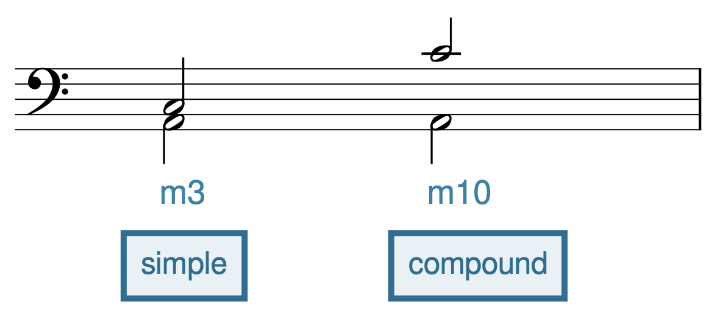
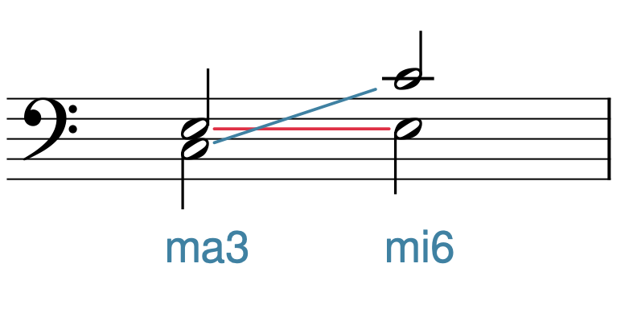

# Интервалы

**Авторы: Chelsey Hamm и Bryn Hughes.**

> **Черновик перевода.** Источник — [OMT2, Nebraska, Fall 2023](https://pressbooks.nebraska.edu/openmusictheory/chapter/intervals/), снимок от 23 сентября 2026 года. С текущей редакцией VIVA не сверено. Перевод — участники Open Music Theory RU. [CC BY-SA 4.0](https://creativecommons.org/licenses/by-sa/4.0/).

## Главное

- Два звука образуют **интервал** (*interval*), который обычно определяют как расстояние между двумя нотами.
- Звуки **мелодического интервала** (*melodic interval*) играют или поют последовательно, а звуки **гармонического интервала** (*harmonic interval*) — одновременно.
- У каждого интервала есть ступеневая и качественная величина. **Ступеневая величина** (*size*) определяется положением двух нот на стане: при подсчёте учитываются линейки и промежутки, включая положения обеих нот.
- Ступеневая величина — обобщённая характеристика (*generic*). Какие бы знаки альтерации ни стояли при нотах, она остаётся неизменной.
- **Качественная величина** (*quality*) вместе со ступеневой уточняет интервал. Примы, кварты, квинты и октавы бывают чистыми, а секунды, терции, сексты и септимы — большими и малыми.
- Интервалы также бывают увеличенными и уменьшёнными. **Увеличенный интервал** (*augmented interval*) на полутон шире чистого или большого; **уменьшённый** (*diminished interval*) — на полутон уже чистого или малого.
- Интервалы от примы до октавы включительно называются **простыми** (*simple intervals*). Любой интервал шире октавы — **составной** (*compound interval*).
- При **обращении интервала** (*intervallic inversion*) два звука меняются местами по высоте. Обращение помогает определить интервал, если его нижний звук — тоника сложной или воображаемой мажорной тональности.
- **Консонансы** (*consonant intervals*) считаются более устойчивыми, как будто не требующими разрешения; **диссонансы** (*dissonant intervals*) — менее устойчивыми, как будто требующими разрешения.

Два звука образуют интервал, который обычно определяют как расстояние между двумя нотами. Но что именно он измеряет? Физическое расстояние на нотном стане? Разницу в длинах волн звуков? Что-то ещё? Представления теоретиков музыки об интервале противоречили друг другу и сильно различались в зависимости от **социально-культурной среды** (*milieu*). В этой главе мы будем рассматривать интервал как меру двух вещей: расстояния между нотами в записи и слышимого «расстояния», или пространства, между двумя звучащими высотами. Помните, что интервал существует и в записи, и в звучании: это поможет мыслить музыкально, а не воспринимать его лишь как отвлечённое понятие, которое вы записываете и читаете.

> **Примечание переводчиков.** Всплывающие определения в источнике частично повреждены: шесть содержат CSS вместо объяснения, три — посторонний текст главы о метре, два пусты. Они не воспроизводятся как определения. Все целые относящиеся к главе определения переведены в [словарике](#definitions); основные объяснения ниже переведены полностью. Нотные примеры MuseScore оставлены точными внешними ссылками: их интерфейс и содержимое не локализованы, воспроизведение не проверено. Подписи и alt-тексты локальных рисунков переведены; внутренние надписи сохранены.

## Ступеневая величина

Интервалы бывают мелодическими — их звуки играют или поют последовательно — и гармоническими, когда звуки исполняются одновременно. В [примере 1](#example-1) ноты первого такта звучат вместе, образуя гармонический интервал; во втором такте — раздельно, образуя мелодический.

**Пример 1. Гармонический и мелодический интервалы.** [Открыть нотный пример в MuseScore](https://musescore.com/user/32728834/scores/8418647/s/H5aOaq/embed).

У каждого интервала есть ступеневая и качественная величина. Ступеневая величина — расстояние между двумя нотами на стане, измеряемое количеством занятых ими и расположенных между ними линеек и промежутков. В записи используются арабские цифры: 2, 3, 4 и так далее; в английских названиях — порядковые числительные: *second, third, fourth, fifth, sixth, seventh*. Всегда начинайте счёт с единицы. В [примере 2](#example-2) показаны восемь ступеневых величин в пределах гаммы до мажор. В английском тексте они названы порядковыми числительными, кроме двух: интервал между нотами на одной линейке или в одном промежутке называется *unison*, а не *first*, а интервал, охватывающий восемь последовательных положений на стане, — *octave*, а не *eighth*.

> **Примечание переводчиков.** Русские названия этих интервалов: прима (1), секунда (2), терция (3), кварта (4), квинта (5), секста (6), септима (7), октава (8). Английское *unison* здесь обозначает ступеневую величину «прима»; при совпадении высот это чистая прима, или унисон. Это различие понадобится для увеличенной примы A1 в [примере 16](#example-16).

**Пример 2. Ступеневые величины интервалов.** [Открыть нотный пример в MuseScore](https://musescore.com/user/32728834/scores/8418638/s/e4jxEI/embed).

Ступеневая величина считается обобщённой (*generic*). Иными словами, знаки альтерации не влияют на неё. Это показано в [примере 3](#example-3): несмотря на разные знаки, каждый интервал остаётся терцией, потому что охватывает три последовательных положения на стане, включая обе ноты.

**Пример 3. Знаки альтерации не влияют на ступеневую величину интервала.** [Открыть нотный пример в MuseScore](https://musescore.com/user/32728834/scores/8418665/s/n71TMI/embed).

## Чистые, большие и малые интервалы

Качественная величина вместе со ступеневой определяет конкретный интервал. Она точнее описывает расстояние между записанными нотами и в сочетании со ступеневой величиной — звучание интервала.

Есть пять качественных характеристик интервала:

- увеличенный — A или +;
- большой — ma;
- чистый — P;
- малый — mi;
- уменьшённый — d или °.

При произнесении или записи интервала качественная характеристика предшествует ступеневой. Например: «чистая кварта» (P4), «малая терция» (mi3), «увеличенная секунда» (+2 или A2).

Пока рассмотрим три характеристики: чистый, большой и малый. В разных местах и в разные эпохи теоретики применяли их к разным ступеневым величинам — это зависело от социально-культурной среды. В [примере 4](#example-4) показано современное применение этих названий. Согласно сопровождающему тексту, левый столбец относит секунды, терции, сексты и септимы к большим и/или малым интервалам, а правый — примы, кварты, квинты и октавы к чистым.

**Пример 4. Качественные характеристики интервалов.**

> **Примечание переводчиков.** Таблица 61 отсутствует в английском снимке: вместо неё показано `[table “61” not found /]`. Сопровождающее объяснение сохранено; содержимое таблицы по догадке не восстановлено.

## Определение качества по мажорной гамме

Научиться записывать и определять качественную величину интервалов можно разными способами. Возможно, вам знаком подсчёт полутонов. Авторы не рекомендуют этот метод: он отнимает много времени и часто приводит к ошибкам. Вместо него они предлагают использовать знания о [мажорных гаммах](12-major-scales.md).

Чтобы определить интервал — его ступеневую и качественную величину — этим способом, выполните следующие действия:

1. Определите ступеневую величину, считая линейки и промежутки между нотами, включая обе крайние ноты.
2. Представьте, что нижний звук интервала — тоника мажорной гаммы.
3. Выясните, входит ли верхний звук в эту гамму, и определите соответствующую качественную величину.
4. Если входит, интервал чистый, когда это прима, кварта, квинта или октава, и большой, когда это секунда, терция, секста или септима. Если не входит, он может быть малым — с пониженной верхней нотой секунды, терции, сексты или септимы — либо увеличенным или уменьшённым; об этом [следующий раздел](#augmented-and-diminished-qualities).

В [примере 5](#example-5) показаны два интервала. Попробуйте определить их ступеневую и качественную величину.

**Пример 5. Два интервала.** [Открыть нотный пример в MuseScore](https://musescore.com/user/32728834/scores/6836733/s/wud8Ld/embed).

В примере 5a записаны фа и до (F–C) в скрипичном ключе. Применим метод мажорной гаммы:

1. По ступеневой величине это квинта: фа — 1, соль — 2, ля — 3, си — 4, до — 5.
2. До входит в фа мажор, где один бемоль — си-бемоль (B♭).
3. Следовательно, это чистая квинта.

Теперь применим тот же способ к примеру 5b. В скрипичном ключе записаны ми-бемоль и до-бемоль (E♭–C♭):

1. По ступеневой величине это секста: ми-бемоль — 1, фа — 2, соль — 3, ля — 4, си — 5, до — 6.
2. До-бемоль **не** входит в ми-бемоль мажор, где три бемоля: B♭, E♭ и A♭.
3. Поэтому это малая секста. Для большой сексты потребовалось бы до-бекар (C♮), а не до-бемоль, поскольку в ми-бемоль мажор входит C♮.

## Увеличенные и уменьшённые интервалы

Напомним пять качественных характеристик, из которых мы уже рассмотрели большой, малый и чистый интервалы:

- увеличенный — A или +;
- большой — ma;
- чистый — P;
- малый — mi;
- уменьшённый — d или °.

**Увеличенные интервалы** на полутон шире чистых или больших. В первом такте примера 6a сначала показаны F и C — чистая квинта, поскольку C входит в фа мажор. Затем верхний звук повышен на полутон до C♯, и интервал становится на полутон шире. Следовательно, F–C♯ — увеличенная квинта, A5 или +5. Во втором такте примера 6a исходный интервал G–E — большая секста, поскольку E входит в соль мажор. Верхний звук повышается на полутон до E♯, и секста становится увеличенной: A6 или +6.

Изменять можно и нижний звук. В первом такте примера 6b чистая квинта F–C превращается в увеличенную при понижении F на полутон до F♭: расстояние становится на полутон больше чистой квинты. Во втором такте большая секста G–E становится увеличенной при понижении G на полутон до G♭.

**Пример 6. Увеличенные интервалы, полученные (a) повышением верхнего звука и (b) понижением нижнего.** [Открыть нотный пример в MuseScore](https://musescore.com/user/32728834/scores/8418677/s/-x_9Yz/embed).

**Уменьшённые интервалы** на полутон уже чистых или малых. В первом такте примера 7a чистая квинта F–C сужается на полутон при понижении верхнего звука до C♭. Получается уменьшённая квинта, также называемая тритоном; обычные сокращения — d5 или °5. Во втором такте G–E образуют большую сексту. При понижении верхнего звука на полутон она становится малой, а при повторном понижении до E𝄫 — уменьшённой. Обратите внимание: сужение на полутон превращает чистые и малые интервалы в уменьшённые, а большие — в малые.

И здесь можно изменять нижний звук. В примере 7b чистая квинта F–C становится уменьшённой, когда нижний звук поднимается на полутон до F♯. Во втором такте большая секста G–E сначала становится малой при повышении G до G♯. В третьем такте G♯ повышается до G𝄪; интервал сужается ещё на полутон и становится уменьшённым.

> **Примечание переводчиков.** Формулировка основных выводов оригинала «любой интервал может быть увеличенным или уменьшённым» требует оговорки для примы. В рассматриваемом здесь измерении неотрицательного расстояния чистая прима равна нулю полутонов, поэтому сузить её ещё на полутон нельзя. В таблице примера 16 для примы показаны P1 и A1; уменьшённая прима там не приводится.

**Пример 7. Уменьшённые интервалы, полученные (a) понижением верхнего звука и (b) повышением нижнего.** [Открыть нотный пример в MuseScore](https://musescore.com/user/32728834/scores/6836745/embed).

[Пример 8](#example-8) ещё раз показывает и обобщает соотношение величин интервалов. Каждый интервал, отмеченный скобкой, на полутон шире или уже соседних. В примере 8a качество меняется с помощью знаков альтерации при верхнем звуке. Интервалы на полутон шире чистых или больших — увеличенные; на полутон уже больших — малые; на полутон уже чистых или малых — уменьшённые. В примере 8b показаны те же качества, что и в 8a, но знаки изменяют нижний звук.

> **Примечание переводчиков.** В последнем предложении оригинала стоит «10a». По контексту речь идёт о примере 8a; ссылка исправлена.

**Пример 8. Соотношение величин интервалов при изменении (a) верхнего звука и (b) нижнего.** [Открыть нотный пример в MuseScore](https://musescore.com/user/32728834/scores/8418728/s/SPtiOU/embed).

## Дважды и трижды увеличенные и уменьшённые интервалы

Интервалы можно расширять и сужать дальше, выходя за пределы увеличенных и уменьшённых. Интервал на полутон шире увеличенного — **дважды увеличенный**, а на полутон шире дважды увеличенного — **трижды увеличенный**. Аналогично интервал на полутон уже уменьшённого — **дважды уменьшённый**, а на полутон уже дважды уменьшённого — **трижды уменьшённый**.

## Составные интервалы

Рассмотренные выше интервалы от примы до октавы называются **простыми**: их величина не превышает октаву. Любой интервал шире октавы — **составной**. В [примере 9](#example-9) звуки ля и до сначала образуют малую терцию — простой интервал. Во второй паре до перенесено на октаву вверх, и получается малая децима — составной интервал. Качественная величина простого интервала и соответствующего ему составного остаётся одинаковой.

<figure id="example-9">

<figcaption>Пример 9. Простой и составной интервалы.</figcaption>
</figure>

Чтобы увеличить простой интервал на октаву, прибавьте 7 к его ступеневой величине:

- прима (1) становится октавой (8);
- секунда (2) — ноной (9);
- терция (3) — децимой (10);
- кварта (4) — ундецимой (11);
- квинта (5) — дуодецимой (12);
- секста (6) — терцдецимой (13).

Это наиболее распространённые результаты такого увеличения, которые встретятся вам при изучении музыки. Помните: октавы, ундецимы и дуодецимы бывают чистыми, как соответствующие исходные интервалы, а ноны, децимы и терцдецимы — большими или малыми.

> **Примечание переводчиков.** Источник вводит этот список словами «чтобы сделать простой интервал составным», но включает превращение примы в октаву. По данному выше определению сама октава остаётся простым интервалом; составные интервалы начинаются с ноны. Здесь сохранён весь список, а действие названо точнее: увеличение на октаву.

## Обращение интервала

При **обращении интервала** два звука меняются местами по высоте. Например, в [примере 10](#example-10) интервал с до внизу и ми вверху обращён переносом до на октаву вверх. Зачем это нужно? Во-первых, пары взаимно обращающихся интервалов обладают интересными свойствами, которыми иногда пользуются композиторы. Во-вторых, обращение помогает определить или записать интервал, если вы не хотите отталкиваться от данного нижнего звука.

<figure id="example-10">

<figcaption>Пример 10. Обращение интервала.</figcaption>
</figure>

Начнём со свойств. Сумма ступеневых величин взаимно обращающихся интервалов всегда равна 9:

- прима (1) обращается в октаву (8): 1 + 8 = 9; октава — в приму;
- секунда — в септиму: 2 + 7 = 9; септима — в секунду;
- терция — в сексту: 3 + 6 = 9; секста — в терцию;
- кварта — в квинту: 4 + 5 = 9; квинта — в кварту.

Качественные величины при обращении также связаны постоянными отношениями:

- чистые интервалы обращаются в чистые;
- большие — в малые, а малые — в большие;
- увеличенные — в уменьшённые, а уменьшённые — в увеличенные.

Теперь вы можете находить обращения, даже не глядя на нотный стан. Например, большая септима обращается в малую секунду, увеличенная секста — в уменьшённую терцию, а чистая кварта — в чистую квинту.

<figure id="example-11">

<figcaption>Пример 11. Обращение может облегчить определение интервала, помещая внизу более простой для работы звук.</figcaption>
</figure>

Теперь о второй причине. Иногда встречается интервал, который неудобно определять от нижнего звука. Например, для E𝄫–A♭ в [примере 11](#example-11) метод мажорной гаммы неудобен: нижний звук — ми-дубль-бемоль, для которого нет обычного набора ключевых знаков; его тональность «воображаемая». Поэтому можно обратить интервал. Тогда его можно определить от ля-бемоль мажора, вполне обычной тональности с четырьмя бемолями: B♭, E♭, A♭ и D♭. Звук E♭ над A♭ образовал бы чистую квинту, но здесь E♭ понижен до E𝄫, поэтому интервал сужен на полутон. Получается уменьшённая квинта d5.

> **Примечание переводчиков.** Оригинал говорит, что метод мажорной гаммы здесь «не сработает» (*would not work*). В переводе это уточнено как неудобство работы с «воображаемой» тональностью, а не невозможность построить такую гамму: отсутствие обычного набора ключевых знаков само по себе не делает интервальный расчёт невозможным.

Зная, что обращение исходного интервала — d5, определим сам исходный интервал. Уменьшённая квинта обращается в увеличенную кварту: уменьшённые интервалы обращаются в увеличенные, а 5 + 4 = 9. Следовательно, исходный интервал — увеличенная кварта A4.

## Консонанс и диссонанс

Интервалы подразделяют на консонансы и диссонансы. Консонансы считаются более устойчивыми, словно не требующими разрешения, а диссонансы — менее устойчивыми, словно требующими разрешения. Эти классификации менялись в зависимости от социально-культурной среды. В [примере 12](#example-12) источник отсылает к таблице мелодически консонантных и диссонантных интервалов.

**Пример 12. Мелодически консонантные и диссонантные интервалы.**

> **Примечание переводчиков.** Таблица 63 отсутствует в снимке: `[table “63” not found /]`. Конкретные категории по догадке не восстановлены.

В [примере 13](#example-13) источник отсылает к гармонически консонантным и диссонантным интервалам.

**Пример 13. Гармонически консонантные и диссонантные интервалы.**

> **Примечание переводчиков.** Таблица 64 отсутствует в снимке: `[table “64” not found /]`. Конкретные категории по догадке не восстановлены.

Значение консонансов и диссонансов подробнее рассматривается во [«Введении в строгий контрапункт»](https://pressbooks.nebraska.edu/openmusictheorymusc165fall2023/chapter/species-counterpoint/). Эта глава пока доступна по исходной англоязычной ссылке; её содержимое и доступность здесь не проверялись.

## Другой способ изучения интервалов: метод белых клавиш

В конечном счёте интервалы нужно запомнить и на слух, и зрительно. Однако есть приёмы, ускоряющие обучение. Один из них — так называемый метод белых клавиш, отсылающий к фортепианной клавиатуре.

Для него нужно запомнить все интервалы между белыми клавишами, то есть все интервалы в до мажоре. Затем любой интервал можно определить как изменение одного из них. Например, мы можем определить D–F♯, если знаем, что D–F — малая терция: после расширения на полутон получается большая терция.

Удобно, что величины интервалов между белыми клавишами часто повторяются. [Пример 14](#example-14) обобщает эти закономерности. Запомните самый частый вид и исключения:

- все секунды большие, кроме двух: E–F и B–C;
- все терции малые, кроме трёх больших: C–E, F–A и G–B;
- все кварты чистые, кроме F–B — увеличенной кварты, или тритона.

**Пример 14. Секунды, терции и кварты между белыми клавишами.** [Открыть нотный пример в MuseScore](https://musescore.com/user/32728834/scores/6836757/embed).

Как ни удивительно, теперь вы знаете все интервалы между белыми клавишами, если понимаете [обращение интервала](#intervallic-inversion). Например, если все секунды большие, кроме малых E–F и B–C, то все септимы малые, кроме больших F–E и C–B, как показано в [примере 15](#example-15).

<figure id="example-15">

<figcaption>Пример 15. Септимы между белыми клавишами.</figcaption>
</figure>

> **Примечание переводчиков.** Исходный alt-текст рисунка 15 перечисляет септимы начиная с C4–B4, но сам рисунок начинается с D4–C5 и заканчивается C5–B5. Русское описание исправлено по изображению; нотный рисунок не изменён. На рисунке 9 малые интервалы подписаны `m3` и `m10`; в тексте главы сохраняются принятые обозначения `mi3` и `mi10`.

Освоив интервалы между белыми клавишами, вы сможете определить любой другой интервал, учитывая знаки альтерации при нотах.

## Энгармоническое равенство интервалов

[Пример 16](#example-16) полезен для понимания энгармонического равенства интервалов. Столбцы соответствуют разным ступеневым величинам, а строки — числу полутонов. Интервалы в каждой строке энгармонически равны. Например, большая секунда ma2 и уменьшённая терция d3 содержат по два полутона. Аналогично увеличенная кварта A4 и уменьшённая квинта d5 энгармонически равны: в обеих шесть полутонов.

| Полутонов | Прима | Секунда | Терция | Кварта | Квинта | Секста | Септима | Октава |
|---|---|---|---|---|---|---|---|---|
| 0 | P1 | d2 | | | | | | |
| 1 | A1 | mi2 | | | | | | |
| 2 | | ma2 | d3 | | | | | |
| 3 | | A2 | mi3 | | | | | |
| 4 | | | ma3 | d4 | | | | |
| 5 | | | A3 | P4 | | | | |
| 6 | | | | A4 | d5 | | | |
| 7 | | | | | P5 | d6 | | |
| 8 | | | | | A5 | mi6 | | |
| 9 | | | | | | ma6 | d7 | |
| 10 | | | | | | A6 | mi7 | |
| 11 | | | | | | | ma7 | d8 |
| 12 | | | | | | | A7 | P8 |

**Пример 16. Энгармоническое равенство интервалов.**

<figure id="example-17">

<figcaption>Пример 17. Энгармоническое равенство помогает определять сложные интервалы.</figcaption>
</figure>

Энгармоническое равенство полезно, когда неудобно определять интервал от нижнего звука. Ранее мы уже рассмотрели другой способ — обращение интервала. В данном примере оба способа дают одинаковый результат, и вы можете выбрать более удобный. [Пример 17](#example-17) повторяет интервал из примера 11. Как вы помните, для нижнего звука E𝄫 нет обычного набора ключевых знаков, что затрудняет определение. Но E𝄫 энгармонически равен D, а A♭ — G♯. Поэтому интервал можно определить как увеличенную кварту A4, используя ключевые знаки мажорной тональности от энгармонически равного нижнего звука D.

> **Примечание переводчиков.** В этом примере замена E𝄫–A♭ на D–G♯ сохраняет не только звучание, но и ступеневую величину — кварту. Вообще энгармоническая замена может изменить название интервала, что видно в примере 16. Поэтому общее утверждение оригинала об одинаковом результате двух методов здесь ограничено данным примером: при определении исходного интервала нужно учитывать его исходную ступеневую величину.

## Определения из всплывающего словаря

Ниже переведены все шесть целых определений, относящихся к этой главе.

- **Интервал:** расстояние между двумя нотами.
- **Ступеневая величина:** число ступеней между нотами звуковой совокупности или гаммы. Как поясняет основной текст, считаются обе крайние ступени.
- **Составной интервал:** интервал шире октавы.
- **Социально-культурная среда:** физическая и/или социальная среда.
- **Мажорная гамма:** упорядоченная последовательность полутонов H и тонов W; при движении вверх — W–W–H–W–W–W–H.
- **Энгармоническое равенство:** отношение между нотами, интервалами или аккордами, которые звучат одинаково, но записываются по-разному.

> **Примечание переводчиков.** Повреждённые определения относятся к мелодическому и гармоническому интервалу, ступеневой величине, увеличенным, уменьшённым и простым интервалам (CSS), а также к обращению, консонансу и диссонансу (посторонний текст главы о метре). Две дополнительные записи пусты. Вместо восстановления отсутствующих определений использованы целые объяснения из основного текста; идентификаторы и характер повреждений перечислены в записи проверки главы.

## Материалы в интернете

Все материалы ниже англоязычные. Ссылки сохранены из источника; доступность, содержимое и работа интерактивных упражнений не проверены, сами материалы не переведены.

- [Конкретные интервалы — musictheory.net](https://www.musictheory.net/lessons/31).
- [Введение в интервалы — Robert Hutchinson](http://musictheory.pugetsound.edu/mt21c/IntervalsIntroduction.html).
- [Интервалы — Hello Music Theory](https://hellomusictheory.com/learn/intervals/).
- [Уменьшённые и увеличенные интервалы — Open Textbooks](http://www.opentextbooks.org.hk/ditatopic/2315).
- [Уменьшённые и увеличенные интервалы — Robert Hutchinson](http://musictheory.pugetsound.edu/mt21c/AugmentedAndDiminishedIntervals.html).
- [Составные интервалы — Hello Music Theory](https://hellomusictheory.com/learn/compound-intervals/).
- [Обращение интервалов — musictheory.net](https://www.musictheory.net/lessons/33).
- [Определение интервалов на слух — musictheory.net](https://www.musictheory.net/exercises/ear-interval).
- [Определение интервалов на слух — Tone Dear](https://tonedear.com/ear-training/intervals).
- [Определение интервалов на слух — teoria](https://www.teoria.com/en/exercises/ie.php).
- [Определение интервалов — musictheory.net](https://www.musictheory.net/exercises/interval).
- [Определение интервалов на клавиатуре — musictheory.net](https://www.musictheory.net/exercises/keyboard-interval).

## Задания из интернета

Англоязычные рабочие листы; переведены только названия. Содержимое, ответы и доступность файлов не проверены.

1. Определение интервалов: [PDF 1](https://www2.lawrence.edu/fast/BIRINGEG/media/theory_funds/pdf/ws20-interval_id.pdf), [PDF 2](https://www.people.vcu.edu/~bhammel/theory/homework/elements/pdf/major_scale_interval.pdf), [PDF 3](https://www.wku.edu/music/documents/intervalswork.pdf); [в мажорных тональностях](https://www2.lawrence.edu/fast/BIRINGEG/media/theory_funds/pdf/ws23-intervals-maj_keys.pdf), [в минорных тональностях](https://www2.lawrence.edu/fast/BIRINGEG/media/theory_funds/pdf/ws24-intervals-minor_keys.pdf).
2. Определение и построение интервалов, с. 18–19: [PDF](https://files.rcmusic.com//sites/default/files/examinations/documents/Theory_Worksheets/Level8-Complete.pdf).
3. Построение интервалов: [PDF 1](https://www2.lawrence.edu/fast/BIRINGEG/media/theory_funds/pdf/ws21-interval_constr_1.pdf), [PDF 2](https://www2.lawrence.edu/fast/BIRINGEG/media/theory_funds/pdf/ws22-interval_constr_2.pdf).
4. Составные интервалы, с. 15–17: [PDF](https://files.rcmusic.com//sites/default/files/examinations/documents/Theory_Worksheets/Level8-Complete.pdf).

## Задания

Англоязычные задания исходной главы; текст файлов не переведён, открытие и выполнение не проверены.

1. Запись и определение интервалов, задание № 1: [PDF](https://pressbooks.nebraska.edu/app/uploads/sites/379/2023/09/WK-Intervals-1.pdf), [MSCZ](https://viva.pressbooks.pub/app/uploads/sites/12/2021/10/WK-Intervals-1.mscz#fixme).
2. Запись и определение интервалов, задание № 2: [PDF](https://pressbooks.nebraska.edu/app/uploads/sites/379/2023/09/WK-Intervals-2.pdf), [MSCZ](https://viva.pressbooks.pub/app/uploads/sites/12/2021/10/WK-Intervals-2.mscz#fixme).
3. Запись и определение интервалов, задание № 3: [PDF](https://pressbooks.nebraska.edu/app/uploads/sites/379/2023/09/WK-Intervals-3.pdf), [MSCZ](https://viva.pressbooks.pub/app/uploads/sites/12/2021/10/WK-Intervals-3.mscz#fixme).

> **Примечание переводчиков.** В оригинале формат трёх файлов подписан `.mcsz`, хотя адреса оканчиваются на `.mscz#fixme`. Подписи исправлены на MSCZ, адреса и исходный фрагмент `#fixme` сохранены. Их работоспособность не подтверждена.
