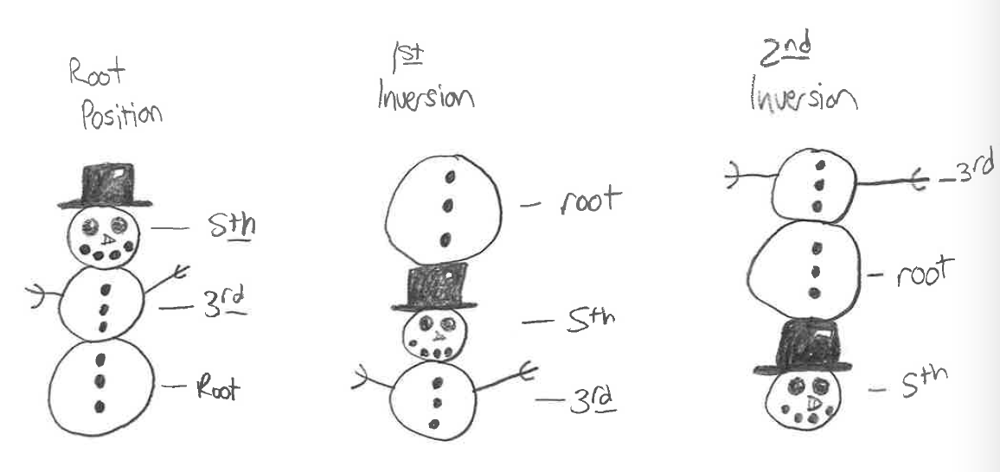

# Обращения и цифровой бас

> **Черновик перевода.** Глава подготовлена по редакции *Open Music Theory — Fall 2023* (Nebraska). Независимая человеческая проверка содержания и терминологии пока не выполнена. Внешние партитуры и задания остаются на языке оригинала; их содержимое и воспроизведение не проверены.

Авторы оригинала: **Chelsey Hamm и Samuel Brady**. [Английская глава](https://pressbooks.nebraska.edu/openmusictheory/chapter/inversion-and-figured-bass/).

## Основные выводы

- Обращение трезвучия определяется нижним голосом — **басом** (*bass voice*), независимо от того, какой инструмент или голос его исполняет.
- В обращённом аккорде основной тон не находится в басу. Терцовый тон в басу означает первое обращение, квинтовый — второе, а септимовый тон — третье обращение.
- Наряду с буквенными обозначениями аккордов музыканты обозначают обращения **цифровым басом** (*figured bass*). Для каждого обращения трезвучия и септаккорда предусмотрены свои цифры, часто сокращённые.
- Цифровой бас обычно не добавляют к буквенным обозначениям аккордов, но используют в краткой аналитической записи аккордов.
- **Реализовать цифровой бас** (*realize figured bass*) — записать или сыграть аккорды, заданные басом и цифрами.
- Трезвучия и септаккорды определяют по основному тону, виду и обращению; при необходимости в записи указывают соответствующие цифры.
- Для обозначения хроматически изменённых звуков перед соответствующей цифрой ставят знак альтерации (♭, ♯, ♮). Перечёркнутая цифра либо знак плюса перед цифрой указывают на повышение звука на полутон.

> **Примечание переводчиков.** В сохранённом источнике вместо сводных таблиц примеров 2 и 12 стоят сообщения об их отсутствии; обе таблицы здесь также обозначены как недоступные. Всплывающие определения некоторых терминов повреждены: вместо них находятся посторонние главы, CSS-код или пустые блоки. Они не представлены как часть этой главы; сведения о них перечислены в [записи проверки](https://github.com/dissonance-ltd/open-music-theory-ru/blob/main/docs/reviews/inversion-figured-bass.md).

## Обращения трезвучий и цифры

В трезвучии музыканты часто обращают внимание на звук в нижнем голосе, который называют **басом**. Это самый низкий голос произведения независимо от того, какой инструмент или тип голоса его исполняет. [Пример 1](#example-1) показывает ля-мажорное трезвучие с тремя разными звуками в басу. Буквенные обозначения аккордов находятся над нотным станом.

**Пример 1.** Ля-мажорное трезвучие в основном положении, первом и втором обращениях.

<iframe src="https://musescore.com/user/32728834/scores/6839459/embed" title="Пример 1. Обращения и цифровой бас — MuseScore" width="100%" height="440" loading="lazy" allowfullscreen></iframe>

<a href="https://musescore.com/user/32728834/scores/6839459">Открыть пример 1 в MuseScore</a> — если плеер не загрузился или нужен полноэкранный просмотр.

Плеер загружается с MuseScore и требует подключения к интернету. Нотный пример оставлен на языке оригинала.

Ля-мажорное трезвучие состоит из основного тона A (ля), терцового тона C♯ (до-диез) и квинтового тона E (ми). Если звуки трезвучия расположены по терциям — в «форме снеговика», — оно находится в **основном положении** (*root position*); в басу тогда звучит основной тон. Аккорд с другим звуком в басу называется **обращённым** (*inverted*). Различие показано в [примере 2](#example-2).

**Пример 2.** Обращения трезвучия, его основной тон и бас. *Таблица 69 в закреплённом английском источнике отсутствует (`[table “69” not found /]`); описание её содержания дано в соседних абзацах.*

Если в басу находится терцовый тон, трезвучие находится в **первом обращении** (*first inversion*); если квинтовый — во **втором обращении** (*second inversion*). Не путайте бас с основным тоном: основной тон ля-мажорного трезвучия всегда A, в каком бы обращении оно ни находилось. Бас же в [примерах 1](#example-1) и [2](#example-2) меняется: A, C♯, E.

Трезвучие в первом обращении можно представить как снеговика, у которого нижнюю часть переставили над головой; во втором обращении — как снеговика, у которого голова оказалась на месте нижней части. Такое сходство показано в [примере 3](#example-3).

<figure id="example-3">

<figcaption>Пример 3. Сходство обращённых трезвучий со снеговиками.</figcaption>
</figure>

Иногда обращения обозначают буквенными символами аккордов, как в примере 1. Другой способ — **цифровой бас** (*figured bass*). Арабские цифры и дополнительные знаки обозначают интервалы **над басом**, а не над основным тоном; музыкант по ним определяет аккорд. [Пример 4](#example-4) показывает полную цифровку трезвучий под их буквенными обозначениями.

**Пример 4.** Полная цифровка обращений трезвучия.

<iframe src="https://musescore.com/user/32728834/scores/6839460/embed" title="Пример 4. Обращения и цифровой бас — MuseScore" width="100%" height="440" loading="lazy" allowfullscreen></iframe>

<a href="https://musescore.com/user/32728834/scores/6839460">Открыть пример 4 в MuseScore</a> — если плеер не загрузился или нужен полноэкранный просмотр.

Плеер загружается с MuseScore и требует подключения к интернету. Нотный пример оставлен на языке оригинала.

В основном положении над басом находятся терция и квинта (цифры 3 и 5); в первом обращении — терция и секста (3 и 6); во втором — кварта и секста (4 и 6). Более крупную цифру в цифровом басе записывают **над** меньшей.

Столетия назад музыканты стали сокращать полную цифровку трезвучий и септаккордов ради экономии времени, бумаги и чернил: до промышленной революции материалы были дорогими. Под буквенными обозначениями в [примере 5](#example-5) показаны сокращённые цифры трезвучий, которые обычно используют сейчас.

**Пример 5.** Сокращённая цифровка обращений трезвучия.

<iframe src="https://musescore.com/user/32728834/scores/6839461/embed" title="Пример 5. Обращения и цифровой бас — MuseScore" width="100%" height="440" loading="lazy" allowfullscreen></iframe>

<a href="https://musescore.com/user/32728834/scores/6839461">Открыть пример 5 в MuseScore</a> — если плеер не загрузился или нужен полноэкранный просмотр.

Плеер загружается с MuseScore и требует подключения к интернету. Нотный пример оставлен на языке оригинала.

В основном положении цифр нет. Для первого обращения оставляют надстрочную цифру 6. Во втором обращении сохраняют обе цифры, 6 4 (далее — ⁶₄), чтобы отличать его от первого.

Цифры обычно не добавляют к буквенным обозначениям аккордов, но добавляют к краткой аналитической записи трезвучий. Последний такт примера 5 в буквенной записи — `A/E`, а в краткой записи с цифровкой — `A⁶₄`.

Когда музыкант записывает или играет аккорды по басу и цифровке, он **реализует цифровой бас** (*realizing figured bass*). [Пример 6](#example-6) показывает реализацию нескольких трезвучий.

**Пример 6.** Трезвучия с цифровым басом и их реализация.

<iframe src="https://musescore.com/user/32728834/scores/6839462/embed" title="Пример 6. Обращения и цифровой бас — MuseScore" width="100%" height="440" loading="lazy" allowfullscreen></iframe>

<a href="https://musescore.com/user/32728834/scores/6839462">Открыть пример 6 в MuseScore</a> — если плеер не загрузился или нужен полноэкранный просмотр.

Плеер загружается с MuseScore и требует подключения к интернету. Нотный пример оставлен на языке оригинала.

В первом такте примера 6 звук E♭ (ми-бемоль) дан без цифр: предполагается ми-бемоль-мажорное трезвучие в основном положении. Оно записано нотами в следующем такте. В третьем такте под басом G (соль) стоит цифра 6, значит, нужно реализовать ми-бемоль-мажорное трезвучие в первом обращении; оно записано в четвёртом такте. В пятом такте под басом B♭ (си-бемоль) стоят цифры ⁶₄: это ми-бемоль-мажорное трезвучие во втором обращении; реализация дана в следующем такте.

[Пример 7](#example-7) подробнее разбирает первое обращение.

**Пример 7.** Реализация соль-минорного трезвучия в первом обращении: три шага.

<iframe src="https://musescore.com/user/32728834/scores/6839464/embed" title="Пример 7. Обращения и цифровой бас — MuseScore" width="100%" height="440" loading="lazy" allowfullscreen></iframe>

<a href="https://musescore.com/user/32728834/scores/6839464">Открыть пример 7 в MuseScore</a> — если плеер не загрузился или нужен полноэкранный просмотр.

Плеер загружается с MuseScore и требует подключения к интернету. Нотный пример оставлен на языке оригинала.

Сначала под басовым B♭ (си-бемоль) стоит цифра 6: в басу находится терцовый тон трезвучия. От него определяем основной тон G (соль). Во втором такте в скобках записана промежуточная реализация соль-минорного трезвучия в основном положении. В третьем такте его терцовый тон B♭ перенесён в бас: получилось первое обращение. Последний такт показывает правильный результат реализации заданного обозначения.

[Пример 8](#example-8) подробнее разбирает второе обращение.

**Пример 8.** Реализация си-мажорного трезвучия во втором обращении: три шага.

<iframe src="https://musescore.com/user/32728834/scores/6839465/embed" title="Пример 8. Обращения и цифровой бас — MuseScore" width="100%" height="440" loading="lazy" allowfullscreen></iframe>

<a href="https://musescore.com/user/32728834/scores/6839465">Открыть пример 8 в MuseScore</a> — если плеер не загрузился или нужен полноэкранный просмотр.

Плеер загружается с MuseScore и требует подключения к интернету. Нотный пример оставлен на языке оригинала.

Здесь реализуется `B⁶₄` — си-мажорное трезвучие во втором обращении. В первом такте под F♯ (фа-диез) стоят цифры ⁶₄: в басу находится квинтовый тон, а основной тон — B (си). Во втором такте си-мажорное трезвучие в основном положении записано в скобках. В третьем такте квинтовый тон F♯ перемещён в бас: теперь трезвучие во втором обращении. Последний такт даёт правильную реализацию цифровки.

## Определение трезвучий

> **Определение из оригинала.** Вид аккорда (*quality*) обобщает качественные величины интервалов от его основного тона до терцового, квинтового и, если он есть, септимового тона. Среди распространённых видов — мажорный, минорный, уменьшённый, полууменьшённый, доминантовый и увеличенный.

Трезвучие определяют по основному тону, виду и обращению. С учётом обращения действуйте в четыре шага:

1. Найдите и запишите основной тон.
2. Определите и запишите вид трезвучия.
3. Определите обращение.
4. При необходимости запишите соответствующие цифры цифрового баса.

[Пример 9](#example-9) показывает трезвучие в обращении (такт 1) и основном положении (такт 2).

**Пример 9.** Трезвучие в обращении (такт 1) и основном положении (такт 2).

<iframe src="https://musescore.com/user/32728834/scores/6839468/embed" title="Пример 9. Обращения и цифровой бас — MuseScore" width="100%" height="440" loading="lazy" allowfullscreen></iframe>

<a href="https://musescore.com/user/32728834/scores/6839468">Открыть пример 9 в MuseScore</a> — если плеер не загрузился или нужен полноэкранный просмотр.

Плеер загружается с MuseScore и требует подключения к интернету. Нотный пример оставлен на языке оригинала.

Чтобы определить аккорд первого такта:

1. Во втором такте он приведён к основному положению: основной тон D (ре).
2. Трезвучие минорное.
3. В басу терцовый тон, то есть это первое обращение.
4. С цифровым басом его обозначение — `Dm⁶`, а буквенное обозначение — `Dm/F`.

[Пример 10](#example-10) показывает ещё одно трезвучие в обращении (такт 1) и основном положении (такт 2).

**Пример 10.** Трезвучие в обращении (такт 1) и основном положении (такт 2).

<iframe src="https://musescore.com/user/32728834/scores/6876514/embed" title="Пример 10. Обращения и цифровой бас — MuseScore" width="100%" height="440" loading="lazy" allowfullscreen></iframe>

<a href="https://musescore.com/user/32728834/scores/6876514">Открыть пример 10 в MuseScore</a> — если плеер не загрузился или нужен полноэкранный просмотр.

Плеер загружается с MuseScore и требует подключения к интернету. Нотный пример оставлен на языке оригинала.

Чтобы определить аккорд первого такта:

1. Во втором такте он приведён к основному положению: основной тон A (ля).
2. Трезвучие мажорное.
3. В басу квинтовый тон, то есть это второе обращение.
4. С цифровым басом его обозначение — `A⁶₄`, а буквенное обозначение — `A/E`.

Вторые такты примеров 9 и 10 заключены в скобки. Чтобы сэкономить время, полезно представлять себе аккорд в основном положении, не записывая его нотами.

## Обращения септаккордов и цифры

Септаккорд, как и трезвучие, может находиться в обращении: его основной тон не обязательно должен быть в басу. В [примере 11](#example-11) аккорд `A7` показан в основном положении, первом, втором и третьем обращениях.

**Пример 11.** Обращения септаккорда.

<iframe src="https://musescore.com/user/32728834/scores/6843779/embed" title="Пример 11. Обращения и цифровой бас — MuseScore" width="100%" height="440" loading="lazy" allowfullscreen></iframe>

<a href="https://musescore.com/user/32728834/scores/6843779">Открыть пример 11 в MuseScore</a> — если плеер не загрузился или нужен полноэкранный просмотр.

Плеер загружается с MuseScore и требует подключения к интернету. Нотный пример оставлен на языке оригинала.

Основной тон в басу означает основное положение септаккорда; терцовый тон — первое обращение; квинтовый — второе. У септаккорда на один звук больше, чем у трезвучия, поэтому есть ещё **третье обращение** (*third inversion*): в басу находится септимовый тон аккорда. Бас и основной тон — разные понятия. В примере 11 основной тон всегда A независимо от обращения и басового звука.

Сводка обращений септаккорда дана в [примере 12](#example-12).

**Пример 12.** Обращения септаккорда, его основной тон и бас. *Таблица 70 в закреплённом английском источнике отсутствует (`[table “70” not found /]`); правила обращений описаны выше.*

Цифровой бас также показывает обращения септаккордов. [Пример 13](#example-13) содержит полную цифровку под буквенными обозначениями аккордов.

**Пример 13.** Обращения септаккорда с буквенными обозначениями и полной цифровкой.

<iframe src="https://musescore.com/user/32728834/scores/6843780/embed" title="Пример 13. Обращения и цифровой бас — MuseScore" width="100%" height="440" loading="lazy" allowfullscreen></iframe>

<a href="https://musescore.com/user/32728834/scores/6843780">Открыть пример 13 в MuseScore</a> — если плеер не загрузился или нужен полноэкранный просмотр.

Плеер загружается с MuseScore и требует подключения к интернету. Нотный пример оставлен на языке оригинала.

В основном положении интервалы над басом — терция, квинта и септима (3, 5, 7). При первом обращении — терция, квинта и секста (3, 5, 6); при втором — терция, кварта и секста (3, 4, 6); при третьем — секунда, кварта и секста (2, 4, 6).

[Пример 14](#example-14) показывает применяемые сейчас сокращения под буквенными обозначениями септаккордов.

**Пример 14.** Сокращённая цифровка обращений септаккорда.

<iframe src="https://musescore.com/user/32728834/scores/6843782/s/mesgHK/embed" title="Пример 14. Обращения и цифровой бас — MuseScore" width="100%" height="440" loading="lazy" allowfullscreen></iframe>

<a href="https://musescore.com/user/32728834/scores/6843782/s/mesgHK">Открыть пример 14 в MuseScore</a> — если плеер не загрузился или нужен полноэкранный просмотр.

Плеер загружается с MuseScore и требует подключения к интернету. Нотный пример оставлен на языке оригинала.

Для основного положения оставляют цифру `7`, для первого обращения — ⁶₅, для второго — ⁴₃, для третьего — ⁴₂. Иногда в старинной записи цифрового баса третье обращение обозначают одной цифрой `2`.

Реализовать цифровой бас для обращённого септаккорда можно тем же способом, что и для трезвучия: сначала запишите септаккорд в основном положении, затем обратите его. [Пример 15](#example-15) показывает этот процесс для `Gmm⁶₅` (буквенное обозначение `Gmi7/B♭`).

**Пример 15.** Реализация обращённого септаккорда.

<iframe src="https://musescore.com/user/32728834/scores/6843784/embed" title="Пример 15. Обращения и цифровой бас — MuseScore" width="100%" height="440" loading="lazy" allowfullscreen></iframe>

<a href="https://musescore.com/user/32728834/scores/6843784">Открыть пример 15 в MuseScore</a> — если плеер не загрузился или нужен полноэкранный просмотр.

Плеер загружается с MuseScore и требует подключения к интернету. Нотный пример оставлен на языке оригинала.

Сначала под басовым B♭ (си-бемоль) стоит цифровка ⁶₅: в басу терцовый тон септаккорда. Основной тон — G (соль). Во втором такте в скобках записан септаккорд `Gmm7` (буквенное обозначение `Gmi7`) в основном положении. В третьем такте его терцовый тон B♭ находится в басу: аккорд в первом обращении.

[Пример 16](#example-16) содержит ещё одну реализацию с обращением.

**Пример 16.** Реализация обращённого септаккорда.

<iframe src="https://musescore.com/user/32728834/scores/6876603/embed" title="Пример 16. Обращения и цифровой бас — MuseScore" width="100%" height="440" loading="lazy" allowfullscreen></iframe>

<a href="https://musescore.com/user/32728834/scores/6876603">Открыть пример 16 в MuseScore</a> — если плеер не загрузился или нужен полноэкранный просмотр.

Плеер загружается с MuseScore и требует подключения к интернету. Нотный пример оставлен на языке оригинала.

Сначала под басовым F (фа) стоит цифровка ⁴₃: в басу квинтовый тон септаккорда. Основной тон — B♭ (си-бемоль). Во втором такте в скобках записан септаккорд `B♭MM7` (буквенное обозначение `B♭M7`) в основном положении. В третьем такте его квинтовый тон F находится в басу: аккорд во втором обращении.

> **Примечание переводчиков.** В последних предложениях описаний примеров 15 и 16 английский текст называет реализованный аккорд *triad* («трезвучием»), хотя оба примера относятся к септаккордам. Здесь используется «аккорд»; исходная неточность отмечена в записи проверки.

## Определение септаккордов

Септаккорд, как и трезвучие, определяют по основному тону, виду и обращению. Для септаккорда выполните пять шагов:

1. Найдите и запишите основной тон.
2. Определите вид трезвучия.
3. Определите качество септимы аккорда.
4. При необходимости определите обращение.
5. При необходимости запишите соответствующую цифровку.

[Пример 17](#example-17) показывает обращённый септаккорд и ход его определения.

**Пример 17.** Септаккорд в обращении (такт 1) и основном положении (такт 2).

<iframe src="https://musescore.com/user/32728834/scores/6843787/embed" title="Пример 17. Обращения и цифровой бас — MuseScore" width="100%" height="440" loading="lazy" allowfullscreen></iframe>

<a href="https://musescore.com/user/32728834/scores/6843787">Открыть пример 17 в MuseScore</a> — если плеер не загрузился или нужен полноэкранный просмотр.

Плеер загружается с MuseScore и требует подключения к интернету. Нотный пример оставлен на языке оригинала.

Чтобы определить септаккорд первого такта:

1. Во втором такте он приведён к основному положению: основной тон E (ми).
2. Трезвучие минорное.
3. Септима аккорда тоже малая.
4. В первоначальном аккорде в басу терцовый тон: это первое обращение.
5. Обозначение — `Emm⁶₅` (буквенное обозначение `Emi7/G`).

В [примере 18](#example-18) приведены ещё один обращённый септаккорд и ход его определения.

**Пример 18.** Септаккорд в обращении (такт 1) и основном положении (такт 2).

<iframe src="https://musescore.com/user/32728834/scores/6876617/embed" title="Пример 18. Обращения и цифровой бас — MuseScore" width="100%" height="440" loading="lazy" allowfullscreen></iframe>

<a href="https://musescore.com/user/32728834/scores/6876617">Открыть пример 18 в MuseScore</a> — если плеер не загрузился или нужен полноэкранный просмотр.

Плеер загружается с MuseScore и требует подключения к интернету. Нотный пример оставлен на языке оригинала.

Чтобы определить септаккорд первого такта:

1. Во втором такте он приведён к основному положению: основной тон G (соль).
2. Трезвучие мажорное.
3. Септима аккорда малая.
4. В первоначальном аккорде в басу септимовый тон: это третье обращение.
5. Обозначение — `GMm⁴₂` (буквенное обозначение `G7/F`).

Вторые такты примеров 17 и 18 заключены в скобки. Чтобы сэкономить время, полезно представлять себе аккорд в основном положении, не записывая его нотами.

## Другие знаки цифрового баса

Для обозначения хроматических изменений звуков перед соответствующей цифрой ставят знак альтерации (♭, ♯, ♮). Несколько таких реализаций показано в [примере 19](#example-19).

**Пример 19.** Реализация цифровки со знаками альтерации.

<iframe src="https://musescore.com/user/32728834/scores/6877976/embed" title="Пример 19. Обращения и цифровой бас — MuseScore" width="100%" height="440" loading="lazy" allowfullscreen></iframe>

<a href="https://musescore.com/user/32728834/scores/6877976">Открыть пример 19 в MuseScore</a> — если плеер не загрузился или нужен полноэкранный просмотр.

Плеер загружается с MuseScore и требует подключения к интернету. Нотный пример оставлен на языке оригинала.

Перечёркнутая цифра или плюс перед цифрой также означают повышение соответствующего звука на полутон. Эти знаки и их реализации показаны в [примере 20](#example-20).

**Пример 20.** Реализация цифровки с другими знаками.

<iframe src="https://musescore.com/user/32728834/scores/6878013/embed" title="Пример 20. Обращения и цифровой бас — MuseScore" width="100%" height="440" loading="lazy" allowfullscreen></iframe>

<a href="https://musescore.com/user/32728834/scores/6878013">Открыть пример 20 в MuseScore</a> — если плеер не загрузился или нужен полноэкранный просмотр.

Плеер загружается с MuseScore и требует подключения к интернету. Нотный пример оставлен на языке оригинала.

Часто встречается и **одиночный знак альтерации** (*orphaned* или *hanging accidental*): он стоит без цифры или иного знака. Предполагается, что он относится к терции над басом, как в [примере 21](#example-21).

**Пример 21.** Реализация одиночных знаков альтерации.

<iframe src="https://musescore.com/user/32728834/scores/6878023/embed" title="Пример 21. Обращения и цифровой бас — MuseScore" width="100%" height="440" loading="lazy" allowfullscreen></iframe>

<a href="https://musescore.com/user/32728834/scores/6878023">Открыть пример 21 в MuseScore</a> — если плеер не загрузился или нужен полноэкранный просмотр.

Плеер загружается с MuseScore и требует подключения к интернету. Нотный пример оставлен на языке оригинала.

Запомните: если под басом есть только `7`, подразумевается септаккорд в основном положении. Если под басом вообще нет цифр, подразумевается трезвучие в основном положении.

## Интернет-ресурсы

Следующие материалы внешние и англоязычные; их содержание и доступность не проверены.

- [Обращения трезвучий и септаккордов](https://www.d.umn.edu/~jrubin1/JHR%20Theory%20Inversions.htm) (Justin Rubin).
- [Обращения трезвучий](https://www.musictheory.net/lessons/42) (musictheory.net).
- [Обращения септаккордов](https://www.musictheory.net/lessons/47) (musictheory.net).
- [Обозначения обращений цифровым басом](http://musictheory.pugetsound.edu/mt21c/FiguredBassInversionSymbols.html) (Robert Hutchinson).
- [Обращения трезвучий](https://www.musictheoryacademy.com/understanding-music/chord-inversions/) (musictheoryacademy.com).
- [Как устроены обращения аккордов?](https://hellomusictheory.com/learn/chord-inversions/) (Hello Music Theory).
- [Обращения аккордов](https://www.key-notes.com/blog/chord-inversions) (key-notes.com).
- [Обращения трезвучий](https://www.teoria.com/en/tutorials/chords/07-inversions.php) (teoria).
- [Цифровой бас: как читать обозначения обращений аккордов](https://blog.landr.com/figured-bass-chord-inversions/) (LANDR).
- [Обращения септаккордов](https://gracemusic.us/courses/introduction-to-music-theory/lessons/chapter-5-chords/topic/5-7-7th-chord-inversions/) (Gracemusic.us).
- [Цифровой бас](http://www.thinkingmusic.ca/thinkingharmony/figuredbass/) (thinkingmusic.ca).
- [Что такое обращения аккордов?](https://www.youtube.com/watch?v=iYwOgd3iavk) (YouTube).
- [Что такое обращения аккордов? Фортепиано](https://www.youtube.com/watch?v=0Us1bB2F7lU) (YouTube).
- [Слуховой тренажёр: септаккорды](https://www.teoria.com/en/exercises/c4e.php) (teoria).
- [Слуховой тренажёр: аккорды](https://www.musictheory.net/exercises/ear-chord) (musictheory.net).
- [Слуховой тренажёр: аккорды](https://tonesavvy.com/music-practice-exercise/216/chord-identification-ear-training-game/) (Tone Savvy).

## Задания из интернета

1. Построение трезвучий в обращениях: [PDF](https://www2.lawrence.edu/fast/BIRINGEG/media/theory_funds/pdf/ws27-triad_constr_2.pdf).
2. Построение и определение трезвучий в обращениях: [с. 10, PDF](https://www.bgsu.edu/content/dam/BGSU/musical-arts/documents/Music-Theory-Placement-Exam-Theory-Worksheets.pdf); [с. 4–8, PDF](https://files.rcmusic.com//sites/default/files/examinations/documents/Theory_Worksheets/Level7-Complete.pdf).
3. Определение трезвучий в обращениях: [PDF 1](https://www.chrissyricker.com/uploads/5/7/9/6/57961517/chord_inversion_worksheet.pdf), [PDF 2](https://people.carleton.edu/~jellinge/m101s12/Pages/14/Media14/14pdf/Worksheet14-1.pdf).
4. Построение септаккордов в обращениях: [PDF](https://www2.lawrence.edu/fast/BIRINGEG/media/theory_funds/pdf/ws32-7th_chords_1-prelims.pdf).
5. Определение мажорных септаккордов в основном положении и обращениях: [с. 2–4, PDF](https://global.oup.com/us/companion.websites/9780195386042/pdf/9_7th_Chds-Maj-Root_Invrsns.pdf).
6. Определение минорных септаккордов в основном положении и обращениях: [с. 2–4, PDF](https://global.oup.com/us/companion.websites/9780195386042/pdf/10_7th_Cds-Mnr-Root_Invrsns.pdf).

## Задания

1. Обращения трезвучий: [PDF](https://pressbooks.nebraska.edu/app/uploads/sites/379/2023/09/WK-Inversion-and-Figured-Bass-1.pdf), [файл MuseScore](https://viva.pressbooks.pub/app/uploads/sites/12/2021/10/WK-Inversion-and-Figured-Bass-1.mscz#fixme).
2. Обращения септаккордов: [PDF](https://pressbooks.nebraska.edu/app/uploads/sites/379/2023/09/WK-Inversion-and-Figured-Bass-2.pdf), [файл MuseScore](https://viva.pressbooks.pub/app/uploads/sites/12/2021/10/WK-Inversion-and-Figured-Bass-2.mscz#fixme).

> **Примечание переводчиков.** Адреса файлов MuseScore в источнике заканчиваются на `.mscz#fixme`, тогда как в их подписях ошибочно написано `.mcsz`. Адреса оставлены как в источнике; загрузка и содержимое файлов не проверены.

---

Перевод и адаптация: проект **Open Music Theory RU**. Оригинал: Chelsey Hamm и Samuel Brady, *Inversion and Figured Bass*, редакция Nebraska Fall 2023. Текст и исходная иллюстрация используются на основании лицензии главы [CC BY-SA 4.0](https://creativecommons.org/licenses/by-sa/4.0/). Русская подпись и альтернативное описание иллюстрации добавлены; внутренние надписи оставлены в оригинале. [Сведения об источниках](../attribution.md) · [Правила перевода и обозначений](../translation-notes.md).
