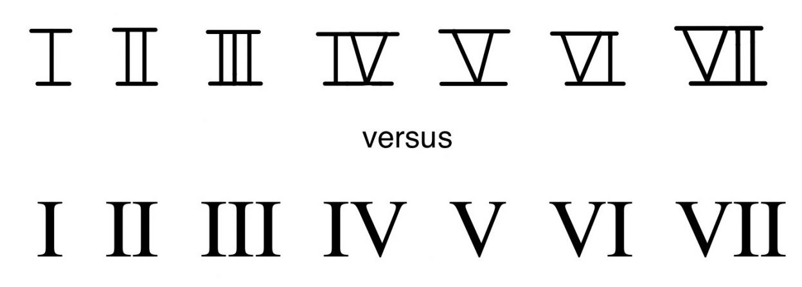
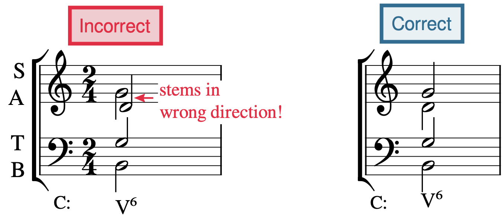
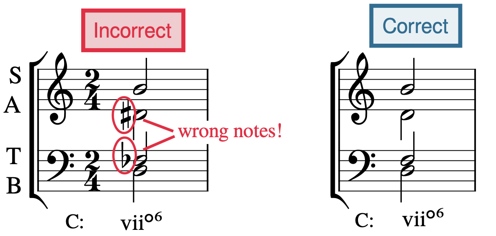
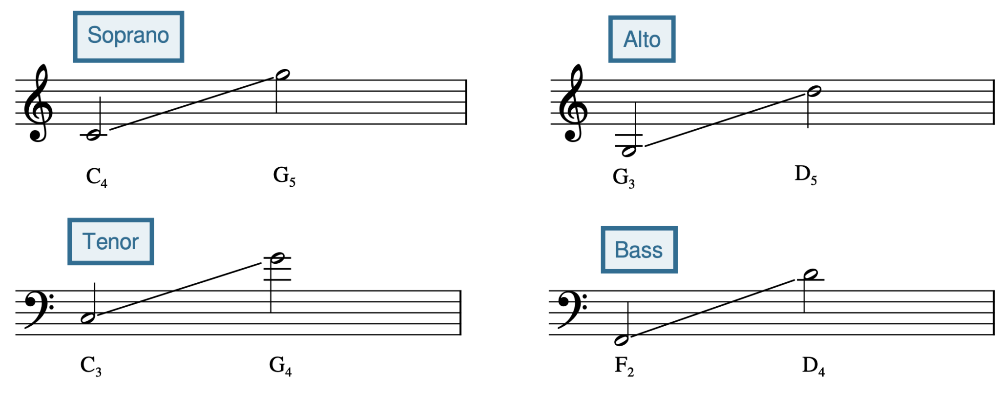
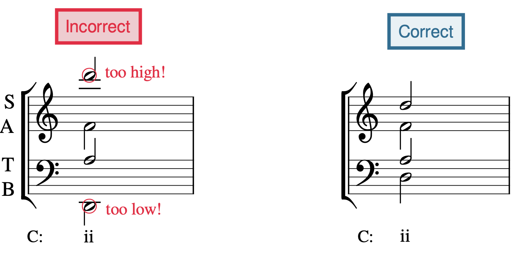
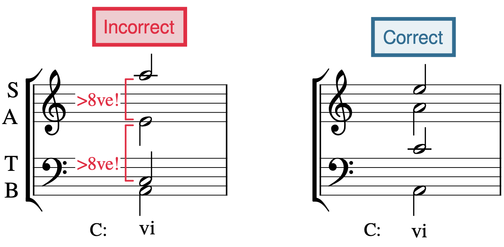
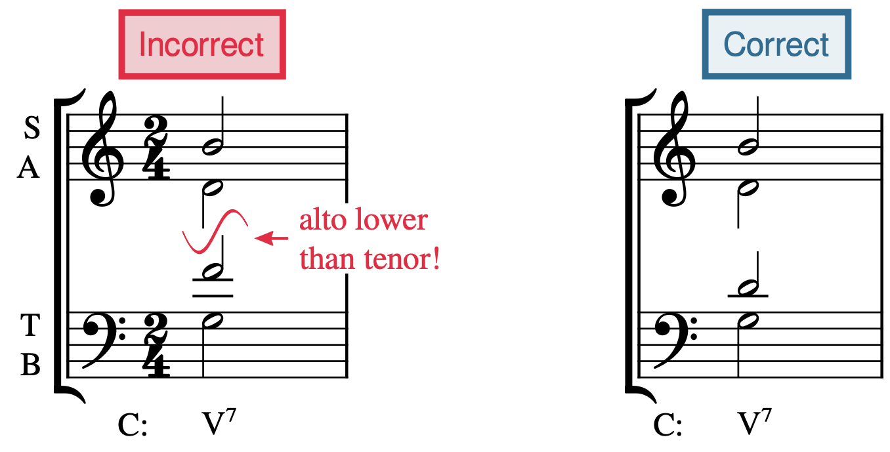
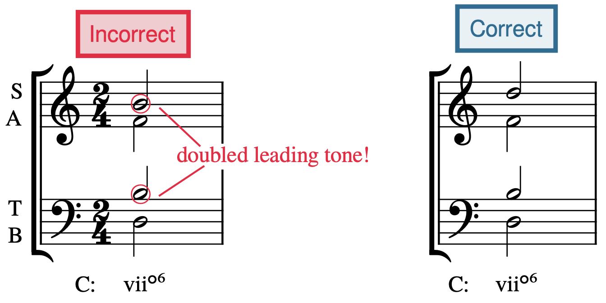

# Римские цифры и построение аккордов для четырёх голосов SATB

> **Черновик перевода.** Глава подготовлена по редакции *Open Music Theory — Fall 2023* (Nebraska). Независимая человеческая проверка содержания и терминологии пока не выполнена. Внешние партитуры, задания, аудиозаписи и видео остаются на языке оригинала; их содержимое и воспроизведение не проверены.

Авторы оригинала: **Samuel Brady и Kris Shaffer**. [Английская глава](https://pressbooks.nebraska.edu/openmusictheory/chapter/roman-numerals/). Лицензия исходного текста: [CC BY-SA 4.0](https://creativecommons.org/licenses/by-sa/4.0/); внешние материалы могут иметь собственные условия использования.

## Основные выводы

- Анализ с помощью римских цифр (*Roman numeral analysis*) — способ определить аккорды в контексте тональности и её ключевых знаков.
- Римские цифры показывают ступень основного тона аккорда, его вид и возможные добавленные звуки или обращения.
- Прописные римские цифры обозначают мажорные трезвучия, строчные — минорные. Надстрочный кружок после строчной цифры означает уменьшённое трезвучие, знак `+` после прописной — увеличенное.
- Обозначение вида септаккорда римской цифрой зависит от вида входящего в него трезвучия; исключение составляют полууменьшённый и полностью уменьшённый септаккорды: их обозначения различаются по септиме аккорда.
- При построении аккорда в четырёхголосном изложении SATB учитывайте шесть правил: направление штилей, звуковой состав аккорда, диапазоны голосов, расстояния между голосами, перекрещивание голосов и удвоение.

> **Примечание переводчиков об источнике.** В примере 1 таблица отсутствует в сохранённом оригинале: на её месте стоит сообщение `[table “68” not found /]`. Ниже приведена восстановленная по окружающему тексту последовательность чисел 1–7 и римских цифр; это дополнение переводчиков, а не сохранившаяся таблица. Несколько всплывающих словарных карточек также пусты или содержат посторонние главы. Сохранившиеся релевантные определения переведены ниже; повреждённые карточки не выдаются за содержание этой главы. [Подробная запись](https://github.com/dissonance-ltd/open-music-theory-ru/blob/main/docs/reviews/roman-numerals.md).

## Запись римских цифр

Теоретики музыки используют римские цифры, чтобы определять аккорды в контексте ключевых знаков тональности. Римская цифра указывает ступень основного тона аккорда, вид аккорда, а также возможные добавленные звуки или обращения. Поскольку эти обозначения передают одинаковые сведения в мажорных и минорных тональностях, с их помощью можно быстрее анализировать музыку западной академической традиции.

В трёх столбцах [примера 1](#example-1) исходно должны были стоять арабские цифры от 1 до 7 и соответствующие прописные и строчные римские цифры. В сохранённой версии таблица не загрузилась.

**Пример 1.** Арабские и римские цифры. *Таблица в сохранённом источнике недоступна; следующая последовательность восстановлена переводчиками по пояснению автора.*

| Арабская цифра | Прописная римская | Строчная римская |
|---|---|---|
| 1 | I | i |
| 2 | II | ii |
| 3 | III | iii |
| 4 | IV | iv |
| 5 | V | v |
| 6 | VI | vi |
| 7 | VII | vii |

Чтобы напечатать прописные римские цифры, используйте прописные латинские буквы `I` и `V`; для строчных — строчные `i` и `v`. IV (4) и VI (6) часто путают. Запомнить разницу помогает вычисление: IV (4) — это V минус I (5 минус 1), а VI (6) — V плюс I (5 плюс 1).

<figure id="example-2">

<figcaption>Пример 2. Различие рукописных и печатных римских цифр.</figcaption>
</figure>

У рукописных прописных римских цифр проводят горизонтальные линии сверху и снизу, чтобы лучше отличать их от строчных ([пример 2](#example-2)). У строчных римских цифр такого различия нет.

## Римские цифры и вид трезвучия

Римская цифра сообщает три вещи: ступень основного тона аккорда, вид аккорда и его обращение (см. раздел [«Обращение»](#inversion)). Числовое значение римской цифры (см. [пример 1](#example-1)) соответствует ступени основного тона аккорда в текущей тональности. Прописными римскими цифрами обозначают мажорные трезвучия, строчными — минорные. Например, в мажорной тональности аккорд на первой ступени, 1̂ (*do*), обозначают `I`, а на второй, 2̂ (*re*), — строчной цифрой `ii`. Строчная цифра с надстрочным `o` (например, viio) обозначает уменьшённое трезвучие, а прописная со знаком `+` (например, редко встречающееся V+) — увеличенное.

При анализе западной музыки римские цифры обычно пишут под нижним нотным станом. Некоторые теоретики пользуются только прописными римскими цифрами и предполагают, что вид аккорда будет понятен из контекста. В этом учебнике виды трезвучий различают написанием прописных и строчных цифр.

[Пример 3](#example-3) показывает трезвучия и септаккорды соль-мажорной гаммы с буквенными обозначениями аккордов и римскими цифрами (синим цветом). Также указаны слоги сольмизации и ступени основных тонов.

**Пример 3.** Римские цифры трезвучий в мажорных и минорных тональностях (подпись сохранённого источника; сам нотный пример описан в тексте как соль мажор).

<iframe src="https://musescore.com/user/32728834/scores/8514239/embed" title="Пример 3. Римские цифры и трезвучия — MuseScore" width="100%" height="440" loading="lazy" allowfullscreen></iframe>

<a href="https://musescore.com/user/32728834/scores/8514239">Открыть пример 3 в MuseScore</a> — если плеер не загрузился или нужен полноэкранный просмотр.

Плеер загружается с MuseScore и требует подключения к интернету. Надписи внутри партитуры оставлены на языке оригинала.

В мажорных тональностях ступени и виды трезвучий таковы:

- I — мажорное;
- ii — минорное;
- iii — минорное;
- IV — мажорное;
- V — мажорное;
- vi — минорное;
- vii° — уменьшённое.

В минорных тональностях:

- i — минорное;
- ii° — уменьшённое;
- III — мажорное;
- iv — минорное;
- v — минорное;
- V — мажорное (при повышенной VII ступени — вводном тоне);
- VI — мажорное;
- VII — мажорное;
- vii° — уменьшённое (при повышенной VII ступени — вводном тоне).

Обратите внимание: вид аккордов v/V и VII/viio зависит от повышения VII ступени до вводного тона.

> **Определения из оригинала.** **Ступень гаммы** (*scale degree*) — отдельная ступень звукоряда; обычно обозначается слогом сольмизации или арабской цифрой со знаком «крышка». **Вид аккорда** (*chord quality*) обобщает качественную величину терции, квинты и, при наличии, септимы над основным тоном. Распространённые виды: мажорный, минорный, уменьшённый, полууменьшённый, доминантовый и увеличенный.

## Римские цифры и вид септаккорда

К римской цифре септаккорда добавляют надстрочную 7: например, V7, ii7 и viio7. Регистр цифры зависит от вида входящего в аккорд трезвучия: прописная — для мажорного (например, V7), строчная — для минорного или уменьшённого (например, ii7). Полууменьшённый и полностью уменьшённый септаккорды содержат уменьшённые трезвучия; их различают дополнительным знаком после строчной цифры: ∅ для полууменьшённого (vii∅7), o для полностью уменьшённого (viio7).

> **Примечание переводчиков.** «Полностью уменьшённый септаккорд» здесь означает «уменьшённый септаккорд» из [главы 18](18-seventh-chords.md). Уточнение «полностью» помогает отличать его обозначение от полууменьшённого.

[Пример 4](#example-4) показывает трезвучия и септаккорды соль-минорной гаммы с буквенными обозначениями и римскими цифрами (синим цветом). Также указаны слоги сольмизации и ступени основных тонов.

**Пример 4.** Римские цифры септаккордов в мажорных и минорных тональностях (подпись сохранённого источника; сам пример описан в тексте как соль минор).

<iframe src="https://musescore.com/user/32728834/scores/8514287/embed" title="Пример 4. Септаккорды и римские цифры — MuseScore" width="100%" height="440" loading="lazy" allowfullscreen></iframe>

<a href="https://musescore.com/user/32728834/scores/8514287">Открыть пример 4 в MuseScore</a> — если плеер не загрузился или нужен полноэкранный просмотр.

Плеер загружается с MuseScore и требует подключения к интернету. Надписи внутри партитуры оставлены на языке оригинала.

В мажорных тональностях ступени и виды септаккордов таковы:

- I7 — большой мажорный септаккорд (мажорное трезвучие с большой септимой);
- ii7 — малый минорный септаккорд (минорное трезвучие с малой септимой);
- iii7 — малый минорный септаккорд;
- IV7 — большой мажорный септаккорд;
- V7 — малый мажорный, или доминантсептаккорд;
- vi7 — малый минорный септаккорд;
- vii∅7 — полууменьшённый септаккорд.

В минорных тональностях:

- i7 — малый минорный септаккорд;
- ii∅7 — полууменьшённый септаккорд;
- III7 — большой мажорный септаккорд;
- iv7 — малый минорный септаккорд;
- v7 — малый минорный септаккорд;
- V7 — малый мажорный, или доминантсептаккорд;
- VI7 — большой мажорный септаккорд;
- VII7 — малый мажорный, или доминантсептаккорд;
- vii°7 — полностью уменьшённый септаккорд.

Вид v7/V7 и VII7/viio7 зависит от повышения VII ступени до вводного тона.

Кроме того, большой мажорный септаккорд и доминантсептаккорд обозначаются римскими цифрами одинаково: например, I7 и V7 имеют одинаковое оформление, хотя первый — большой мажорный септаккорд, а второй — доминантсептаккорд. Разницу определяют по музыкальному контексту.

## Обращение

Римские цифры указывают и обращения аккордов: после цифры ставят обозначения цифрового баса (см. главу [«Обращения и цифровой бас»](19-inversion-figured-bass.md)). Например, надстрочная 6 означает трезвучие в первом обращении, а цифры ⁴₃ — септаккорд во втором обращении. [Пример 5](#example-5) показывает четыре аккорда в обращениях с римскими цифрами.

**Пример 5.** Четыре аккорда в обращениях с римскими цифрами и обозначениями цифрового баса.

<iframe src="https://musescore.com/user/32728834/scores/6869635/embed" title="Пример 5. Римские цифры и обращения — MuseScore" width="100%" height="440" loading="lazy" allowfullscreen></iframe>

<a href="https://musescore.com/user/32728834/scores/6869635">Открыть пример 5 в MuseScore</a> — если плеер не загрузился или нужен полноэкранный просмотр.

Плеер загружается с MuseScore и требует подключения к интернету. Надписи внутри партитуры оставлены на языке оригинала.

> **Определение из оригинала.** **Основное положение** (*root position*) — расположение звуков аккорда по терциям с основным тоном внизу. В анализе обращение определяется звуком в басу; подробное разграничение узкого определения и фактического расположения дано в главе [«Трезвучия»](17-triads.md).

## Анализ с помощью римских цифр

Сначала [определите тональность произведения](13-minor-scales.md) и запишите её под ключевыми знаками в начале: для мажорной тональности используйте прописную букву, для минорной — строчную. После буквы минорной тональности также можно написать строчное `m` (например, `dm` для ре минора). Не забудьте необходимый знак альтерации: например, `E♭` для ми-бемоль мажора.

Определив и записав тональность, анализируйте каждый аккорд по шагам:

1. Если аккорд дан в обращении, расположите его звуки в основном положении (желательно мысленно).
2. Определите все звуки аккорда с учётом его вида.
3. Запишите римскую цифру, соответствующую ступени основного тона, и передайте вид аккорда прописным или строчным написанием.
4. При необходимости добавьте обозначение вида — o, ∅ или +.
5. После римской цифры запишите цифры обращения.

В [примере 6](#example-6) приведён анализ хорала Иоганна Себастьяна Баха «Jesu meiner Seelen Wonne» («Иисус, радость моей души», 1642). При анализе не учитывайте ноты в скобках. Рекомендуем сначала закрыть римские цифры и попробовать подписать их самостоятельно, а затем сверить результат.

> **Примечание переводчиков.** Дата 1642 года напечатана в оригинале рядом с упоминанием хорала. Она не может быть датой обработки Баха, поскольку он жил позднее; принадлежность этой даты исходный текст не разъясняет.

**Пример 6.** Анализ фрагмента хорала И. С. Баха «Jesu, meiner Seelen Wonne» (BWV 359) римскими цифрами.

<iframe src="https://musescore.com/user/32728834/scores/6867245/embed" title="Пример 6. Хорал Баха: анализ римскими цифрами — MuseScore" width="100%" height="440" loading="lazy" allowfullscreen></iframe>

<a href="https://musescore.com/user/32728834/scores/6867245">Открыть пример 6 в MuseScore</a> — если плеер не загрузился или нужен полноэкранный просмотр.

Плеер загружается с MuseScore и требует подключения к интернету. Надписи внутри партитуры оставлены на языке оригинала.

Анализ римскими цифрами применим не только к хоралам, но и ко многим другим жанрам. [Пример 7](#example-7) показывает анализ фрагмента «Caro Mio Ben» («Мой любимый», около 1783 года), приписываемого Джузеппе Джордани.

**Пример 7.** Анализ фрагмента песни «Caro Mio Ben» Джузеппе Джордани римскими цифрами.

<iframe src="https://musescore.com/user/32728834/scores/6867246/embed" title="Пример 7. Caro Mio Ben: анализ римскими цифрами — MuseScore" width="100%" height="440" loading="lazy" allowfullscreen></iframe>

<a href="https://musescore.com/user/32728834/scores/6867246">Открыть пример 7 в MuseScore</a> — если плеер не загрузился или нужен полноэкранный просмотр.

Плеер загружается с MuseScore и требует подключения к интернету. Надписи внутри партитуры оставлены на языке оригинала.

Если один и тот же аккорд, как часто бывает, встречается подряд дважды или более, можно повторять его римскую цифру (как в такте 1 [примера 7](#example-7)) либо не повторять (как в такте 2 [примера 6](#example-6)).

## Построение аккордов в изложении SATB

> **Примечание о рисунках.** Подписи и описания рисунков 8–14 переведены; слова «Incorrect», «Correct» и пояснения внутри самих изображений остались на английском языке.

Теоретики музыки иногда сводят произведение к четырём партиям (голосам), чтобы яснее показать его гармонию. Такое изложение называется **SATB** — по начальным буквам четырёх распространённых хоровых партий: сопрано (S), альта (A), тенора (T) и баса (B). При построении аккорда в строгом стиле SATB музыканты обычно следуют шести правилам:

1. направление штилей;
2. звуковой состав аккорда;
3. диапазон;
4. расположение голосов;
5. перекрещивание голосов;
6. удвоение.

Эти шесть параметров служат основой контрапункта и голосоведения; их подробнее рассматривают в разделах оригинала [«Контрапункт и галантные схемы»](https://pressbooks.nebraska.edu/openmusictheorymusc165fall2023/part/counterpoint/) и [«Диатоническая гармония, отклонения и модуляции»](https://pressbooks.nebraska.edu/openmusictheorymusc165fall2023/part/diatonic-harmony/).

### Направление штилей

<figure id="example-8">

<figcaption>Пример 8. Ошибка направления штилей.</figcaption>
</figure>

На двух нотных станах партии сопрано и альта пишут в скрипичном ключе (верхний стан), тенора и баса — в басовом ключе (нижний стан). Штили сопрано и тенора направляют вверх, альта и баса — вниз. Перепутанное направление штилей считается ошибкой. [Пример 8](#example-8) показывает аккорд с ошибочной записью, а затем исправленный вариант.

### Звуковой состав аккорда

<figure id="example-9">

<figcaption>Пример 9. Ошибка в звуковом составе аккорда.</figcaption>
</figure>

Проверяйте состав каждого аккорда, все ноты и знаки альтерации; ни один звук аккорда не должен быть пропущен. В [примере 9](#example-9) к двум звукам первого аккорда ошибочно добавлены знаки альтерации. Во втором аккорде их убрали и получилось правильное уменьшённое трезвучие от си в первом обращении.

Басовый голос всегда должен соответствовать обращению, указанному цифрами после римской цифры. Верхние голоса, однако, можно расположить по-разному: у аккорда не обязательно есть только один правильный вариант распределения звуков по голосам.

### Диапазон

<figure id="example-10">

<figcaption>Пример 10. Диапазоны голосов.</figcaption>
</figure>

Для каждого голоса принят примерный диапазон ([пример 10](#example-10)):

- сопрано — C4–G5;
- альт — G3–D5;
- тенор — C3–G4;
- бас — F2–D4.

> **Определение из оригинала.** **Диапазон** (*range*) — область звуков, которые может исполнить голос или инструмент. В обозначениях высот C4 соответствует до первой октавы.

<figure id="example-11">

<figcaption>Пример 11. Ошибка диапазона.</figcaption>
</figure>

В [примере 11](#example-11) звуки сопрано и баса выходят за пределы своих диапазонов. Ошибку исправляют, опуская звук сопрано на октаву и поднимая звук баса на октаву.

### Расположение голосов

<figure id="example-12">

<figcaption>Пример 12. Ошибка расположения голосов.</figcaption>
</figure>

Между соседними верхними голосами (сопрано и альтом, альтом и тенором) должно быть не больше октавы, а между тенором и басом — не больше дуодецимы. Чаще всего ошибаются с расстоянием между альтом и тенором, поскольку их ноты записаны в разных ключах. В [примере 12](#example-12) сначала показан аккорд с неправильным расположением: сопрано и альт отстоят друг от друга больше чем на октаву, как и альт с тенором. Затем приведён исправленный вариант.

### Перекрещивание голосов

<figure id="example-13">

<figcaption>Пример 13. Ошибка перекрещивания голосов.</figcaption>
</figure>

Голоса не должны перекрещиваться: сопрано всегда должно быть выше альта, альт — выше тенора, а тенор — выше баса. В [примере 13](#example-13) перекрещены альт и тенор. Именно между этими голосами такая ошибка встречается чаще всего.

### Удвоение

<figure id="example-14">

<figcaption>Пример 14. Ошибка удвоения.</figcaption>
</figure>

В трезвучии звук баса обычно удваивают в одном из верхних голосов. Но есть исключение: вводный тон никогда не удваивают. Другие тяготеющие звуки, например септимы аккордов, также никогда не удваивают. В септаккордах вообще не удваивают звуки: аккорд содержит четыре звука — по одному на каждый голос. В первом такте [примера 14](#example-14) вводный тон ошибочно удвоен, во втором показан исправленный вариант.

> **Определения из оригинала.** **Удвоение** (*doubling*) — повторение некоторого звука аккорда в нескольких партиях. **Вводный тон** (*leading tone*) — VII ступень, отстоящая на полутон ниже I; в мажоре она диатоническая, а в миноре для её получения нужен знак альтерации.

## Интернет-ресурсы

Следующие внешние материалы сохранены из оригинала на английском языке. Их доступность и содержание пока не проверены.

- [Анализ трезвучий римскими цифрами (musictheory.net)](https://www.musictheory.net/lessons/44).
- [Гармонизация гамм и анализ римскими цифрами (Kaitlin Bove)](https://kaitlinbove.com/harmonizing-scales-roman-numeral-analysis).
- [Римские цифры (learnmusictheory.net, PDF)](https://learnmusictheory.net/PDFs/pdffiles/01-05-02-RomanNumerals.pdf).
- [Анализ римскими цифрами (Phillip Magnuson)](https://academic.udayton.edu/PhillipMagnuson/soundpatterns/diatonicI/romnumeral.html).
- [Анализ римскими цифрами (8notes.com)](https://www.8notes.com/school/theory/roman_numeral_analysis.asp?show=all).
- [Аккорды и римские цифры (Robert Hutchinson)](https://musictheory.pugetsound.edu/mt21c/RomanNumeralChordSymbols.html).
- [Карточки: римские цифры в мажоре](https://www.gmajormusictheory.org/Fundamentals/Flashcards/11_3RNsInMajor.html).
- [Карточки: римские цифры в миноре](https://www.gmajormusictheory.org/Fundamentals/Flashcards/11_4RNsInMinor.html).
- [Карточки: обращения и римские цифры в мажоре](https://www.gmajormusictheory.org/Fundamentals/Flashcards/13_1InversionRNsMaj.html).
- [Карточки: обращения и римские цифры в миноре](https://www.gmajormusictheory.org/Fundamentals/Flashcards/13_2InversionRNsMin.html).
- [Как устроена система римских цифр (YouTube)](https://www.youtube.com/watch?v=M2skX-SNIvA).

## Задания из интернета

Внешние листы и сайты остаются на языке оригинала; задания и ответы не проверены.

A. **Определение аккордов по римским цифрам:** стр. 15–16, 18 ([PDF](http://musictheory.pugetsound.edu/hw/MT21C-HOMEWORK-EXERCISES.pdf)); стр. 5–7 ([PDF](https://www.gmajormusictheory.org/Fundamentals/Ch11.pdf)); стр. 1, 3, 4 ([PDF](https://www.gmajormusictheory.org/Fundamentals/Ch13.pdf)); дополнительные листы: [септаккорды](https://www2.lawrence.edu/fast/BIRINGEG/media/theory_funds/pdf/ws33-7th_chords_2-id.pdf), [трезвучия в мажоре и миноре — 2](https://www2.lawrence.edu/fast/BIRINGEG/media/theory_funds/pdf/ws31-triads-majmin_keys_2.pdf), [трезвучия в мажоре и миноре — 1](https://www2.lawrence.edu/fast/BIRINGEG/media/theory_funds/pdf/ws30-triads-majmin_keys_1.pdf), [лист Carleton](https://people.carleton.edu/~jellinge/m101s12/Pages/14/Media14/14pdf/Worksheet14-2.pdf).
B. **Определение и построение аккордов по римским цифрам:** стр. 14 (трезвучия) и 17 (септаккорды) ([PDF](http://musictheory.pugetsound.edu/hw/MT21C-HOMEWORK-EXERCISES.pdf)); стр. 11 ([PDF](https://www.bgsu.edu/content/dam/BGSU/musical-arts/documents/Music-Theory-Placement-Exam-Theory-Worksheets.pdf)); стр. 8 ([PDF](https://www.gmajormusictheory.org/Fundamentals/Ch11.pdf)); стр. 5 ([PDF](https://www.gmajormusictheory.org/Fundamentals/Ch13.pdf)); упражнения [по римским цифрам](https://musictheory.pugetsound.edu/mt21c/RomanNumeralPracticeExercises.html) и [по септаккордам](https://musictheory.pugetsound.edu/mt21c/SeventhChordsExercises.html).
C. **Построение аккордов по римским цифрам:** стр. 22 ([PDF](http://musictheory.pugetsound.edu/hw/MT21C-HOMEWORK-EXERCISES.pdf)).

## Задания главы

Три внешних комплекта остаются на языке оригинала; PDF, партитуры MuseScore и аудио не изучены. Суффикс `#fixme` сохранён в исходных ссылках на `.mscz`; работоспособность адресов не подтверждена.

1. Определение римских цифр, задание № 1: [PDF](https://pressbooks.nebraska.edu/app/uploads/sites/379/2023/09/WK-Roman-Numerals-1.pdf), [файл `.mscz`](https://viva.pressbooks.pub/app/uploads/sites/12/2021/10/WK-Roman-Numerals-1.mscz#fixme), [аудио `.mp3`](https://pressbooks.nebraska.edu/app/uploads/sites/379/2023/09/WK-Intro-to-Roman-Numerals-A.mp3).
2. Определение римских цифр, задание № 2: [PDF](https://pressbooks.nebraska.edu/app/uploads/sites/379/2023/09/WK-Roman-Numerals-2.pdf), [файл `.mscz`](https://viva.pressbooks.pub/app/uploads/sites/12/2021/10/WK-Roman-Numerals-2.mscz#fixme), [аудио `.mp3`](https://pressbooks.nebraska.edu/app/uploads/sites/379/2023/09/WK-Intro-to-Roman-Numerals-B.mp3).
3. Определение римских цифр, задание № 3: [PDF](https://pressbooks.nebraska.edu/app/uploads/sites/379/2023/09/WK-Roman-Numerals-3.pdf), [файл `.mscz`](https://viva.pressbooks.pub/app/uploads/sites/12/2021/10/WK-Roman-Numerals-3.mscz#fixme), [аудио `.mp3`](https://pressbooks.nebraska.edu/app/uploads/sites/379/2023/09/WK-Intro-to-Roman-Numerals-C.mp3).
